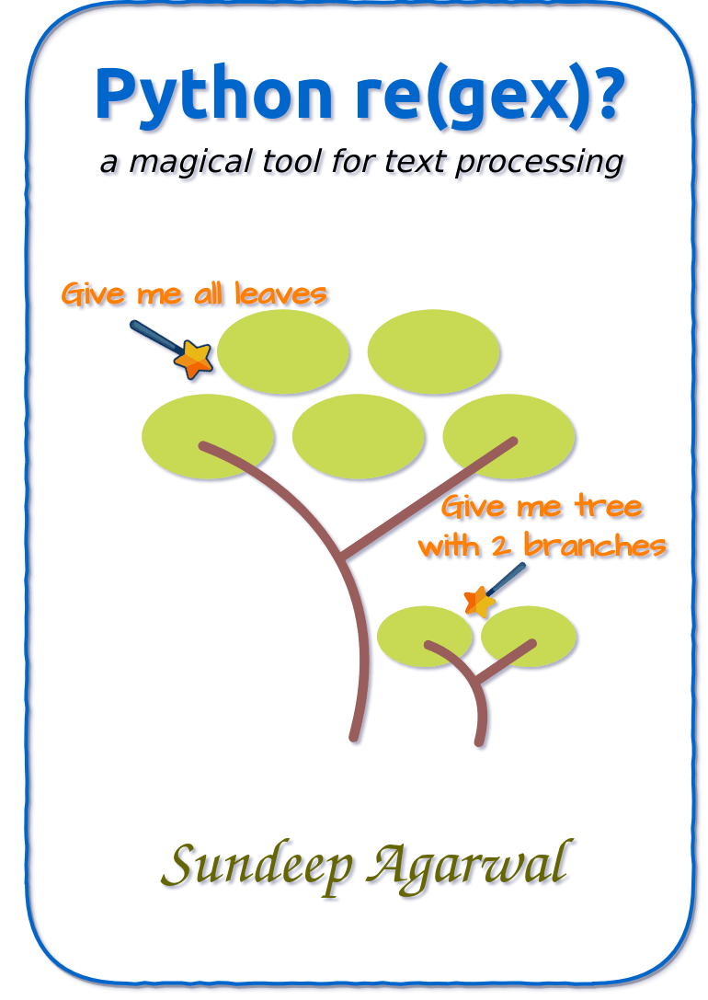

# Python re(gex)?

Learn Python Regular Expressions step by step from beginner to advanced levels with hundreds of examples and exercises

    

The book also includes exercises to test your understanding, which is presented together as a single file in this repo — [Exercises.md](./exercises/Exercises.md)

For solutions to the exercises, see [Exercise_solutions.md](./exercises/Exercise_solutions.md).

See [Version_changes.md](./Version_changes.md) to keep track of changes made to the book.

 

# E-book

* You can purchase the pdf/epub versions of the book using these links
    * https://leanpub.com/py_regex
        * You might find reduced price using this coupon: https://leanpub.com/py_regex/c/P7erPYAm1386
    * https://learnbyexample.gumroad.com/l/py_regex
* You can also get the book as part of these bundles:
    * **The Indie Python Extravaganza** bundle from https://leanpub.com/b/theindiepythonextravaganza
        * Includes *Python 101*, *Pydon'ts*, *Python re(gex)?*, *Practice Python Projects* and *Clean Architectures in Python*
    * **Learn by example Python bundle** from https://leanpub.com/b/python-bundle or https://learnbyexample.gumroad.com/l/python-bundle
    * **Awesome Regex** bundle from https://leanpub.com/b/regex or https://learnbyexample.gumroad.com/l/regex
    * **All books bundle** bundle from https://learnbyexample.gumroad.com/l/all-books
        * Includes all my programming books
    * [Python 101 + Python re(gex)?](https://leanpub.com/b/python101pythonregex) or [Python 201: Intermediate Python + Python re(gex)?](https://leanpub.com/b/python201_and_regex)
        * Python 101/201 is authored by [Michael Driscoll](https://www.blog.pythonlibrary.org/)
* See https://learnbyexample.github.io/books/ for list of other books

For a preview of the book, see [sample chapters](./sample_chapters/Python_Regex_sample.pdf)

The book can also be [viewed as a single markdown file in this repo](./py_regex.md). See my blogpost on [generating pdf from markdown using pandoc](https://learnbyexample.github.io/customizing-pandoc/) if you are interested in the ebook creation process.

For web version of the book, visit https://learnbyexample.github.io/py_regular_expressions/

 

# Feedback and Contributing

[Open an issue](https://github.com/learnbyexample/py_regular_expressions/issues) if you spot any typo/errors.

:warning: :warning: Please DO NOT submit pull requests. Main reason being any modification requires changes in multiple places.

I'd also highly appreciate your feedback about the book.

Twitter: https://twitter.com/learn_byexample

 

# Table of Contents

1. Preface
2. Why is it needed?
3. re introduction
4. Anchors
5. Alternation and Grouping
6. Escaping metacharacters
7. Dot metacharacter and Quantifiers
8. Interlude: Tools for debugging and visualization
9. Working with matched portions
10. Character class
11. Groupings and backreferences
12. Interlude: Common tasks
13. Lookarounds
14. Flags
15. Unicode
16. regex module
17. Gotchas
18. Further Reading

 

# Acknowledgements

* [Python documentation](https://docs.python.org/3/) — manuals and tutorials
* [/r/learnpython/](https://www.reddit.com/r/learnpython/), [/r/Python/](https://www.reddit.com/r/Python/) and [/r/regex/](https://www.reddit.com/r/regex/) — helpful forums for beginners and experienced programmers alike
* [stackoverflow](https://stackoverflow.com/) — for getting answers to pertinent questions on Python and regular expressions
* [tex.stackexchange](https://tex.stackexchange.com/) — for help on `pandoc` and `tex` related questions
* Cover image: [draw.io](https://about.draw.io/), [tree icon](https://www.iconfinder.com/icons/3199231/ellipse_green_nature_tree_icon) by [Gopi Doraisamy](https://www.iconfinder.com/gopidoraisamy) under [Creative Commons Attribution 3.0 Unported](https://creativecommons.org/licenses/by/3.0/) and [wand icon](https://www.iconfinder.com/icons/1679640/design_magic_magician_tool_wand_icon) by [roundicons.com](https://www.iconfinder.com/roundicons)
* [Warning](https://commons.wikimedia.org/wiki/File:Warning_icon.svg) and [Info](https://commons.wikimedia.org/wiki/File:Info_icon_002.svg) icons by [Amada44](https://commons.wikimedia.org/wiki/User:Amada44) under public domain
* [pngquant](https://pngquant.org/) and [svgcleaner](https://github.com/RazrFalcon/svgcleaner) for optimizing images
* [David Cortesi](https://leanpub.com/u/dcortesi) for helpful feedback on both the technical content and grammar issues
* **Kye** and [gmovchan](https://github.com/gmovchan) for spotting a typo
* **Hugh**'s email exchanges helped me significantly to improve the presentation of concepts and exercises
* [Christopher Patti](https://github.com/feoh) for reviewing the book, providing feedback and brightening the day with kind words
* Users **73tada**, **DrBobHope**, **nlomb** and others for feedback in [this reddit thread](https://www.reddit.com/r/learnpython/comments/hmvnt1/my_python_regex_ebook_with_hundreds_of_examples/)
* [mdBook](https://github.com/rust-lang/mdBook) — for web version of the book
    * [mdBook-pagetoc](https://github.com/JorelAli/mdBook-pagetoc) — for adding table of contents for each chapter
    * [minify-html](https://github.com/wilsonzlin/minify-html) — for minifying html files

Special thanks to Al Sweigart, for introducing me to Python with his awesome [automatetheboringstuff](https://automatetheboringstuff.com/) book and video course.

 

# License

The book is licensed under a [Creative Commons Attribution-NonCommercial-ShareAlike 4.0 International License](https://creativecommons.org/licenses/by-nc-sa/4.0/)

The code snippets are licensed under MIT, see [LICENSE](./LICENSE) file

