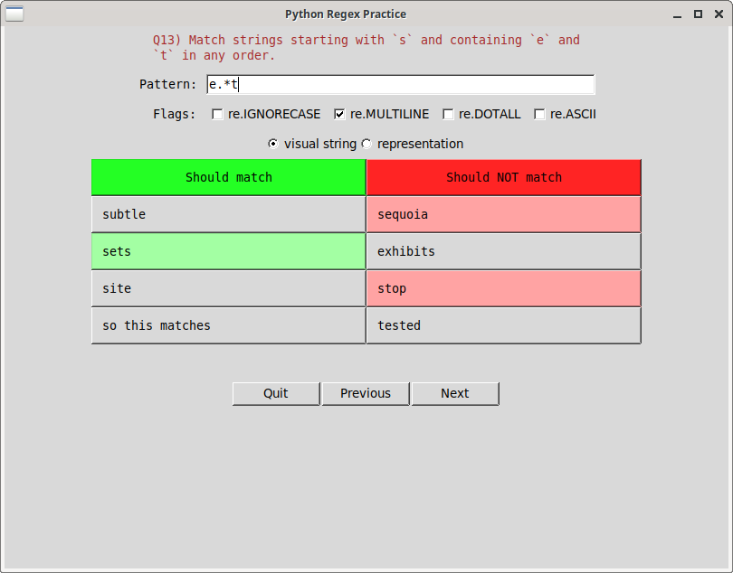
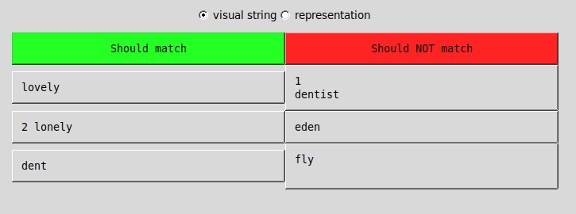
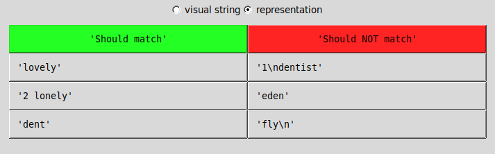

## About

A GUI app written in `tkinter` to help you practice Python regular expressions. The script has been tested for `python3.8` and above versions on Linux. This is likely to be functional on Windows/Mac as well.

The following functions are currently supported:

* `re.search()`
* `re.sub()`
* `re.findall()`
* `re.split()`

The app automatically checks and highlights test strings based on user input. Here's a screenshot:

<p align="center">  </p>

## Instructions

Download [regex_practice.py](https://github.com/learnbyexample/py_regular_expressions/raw/master/interactive_exercises/regex_practice.py) and [questions.json](https://github.com/learnbyexample/py_regular_expressions/raw/master/interactive_exercises/questions.json) or clone this repo as shown below.

```bash
$ git clone --depth=1 https://github.com/learnbyexample/py_regular_expressions

$ cd py_regular_expressions/interactive_exercises/

# use py instead of python3 for Windows
$ python3 regex_practice.py
```

Your progress will be saved in a new file named `user_progress.json`. If you close the app and launch it again, already solved questions will be automatically skipped.

There are 75 questions in total. You can pass an integer value as command-line argument to directly open that particular question (this would also be skipped if it is already answered).

```bash
# use py instead of python3 for Windows
# opens 50th question
$ python3 regex_practice.py 50
```

## Notes

* Use appropriate anchors based on whether **string** or **line** is used in the question description.
* By default, **visual string** radio option is active. It shows the test strings in the same way you'd see from the output of `print()` function. In case of `re.split()` and `re.findall()` functions, the output column shows the `list` return value. The **representation** radio choice shows the test strings using the `repr()` function, this is useful when the test strings contain whitespace characters.

Here's a screenshot to show the difference between these two options:

<p align="center">  </p>
<p align="center">  </p>

* Backticks are used in the question descriptions to highlight search and replace terms.
* User input entered via **Pattern** and **Replace** boxes will always be treated as raw-strings. For this reason, raw-strings are used for the reference solutions as well.
* These exercise questions have been adapted from my [Python re(gex)?](https://github.com/learnbyexample/py_regular_expressions) ebook (free to read online). See [Exercises.md](https://github.com/learnbyexample/py_regular_expressions/blob/master/exercises/Exercises.md) for all the exercise questions from this book.

## TODO

* Highlight portion of test strings that match the user pattern and show live output — these features will help in debugging solutions
* Add support for arguments like `count` for `re.sub`, `maxsplit` for `re.split`, etc
* Add support for `re.subn`, `re.fullmatch`, `re.finditer`, `re.Match`, etc
* Add support for third-party [regex](https://pypi.org/project/regex/) module
* Refactor
* Add tests?
* Etc

## License

The [regex_practice.py](https://github.com/learnbyexample/py_regular_expressions/raw/master/interactive_exercises/regex_practice.py) file is licensed under [MIT LICENSE](../LICENSE)

Rest of the content is licensed under [Creative Commons Attribution-NonCommercial-ShareAlike 4.0 International License](https://creativecommons.org/licenses/by-nc-sa/4.0/)
