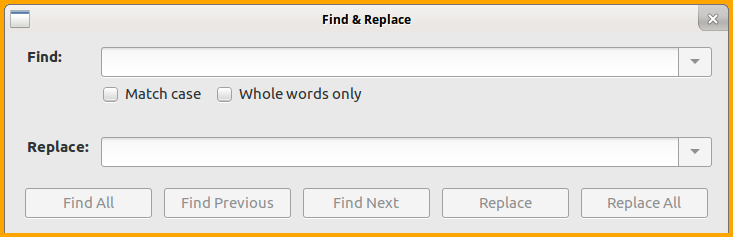
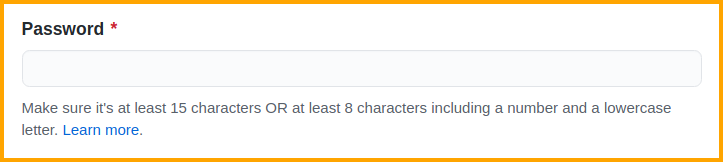
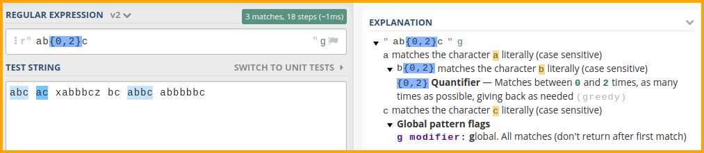
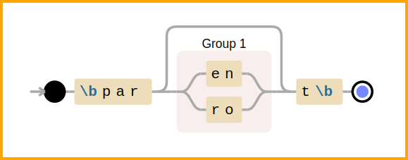
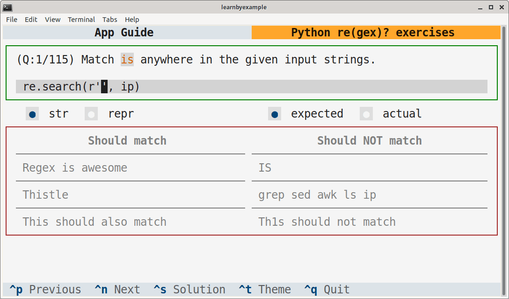
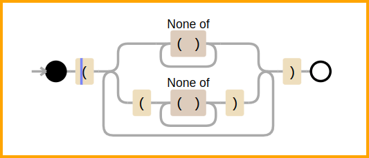

# Preface

Scripting and automation tasks often need to extract particular portions of text from input data or modify them from one format to another. This book will help you understand Regular Expressions, a mini-programming language for all sorts of text processing needs.

This book heavily leans on examples to present features of regular expressions one by one. It is recommended that you manually type each example and experiment with them. Make an effort to understand the sample input as well as the solution presented and check if the output changes (or not!) when you alter some part of the input and the command. As an analogy, consider learning to drive a car — no matter how much you read about them or listen to explanations, you'd need practical experience to become proficient.

## Prerequisites

You should be familiar with programming basics. You should also have a working knowledge of Python syntax and features like string formats, string methods and list comprehensions.

You are also expected to get comfortable with reading manuals, searching online, visiting external links provided for further reading, tinkering with illustrated examples, asking for help when you are stuck and so on. In other words, be proactive and curious instead of just consuming the content passively.

If you have prior experience with a programming language but not Python, see my [curated list of learning resources](https://learnbyexample.github.io/py_resources/) before starting this book.

## Conventions

* The examples presented here have been tested with **Python version 3.13.1** and includes features not available in earlier versions.
* Code snippets shown are copy pasted from the Python REPL shell and modified for presentation purposes. Some commands are preceded by comments to provide context and explanations. Blank lines have been added to improve readability. Error messages are shortened. `import` statements are skipped after initial use. And so on.
* Unless otherwise noted, all examples and explanations are meant for **ASCII** characters.
* External links are provided throughout the book for you to explore certain topics in more depth.
* The [py_regular_expressions repo](https://github.com/learnbyexample/py_regular_expressions) has all the [code snippets](https://github.com/learnbyexample/py_regular_expressions/tree/master/code_snippets) and [exercises](https://github.com/learnbyexample/py_regular_expressions/tree/master/exercises) used in the book. Solutions file is also provided. If you are not familiar with the `git` command, click the **Code** button on the webpage to get the files.

## Acknowledgements

* [Python documentation](https://docs.python.org/3/) — manuals and tutorials
* [/r/learnpython/](https://old.reddit.com/r/learnpython/), [/r/Python/](https://old.reddit.com/r/Python/) and [/r/regex/](https://old.reddit.com/r/regex/) — helpful forums for beginners and experienced programmers alike
* [stackoverflow](https://stackoverflow.com/) — for getting answers to pertinent questions on Python and regular expressions
* [tex.stackexchange](https://tex.stackexchange.com/) — for help on [pandoc](https://github.com/jgm/pandoc/) and `tex` related questions
* [canva](https://www.canva.com/) — cover image
* [Warning](https://commons.wikimedia.org/wiki/File:Warning_icon.svg) and [Info](https://commons.wikimedia.org/wiki/File:Info_icon_002.svg) icons by [Amada44](https://commons.wikimedia.org/wiki/User:Amada44) under public domain
* [oxipng](https://github.com/shssoichiro/oxipng), [pngquant](https://pngquant.org/) and [svgcleaner](https://github.com/RazrFalcon/svgcleaner) — optimizing images
* [David Cortesi](https://leanpub.com/u/dcortesi) for helpful feedback on both the technical content and grammar issues
* **Kye** and [gmovchan](https://github.com/gmovchan) for spotting a typo
* **Hugh**'s email exchanges helped me significantly to improve the presentation of concepts and exercises
* [Christopher Patti](https://github.com/feoh) for reviewing the book, providing feedback and brightening the day with kind words
* Users **73tada**, **DrBobHope**, **nlomb** and others for feedback in [this reddit thread](https://old.reddit.com/r/learnpython/comments/hmvnt1/my_python_regex_ebook_with_hundreds_of_examples/)

Special thanks to Al Sweigart. His [Automate the Boring Stuff](https://automatetheboringstuff.com/) book was instrumental for me to get started with Python.

## Feedback and Errata

I would highly appreciate it if you'd let me know how you felt about this book. It could be anything from a simple thank you, pointing out a typo, mistakes in code snippets, which aspects of the book worked for you (or didn't!) and so on. Reader feedback is essential and especially so for self-published authors.

You can reach me via:

* Issue Manager: [https://github.com/learnbyexample/py_regular_expressions/issues](https://github.com/learnbyexample/py_regular_expressions/issues)
* E-mail: learnbyexample.net@gmail.com
* Twitter: [https://twitter.com/learn_byexample](https://twitter.com/learn_byexample)

## Author info

Sundeep Agarwal is a lazy being who prefers to work just enough to support his modest lifestyle. He accumulated vast wealth working as a Design Engineer at Analog Devices and retired from the corporate world at the ripe age of twenty-eight. Unfortunately, he squandered his savings within a few years and had to scramble trying to earn a living. Against all odds, selling programming ebooks saved his lazy self from having to look for a job again. He can now afford all the fantasy ebooks he wants to read and spends unhealthy amount of time browsing the internet.

When the creative muse strikes, he can be found working on yet another programming ebook (which invariably ends up having at least one example with regular expressions). Researching materials for his ebooks and everyday social media usage drowned his bookmarks, so he maintains curated resource lists for sanity sake. He is thankful for free learning resources and open source tools. His own contributions can be found at [https://github.com/learnbyexample](https://github.com/learnbyexample).

**List of books:** https://learnbyexample.github.io/books/

## License

This work is licensed under a [Creative Commons Attribution-NonCommercial-ShareAlike 4.0 International License](https://creativecommons.org/licenses/by-nc-sa/4.0/).

Code snippets are available under [MIT License](https://github.com/learnbyexample/py_regular_expressions/blob/master/LICENSE).

Resources mentioned in the Acknowledgements section above are available under original licenses.

## Book version

4.5

See [Version_changes.md](https://github.com/learnbyexample/py_regular_expressions/blob/master/Version_changes.md) to track changes across book versions.

# Why is it needed?

Regular Expressions is a versatile tool for text processing. You'll find them included as part of the standard library of most programming languages that are used for scripting purposes. If not, you can usually find a third-party library. Syntax and features of regular expressions vary from language to language. Python's syntax is similar to that of Perl language, but there are significant feature differences.

The `str` class comes loaded with variety of methods to deal with text. So, what's so special about regular expressions and why would you need it? For learning and understanding purposes, one can view regular expressions as a mini-programming language specialized for text processing. Parts of a regular expression can be saved for future use, analogous to variables and functions. There are ways to perform AND, OR, NOT conditionals. Operations similar to the `range()` function, string repetition operator and so on.

Here are some common use cases:

* Sanitizing a string to ensure that it satisfies a known set of rules. For example, to check if a given string matches password rules.
* Filtering or extracting portions on an abstract level like alphabets, digits, punctuation and so on.
* Qualified string replacement. For example, at the start or the end of a string, only whole words, based on surrounding text, etc.

You are likely to be familiar with graphical search and replace tools, like the screenshot shown below from LibreOffice Writer. **Match case**, **Whole words only**, **Replace** and **Replace All** are some of the basic features supported by regular expressions.



Another real world use case is password validation. The screenshot below is from GitHub sign up page. Performing multiple checks like **string length** and the **type of characters allowed** is another core feature of regular expressions.



Here are some articles on regular expressions to know about its history and the type of problems it is suited for.

* [The true power of regular expressions](https://www.npopov.com/2012/06/15/The-true-power-of-regular-expressions.html) — it also includes a nice explanation of what *regular* means in this context
* [softwareengineering: Is it a must for every programmer to learn regular expressions?](https://softwareengineering.stackexchange.com/questions/133968/is-it-a-must-for-every-programmer-to-learn-regular-expressions)
* [softwareengineering: When you should NOT use Regular Expressions?](https://softwareengineering.stackexchange.com/questions/113237/when-you-should-not-use-regular-expressions)
* [codinghorror: Now You Have Two Problems](https://blog.codinghorror.com/regular-expressions-now-you-have-two-problems/) — demystifies the often (mis)quoted meme
* [wikipedia: Regular expression](https://en.wikipedia.org/wiki/Regular_expression) — this article includes discussion on regular expressions as a formal language as well as details about various implementations

## How this book is organized

This book introduces concepts one by one and exercises at the end of chapters will require only the features introduced until that chapter. Each concept is accompanied by plenty of examples to cover multiple problems and corner cases. As mentioned before, it is highly recommended that you follow along the examples by typing out the code snippets manually. It is important to understand both the nature of the sample input string as well as the actual programming command used. There are two interlude chapters that give an overview of useful tools and some more resources are collated in the final chapter.

* [re introduction](#re-introduction)
* [Anchors](#anchors)
* [Alternation and Grouping](#alternation-and-grouping)
* [Escaping metacharacters](#escaping-metacharacters)
* [Dot metacharacter and Quantifiers](#dot-metacharacter-and-quantifiers)
* [Interlude: Tools for debugging and visualization](#interlude-tools-for-debugging-and-visualization)
* [Working with matched portions](#working-with-matched-portions)
* [Character class](#character-class)
* [Groupings and backreferences](#groupings-and-backreferences)
* [Interlude: Common tasks](#interlude-common-tasks)
* [Lookarounds](#lookarounds)
* [Flags](#flags)
* [Unicode](#unicode)
* [regex module](#regex-module)
* [Gotchas](#gotchas)
* [Further Reading](#further-reading)

By the end of the book, you should be comfortable with both writing and reading regular expressions, how to debug them and know when to *avoid* them.

# re introduction

This chapter gives an introduction to the `re` module. This module is part of the standard library. For some examples, the equivalent normal string method is also shown for comparison. This chapter just focuses on the basics of using functions from the `re` module. Regular expression features will be covered from the next chapter onwards.

## re module documentation

It is always a good idea to know where to find the documentation. The default offering for Python regular expressions is the `re` standard library module. Visit [docs.python: re](https://docs.python.org/3/library/re.html) for information on available methods, syntax, features, examples and more. Here's a quote:

>A regular expression (or RE) specifies a set of strings that matches it; the functions in this module let you check if a particular string matches a given regular expression

## re.search()

Normally you'd use the `in` operator to test whether a string is part of another string or not. For regular expressions, use the `re.search()` function whose argument list is shown below.

>`re.search(pattern, string, flags=0)`

The first argument is the RE pattern you want to test against the input string, which is the second argument. `flags` is optional, it helps to change the default behavior of RE patterns.

As a good practice, always use **raw strings** to construct the RE pattern. This will become clearer in later chapters. Here are some examples to get started.

```ruby
>>> sentence = 'This is a sample string'

# check if 'sentence' contains the given search string
>>> 'is' in sentence
True
>>> 'xyz' in sentence
False

# need to load the re module before use
>>> import re

# check if 'sentence' contains the pattern described by the RE argument
>>> bool(re.search(r'is', sentence))
True
>>> bool(re.search(r'xyz', sentence))
False
```

Before using the `re` module, you need to `import` it. Further example snippets will assume that this module is already loaded. The return value of the `re.search()` function is a `re.Match` object when a match is found and `None` otherwise (note that I treat `re` as a word, not as `r` and `e` separately, hence the use of *a* instead of *an*). More details about the `re.Match` object will be discussed in the [Working with matched portions](#working-with-matched-portions) chapter. For presentation purposes, the examples will use the `bool()` function to show `True` or `False` depending on whether the RE pattern matched or not.

Here's an example with the `flags` optional argument. By default, the pattern will match the input string case sensitively. By using the `re.I` flag, you can match case insensitively. See the [Flags](#flags) chapter for more details.

```ruby
>>> sentence = 'This is a sample string'

>>> bool(re.search(r'this', sentence))
False

# re.IGNORECASE (or re.I) is a flag to enable case insensitive matching
>>> bool(re.search(r'this', sentence, flags=re.I))
True
```

## re.search() in conditional expressions

As Python evaluates `None` as `False` in boolean context, `re.search()` can be used directly in conditional expressions. See also [docs.python: Truth Value Testing](https://docs.python.org/3/library/stdtypes.html#truth).

```ruby
>>> sentence = 'This is a sample string'
>>> if re.search(r'ring', sentence):
...     print('mission success')
... 
mission success

>>> if not re.search(r'xyz', sentence):
...     print('mission failed')
... 
mission failed
```

Here are some examples with list comprehensions and generator expressions:

```ruby
>>> words = ['cat', 'attempt', 'tattle']

>>> [w for w in words if re.search(r'tt', w)]
['attempt', 'tattle']
>>> all(re.search(r'at', w) for w in words)
True
>>> any(re.search(r'stat', w) for w in words)
False
```

## re.sub()

For normal search and replace, you'd use the `str.replace()` method. For regular expressions, use the `re.sub()` function, whose argument list is shown below.

>`re.sub(pattern, repl, string, count=0, flags=0)`

The first argument is the RE pattern to match against the input string, which is the third argument. The second argument specifies the string which will replace the portions matched by the RE pattern. `count` and `flags` are optional arguments.

```ruby
>>> greeting = 'Have a nice weekend'

# replace all occurrences of 'e' with 'E'
# same as: greeting.replace('e', 'E')
>>> re.sub(r'e', 'E', greeting)
'HavE a nicE wEEkEnd'

# replace the first two occurrences of 'e' with 'E'
# same as: greeting.replace('e', 'E', count=2)
>>> re.sub(r'e', 'E', greeting, count=2)
'HavE a nicE weekend'
```

> A common mistake, not specific to `re.sub()`, is forgetting that strings are immutable in Python.
> 
> ```ruby
> >>> word = 'cater'
> # this will return a string object, won't modify the 'word' variable
> >>> re.sub(r'cat', 'wag', word)
> 'wager'
> >>> word
> 'cater'
> 
> # need to explicitly assign the result if 'word' has to be changed
> >>> word = re.sub(r'cat', 'wag', word)
> >>> word
> 'wager'
> ```

## Compiling regular expressions

Regular expressions can be compiled using the `re.compile()` function, which gives back a `re.Pattern` object.

>`re.compile(pattern, flags=0)`

The top level `re` module functions are all available as methods for such objects. Compiling a regular expression is useful if the RE has to be used in multiple places or called upon multiple times inside a loop (speed benefit).

> By default, Python maintains a small list of recently used RE, so the speed benefit doesn't apply for trivial use cases. See also [stackoverflow: Is it worth using re.compile?](https://stackoverflow.com/q/452104/4082052)

```ruby
>>> pet = re.compile(r'dog')
>>> type(pet)
<class 're.Pattern'>

# note that 'search' is called upon 'pet' which is a 're.Pattern' object
# since 'pet' has the RE information, you only need to pass the input string
>>> bool(pet.search('They bought a dog'))
True
>>> bool(pet.search('A cat crossed their path'))
False

# replace all occurrences of 'dog' with 'cat'
>>> pet.sub('cat', 'They bought a dog')
'They bought a cat'
```

Some of the methods available for compiled patterns also accept more arguments than those available for the top level functions of the `re` module. For example, the `search()` method on a compiled pattern has two optional arguments to specify the **start** and **end** index positions. Similar to the `range()` function and slicing notation, the ending index has to be specified `1` greater than the desired index.

>`Pattern.search(string[, pos[, endpos]])`

Note that there's no `flags` option as that has to be specified with `re.compile()`.

```ruby
>>> sentence = 'This is a sample string'
>>> word = re.compile(r'is')

# search for 'is' starting from the 5th character
>>> bool(word.search(sentence, 4))
True

# search for 'is' starting from the 7th character
>>> bool(word.search(sentence, 6))
False

# search for 'is' from the 3rd character to the 4th character
>>> bool(word.search(sentence, 2, 4))
True
```

## bytes

To work with the `bytes` data type, the RE must be specified as `bytes` as well. Similar to the `str` RE, use **raw** format to construct a `bytes` RE.

```ruby
>>> byte_data = b'This is a sample string'

# error message truncated for presentation purposes
>>> re.search(r'is', byte_data)
TypeError: cannot use a string pattern on a bytes-like object

# use rb'..' for constructing bytes pattern
>>> bool(re.search(rb'is', byte_data))
True
>>> bool(re.search(rb'xyz', byte_data))
False
```

## re(gex)? playground

To make it easier to experiment, I wrote an interactive TUI app. See [PyRegexPlayground](https://github.com/learnbyexample/TUI-apps/tree/main/PyRegexPlayground) repo for installation instructions and usage guide. A sample screenshot is shown below:


## Cheatsheet and Summary

| Note    | Description |
| ------- | ----------- |
| [docs.python: re](https://docs.python.org/3/library/re.html) | Python standard module for regular expressions |
| `re.search()` | Check if the given pattern is present anywhere in the input string |
|  | `re.search(pattern, string, flags=0)` |
|  | Output is a `re.Match` object, usable in conditional expressions |
|  | raw strings preferred to define RE |
|  | Additionally, Python maintains a small cache of recent RE |
| `re.sub()` | search and replace using RE |
|  | `re.sub(pattern, repl, string, count=0, flags=0)` |
| `re.compile()` | Compile a pattern for reuse, output is a `re.Pattern` object |
|  | `re.compile(pattern, flags=0)` |
| `rb'pat'` | Use byte pattern for byte input |
| `re.IGNORECASE` or `re.I` | flag to ignore case while matching |

This chapter introduced the `re` module, which is part of the standard library. Functions `re.search()` and `re.sub()` were discussed as well as how to compile RE using the `re.compile()` function. The RE pattern is usually defined using raw strings. For byte input, the pattern has to be of byte type too. Although the `re` module is good enough for most use cases, there are situations where you need to use the third-party `regex` module. To avoid mixing up features, a separate chapter is dedicated for the [regex module](#regex-module) at the end of this book.

The next section has exercises to test your understanding of the concepts introduced in this chapter. Please do solve them before moving on to the next chapter.

## Exercises

> Try to solve exercises in every chapter using only the features discussed until that chapter. Some of the exercises will be easier to solve with techniques presented in later chapters, but the aim of these exercises is to explore the features presented so far.

> All the exercises are also collated together in one place at [Exercises.md](https://github.com/learnbyexample/py_regular_expressions/blob/master/exercises/Exercises.md). For solutions, see [Exercise_solutions.md](https://github.com/learnbyexample/py_regular_expressions/blob/master/exercises/Exercise_solutions.md).

**1)** Check whether the given strings contain `0xB0`. Display a boolean result as shown below.

```ruby
>>> line1 = 'start address: 0xA0, func1 address: 0xC0'
>>> line2 = 'end address: 0xFF, func2 address: 0xB0'

>>> bool(re.search(r'', line1))     ##### add your solution here
False
>>> bool(re.search(r'', line2))     ##### add your solution here
True
```

**2)** Replace all occurrences of `5` with `five` for the given string.

```ruby
>>> ip = 'They ate 5 apples and 5 oranges'

>>> re.sub()        ##### add your solution here
'They ate five apples and five oranges'
```

**3)** Replace only the first occurrence of `5` with `five` for the given string.

```ruby
>>> ip = 'They ate 5 apples and 5 oranges'

>>> re.sub()       ##### add your solution here
'They ate five apples and 5 oranges'
```

**4)** For the given list, filter all elements that do *not* contain `e`.

```ruby
>>> items = ['goal', 'new', 'user', 'sit', 'eat', 'dinner']

>>> [w for w in items if not re.search()]        ##### add your solution here
['goal', 'sit']
```

**5)** Replace all occurrences of `note` irrespective of case with `X`.

```ruby
>>> ip = 'This note should not be NoTeD'

>>> re.sub()        ##### add your solution here
'This X should not be XD'
```

**6)** Check if `at` is present in the given byte input data.

```ruby
>>> ip = b'tiger imp goat'

>>> bool(re.search())     ##### add your solution here
True
```

**7)** For the given input string, display all lines not containing `start` irrespective of case.

```ruby
>>> para = '''good start
... Start working on that
... project you always wanted
... stars are shining brightly
... hi there
... start and try to
... finish the book
... bye'''

>>> pat = re.compile()      ##### add your solution here
>>> for line in para.split('\n'):
...     if not pat.search(line):
...         print(line)
... 
project you always wanted
stars are shining brightly
hi there
finish the book
bye
```

**8)** For the given list, filter all elements that contain either `a` or `w`.

```ruby
>>> items = ['goal', 'new', 'user', 'sit', 'eat', 'dinner']

##### add your solution here
>>> [w for w in items if re.search() or re.search()]
['goal', 'new', 'eat']
```

**9)** For the given list, filter all elements that contain both `e` and `n`.

```ruby
>>> items = ['goal', 'new', 'user', 'sit', 'eat', 'dinner']

##### add your solution here
>>> [w for w in items if re.search() and re.search()]
['new', 'dinner']
```

**10)** For the given string, replace `0xA0` with `0x7F` and `0xC0` with `0x1F`.

```ruby
>>> ip = 'start address: 0xA0, func1 address: 0xC0'

##### add your solution here
'start address: 0x7F, func1 address: 0x1F'
```

# Anchors

Now that you're familiar with RE syntax and couple of `re` module functions, the next step is to know about the special features of regular expressions. In this chapter, you'll be learning about qualifying a pattern. Instead of matching anywhere in the given input string, restrictions can be specified. For now, you'll see the ones that are already part of the `re` module. In later chapters, you'll learn how to define custom rules.

These restrictions are made possible by assigning special meaning to certain characters and escape sequences. The characters with special meaning are known as **metacharacters** in regular expressions parlance. In case you need to match those characters literally, you need to escape them with a `\` character (discussed in the [Escaping metacharacters](#escaping-metacharacters) chapter).

## String anchors

This restriction is about qualifying a RE to match only at the start or the end of an input string. These provide functionality similar to the `str` methods `startswith()` and `endswith()`. First up, the escape sequence `\A` which restricts the matching to the start of string.

```ruby
# \A is placed as a prefix to the search term
>>> bool(re.search(r'\Acat', 'cater'))
True
>>> bool(re.search(r'\Acat', 'concatenation'))
False

>>> bool(re.search(r'\Ahi', 'hi hello\ntop spot'))
True
>>> bool(re.search(r'\Atop', 'hi hello\ntop spot'))
False
```

To restrict the matching to the end of string, `\Z` is used.

```ruby
# \Z is placed as a suffix to the search term
>>> bool(re.search(r'are\Z', 'spare'))
True
>>> bool(re.search(r'are\Z', 'nearest'))
False

>>> words = ['surrender', 'unicorn', 'newer', 'door', 'erase', 'eel', 'pest']
>>> [w for w in words if re.search(r'er\Z', w)]
['surrender', 'newer']
>>> [w for w in words if re.search(r't\Z', w)]
['pest']
```

You can emulate string concatenation operations by using the anchors by themselves as a pattern.

```ruby
# insert text at the start of a string
>>> re.sub(r'\A', 're', 'live')
'relive'
>>> re.sub(r'\A', 're', 'send')
'resend'

# appending text
>>> re.sub(r'\Z', 'er', 'cat')
'cater'
>>> re.sub(r'\Z', 'er', 'hack')
'hacker'
```

> Use the optional start and end index arguments of the `Pattern.search()` method with caution. They are not equivalent to string slicing. For example, specifying a greater than `0` start index when using `\A` is always going to return `False`. This is because, as far as the `search()` method is concerned, only the search space has been narrowed — the anchor positions haven't changed. When slicing is used, you are creating an entirely new string object with new anchor positions.
> 
> ```ruby
> >>> word_pat = re.compile(r'\Aat')
> 
> >>> bool(word_pat.search('cater', 1))
> False
> >>> bool(word_pat.search('cater'[1:]))
> True
> ```

## re.fullmatch()

Combining both the start and end string anchors, you can restrict the matching to the whole string. The effect is similar to comparing strings using the `==` operator.

```ruby
>>> word_pat = re.compile(r'\Acat\Z')

>>> bool(word_pat.search('cat'))
True
>>> bool(word_pat.search('concatenation'))
False
```

You can also use the `re.fullmatch()` function to ensure the pattern matches only the whole input string and not just a part of the input. This may not seem useful with features introduced so far, but when you have a complex RE pattern with multiple alternatives, this function is quite handy. The argument list is same as the `re.search()` function.

>`re.fullmatch(pattern, string, flags=0)`

```ruby
>>> word_pat = re.compile(r'cat', flags=re.I)

>>> bool(word_pat.fullmatch('Cat'))
True
>>> bool(word_pat.fullmatch('Scatter'))
False
```

## Line anchors

A string input may contain single or multiple lines. The newline character `\n` is considered as the line separator. There are two line anchors. `^` metacharacter for matching the start of line and `$` for matching the end of line. If there are no newline characters in the input string, these will behave exactly the same as `\A` and `\Z` respectively.

```ruby
>>> pets = 'cat and dog'

>>> bool(re.search(r'^cat', pets))
True
>>> bool(re.search(r'^dog', pets))
False

>>> bool(re.search(r'dog$', pets))
True
>>> bool(re.search(r'^dog$', pets))
False
```

>  By default, the input string is considered as a single line, even if multiple newline characters are present. In such cases, the `$` metacharacter can match both the end of string and just before `\n` if it is the last character. However, `\Z` will always match the end of string, irrespective of the characters present.
> 
> ```ruby
> >>> greeting = 'hi there\nhave a nice day\n'
> 
> >>> bool(re.search(r'day$', greeting))
> True
> >>> bool(re.search(r'day\n$', greeting))
> True
> 
> >>> bool(re.search(r'day\Z', greeting))
> False
> >>> bool(re.search(r'day\n\Z', greeting))
> True
> ```

To indicate that the input string should be treated as multiple lines, you need to enable the `re.MULTILINE` flag (`re.M` for short).

```ruby
# check if any line in the string starts with 'top'
>>> bool(re.search(r'^top', 'hi hello\ntop spot', flags=re.M))
True

# check if any line in the string ends with 'ar'
>>> bool(re.search(r'ar$', 'spare\npar\ndare', flags=re.M))
True

# filter all elements having lines ending with 'are'
>>> elements = ['spare\ntool', 'par\n', 'dare']
>>> [e for e in elements if re.search(r'are$', e, flags=re.M)]
['spare\ntool', 'dare']

# check if any whole line in the string is 'par'
>>> bool(re.search(r'^par$', 'spare\npar\ndare', flags=re.M))
True
```

Just like string anchors, you can use the line anchors by themselves as a pattern.

```ruby
>>> ip_lines = 'catapults\nconcatenate\ncat'
>>> print(re.sub(r'^', '* ', ip_lines, flags=re.M))
* catapults
* concatenate
* cat

>>> print(re.sub(r'$', '.', ip_lines, flags=re.M))
catapults.
concatenate.
cat.
```

> If you are dealing with Windows OS based text files, you may have to convert `\r\n` line endings to `\n` first. Python functions and methods make it easier to handle such situations. For example, you can specify which line ending to use for the `open()` function, the `split()` string method handles all whitespaces by default and so on. Or, you can handle `\r` as an optional character with quantifiers (see the [Dot metacharacter and Quantifiers](#dot-metacharacter-and-quantifiers) chapter for details).

## Word anchors

The third type of restriction is word anchors. Alphabets (irrespective of case), digits and the underscore character qualify as word characters. You might wonder why there are digits and underscores as well, why not just alphabets? This comes from variable and function naming conventions — typically alphabets, digits and underscores are allowed. So, the definition is more oriented to programming languages than natural ones.

The escape sequence `\b` denotes a word boundary. This works for both the start and end of word anchoring. Start of word means either the character prior to the word is a non-word character or there is no character (start of string). Similarly, end of word means the character after the word is a non-word character or no character (end of string). This implies that you cannot have word boundary `\b` without a word character.

```ruby
>>> words = 'par spar apparent spare part'

# replace 'par' irrespective of where it occurs
>>> re.sub(r'par', 'X', words)
'X sX apXent sXe Xt'
# replace 'par' only at the start of word
>>> re.sub(r'\bpar', 'X', words)
'X spar apparent spare Xt'
# replace 'par' only at the end of word
>>> re.sub(r'par\b', 'X', words)
'X sX apparent spare part'
# replace 'par' only if it is not part of another word
>>> re.sub(r'\bpar\b', 'X', words)
'X spar apparent spare part'
```

Using word boundary as a pattern by itself can yield creative solutions:

```ruby
# space separated words to double quoted csv
# note the use of 'replace' string method for normal string replacement
# 'translate' method can also be used
>>> words = 'par spar apparent spare part'
>>> print(re.sub(r'\b', '"', words).replace(' ', ','))
"par","spar","apparent","spare","part"

>>> re.sub(r'\b', ' ', '-----hello-----')
'----- hello -----'

# make a programming statement more readable
# shown for illustration purpose only, won't work for all cases
>>> re.sub(r'\b', ' ', 'output=num1+35*42/num2')
' output = num1 + 35 * 42 / num2 '
# excess space at start/end of string can be stripped off
# later you'll learn how to add a qualifier so that strip is not needed
>>> re.sub(r'\b', ' ', 'output=num1+35*42/num2').strip()
'output = num1 + 35 * 42 / num2'
```

The word boundary has an opposite anchor too. `\B` matches wherever `\b` doesn't match. This duality will be seen with some other escape sequences too. Negative logic is handy in many text processing situations. But use it with care, you might end up matching things you didn't intend!

```ruby
>>> words = 'par spar apparent spare part'

# replace 'par' if it is not at the start of word
>>> re.sub(r'\Bpar', 'X', words)
'par sX apXent sXe part'
# replace 'par' at the end of word but not the whole word 'par'
>>> re.sub(r'\Bpar\b', 'X', words)
'par sX apparent spare part'
# replace 'par' if it is not at the end of word
>>> re.sub(r'par\B', 'X', words)
'par spar apXent sXe Xt'
# replace 'par' if it is surrounded by word characters
>>> re.sub(r'\Bpar\B', 'X', words)
'par spar apXent sXe part'
```

Here are some standalone pattern usage to compare and contrast the two word anchors.

```ruby
>>> re.sub(r'\b', ':', 'copper')
':copper:'
>>> re.sub(r'\B', ':', 'copper')
'c:o:p:p:e:r'

>>> re.sub(r'\b', ' ', '-----hello-----')
'----- hello -----'
>>> re.sub(r'\B', ' ', '-----hello-----')
' - - - - -h e l l o- - - - - '
```

## Cheatsheet and Summary

| Note    | Description |
| ------- | ----------- |
| `\A` | restricts the match to the start of string |
| `\Z` | restricts the match to the end of string |
| `re.fullmatch()` | ensures pattern matches the entire input string |
|  | `re.fullmatch(pattern, string, flags=0)` |
| `\n` | line separator, dos-style files may need special attention |
| metacharacter | characters with special meaning in RE |
| `^` | restricts the match to the start of line |
| `$` | restricts the match to the end of line |
| `re.MULTILINE` or `re.M` | flag to treat input as multiline string |
| `\b` | restricts the match to the start and end of words |
|  | word characters: alphabets, digits, underscore |
| `\B` | matches wherever `\b` doesn't match |

In this chapter, you've begun to see building blocks of regular expressions and how they can be used in interesting ways. But at the same time, regular expression is but another tool in the land of text processing. Often, you'd get simpler solution by combining regular expressions with other string methods and expressions. Practice, experience and imagination would help you construct creative solutions. In the coming chapters, you'll see examples for anchors in combination with other features.

## Exercises

**1)** Check if the given strings start with `be`.

```ruby
>>> line1 = 'be nice'
>>> line2 = '"best!"'
>>> line3 = 'better?'
>>> line4 = 'oh no\nbear spotted'

>>> pat = re.compile()       ##### add your solution here

>>> bool(pat.search(line1))
True
>>> bool(pat.search(line2))
False
>>> bool(pat.search(line3))
True
>>> bool(pat.search(line4))
False
```

**2)** For the given input string, change only the whole word `red` to `brown`.

```ruby
>>> words = 'bred red spread credible red.'

>>> re.sub()     ##### add your solution here
'bred brown spread credible brown.'
```

**3)** For the given input list, filter all elements that contain `42` surrounded by word characters.

```ruby
>>> words = ['hi42bye', 'nice1423', 'bad42', 'cool_42a', '42fake', '_42_']

>>> [w for w in words if re.search()]   ##### add your solution here
['hi42bye', 'nice1423', 'cool_42a', '_42_']
```

**4)** For the given input list, filter all elements that start with `den` or end with `ly`.

```ruby
>>> items = ['lovely', '1\ndentist', '2 lonely', 'eden', 'fly\n', 'dent']

>>> [e for e in items if ]        ##### add your solution here
['lovely', '2 lonely', 'dent']
```

**5)** For the given input string, change whole word `mall` to `1234` only if it is at the start of a line.

```ruby
>>> para = '''\
... (mall) call ball pall
... ball fall wall tall
... mall call ball pall
... wall mall ball fall
... mallet wallet malls
... mall:call:ball:pall'''

>>> print(re.sub())    ##### add your solution here
(mall) call ball pall
ball fall wall tall
1234 call ball pall
wall mall ball fall
mallet wallet malls
1234:call:ball:pall
```

**6)** For the given list, filter all elements having a line starting with `den` or ending with `ly`.

```ruby
>>> items = ['lovely', '1\ndentist', '2 lonely', 'eden', 'fly\nfar', 'dent']

##### add your solution here
['lovely', '1\ndentist', '2 lonely', 'fly\nfar', 'dent']
```

**7)** For the given input list, filter all whole elements `12\nthree` irrespective of case.

```ruby
>>> items = ['12\nthree\n', '12\nThree', '12\nthree\n4', '12\nthree']

##### add your solution here
['12\nThree', '12\nthree']
```

**8)** For the given input list, replace `hand` with `X` for all elements that start with `hand` followed by at least one word character.

```ruby
>>> items = ['handed', 'hand', 'handy', 'un-handed', 'handle', 'hand-2']

##### add your solution here
['Xed', 'hand', 'Xy', 'un-handed', 'Xle', 'hand-2']
```

**9)** For the given input list, filter all elements starting with `h`. Additionally, replace `e` with `X` for these filtered elements.

```ruby
>>> items = ['handed', 'hand', 'handy', 'unhanded', 'handle', 'hand-2']

##### add your solution here
['handXd', 'hand', 'handy', 'handlX', 'hand-2']
```

# Alternation and Grouping

Similar to logical OR, alternation in regular expressions allows you to combine multiple patterns. These patterns can have some common elements between them, in which case grouping helps to form terser expressions. This chapter will also discuss the precedence rules used to determine which alternation wins.

## Alternation

A conditional expression combined with logical OR evaluates to `True` if any of the condition is satisfied. Similarly, in regular expressions, you can use the `|` metacharacter to combine multiple patterns to indicate logical OR. The matching will succeed if any of the alternate pattern is found in the input string. These alternatives have the full power of a regular expression, for example they can have their own independent anchors. Here are some examples.

```ruby
# match either 'cat' or 'dog'
>>> pet = re.compile(r'cat|dog')
>>> bool(pet.search('I like cats'))
True
>>> bool(pet.search('I like dogs'))
True
>>> bool(pet.search('I like parrots'))
False

# replace 'cat' at the start of string or 'cat' at the end of word
>>> re.sub(r'\Acat|cat\b', 'X', 'catapults concatenate cat scat cater')
'Xapults concatenate X sX cater'
# replace 'cat' or 'dog' or 'fox' with 'mammal'
>>> re.sub(r'cat|dog|fox', 'mammal', 'cat dog bee parrot fox')
'mammal mammal bee parrot mammal'
```

You might infer from the above examples that there can be cases where many alternations are required. The `join` string method can be used to build the alternation list automatically from an iterable of strings.

```ruby
>>> '|'.join(['car', 'jeep'])
'car|jeep'
>>> words = ['cat', 'dog', 'fox']
>>> '|'.join(words)
'cat|dog|fox'
>>> re.sub('|'.join(words), 'mammal', 'cat dog bee parrot fox')
'mammal mammal bee parrot mammal'
```

> In the above examples, the elements do not contain any special regular expression characters. Handling strings that contain metacharacters will be discussed in the [re.escape()](#reescape) section.

> If you have thousands of search terms to be matched, using specialized libraries like [flashtext](https://github.com/vi3k6i5/flashtext) (or [flashtext2](https://pypi.org/project/flashtext2/)) is highly recommended instead of regular expressions.

## Grouping

Often, there are some common portions among the alternatives. It could be common characters, qualifiers like the anchors and so on. In such cases, you can group them using a pair of parentheses metacharacters. Similar to `a(b+c)d = abd+acd` in maths, you get `a(b|c)d = abd|acd` in regular expressions.

```ruby
# without grouping
>>> re.sub(r'reform|rest', 'X', 'red reform read arrest')
'red X read arX'
# with grouping
>>> re.sub(r're(form|st)', 'X', 'red reform read arrest')
'red X read arX'

# without grouping
>>> re.sub(r'\bpar\b|\bpart\b', 'X', 'par spare part party')
'X spare X party'
# taking out common anchors
>>> re.sub(r'\b(par|part)\b', 'X', 'par spare part party')
'X spare X party'
# taking out common characters as well
# you'll later learn a better technique instead of using empty alternates
>>> re.sub(r'\bpar(|t)\b', 'X', 'par spare part party')
'X spare X party'
```

> There are many more uses for grouping than just forming a terser RE. They will be discussed as they become relevant in the coming chapters.

For now, this is a good place to show how to incorporate normal strings (from a variable, expression result, etc) while building a regular expression. For example, adding anchors to an alternation list created using the `join` method.

```ruby
>>> words = ['cat', 'par']
>>> '|'.join(words)
'cat|par'
# without word boundaries, any matching portion will be replaced
>>> re.sub('|'.join(words), 'X', 'cater cat concatenate par spare')
'Xer X conXenate X sXe'

# you can also use: alt = re.compile(r'\b(' + '|'.join(words) + r')\b')
>>> alt = re.compile(rf"\b({'|'.join(words)})\b")
# only whole words will be replaced now
>>> alt.sub('X', 'cater cat concatenate par spare')
'cater X concatenate X spare'

# this is how the above RE looks as a normal string
>>> alt.pattern
'\\b(cat|par)\\b'
>>> alt.pattern == r'\b(cat|par)\b'
True
```

In the above example, you had to concatenate strings to add word boundaries. If you needed to add string anchors so that the pattern only matches whole string, you can use `re.fullmatch()` instead of manually adding the anchors.

```ruby
>>> terms = ['no', 'ten', 'it']
>>> items = ['dip', 'nobody', 'it', 'oh', 'no', 'bitten']

>>> pat = re.compile('|'.join(terms))

# matching only whole elements
>>> [w for w in items if(pat.fullmatch(w))]
['it', 'no']
# matching anywhere
>>> [w for w in items if(pat.search(w))]
['nobody', 'it', 'no', 'bitten']
```

## Precedence rules

There are tricky situations when using alternation. There is no ambiguity if it is used to get a boolean result by testing a match against a string input. However, for cases like string replacement, it depends on a few factors. Say, you want to replace either `are` or `spared` — which one should get precedence? The bigger word `spared` or the substring `are` inside it or based on something else?

In Python, the alternative which matches earliest in the input string gets precedence. `re.Match` output is handy to illustrate this concept.

```ruby
>>> words = 'lion elephant are rope not'

# span shows the start and end+1 index of the matched portion
# match shows the text that satisfied the search criteria
>>> re.search(r'on', words)
<re.Match object; span=(2, 4), match='on'>
>>> re.search(r'ant', words)
<re.Match object; span=(10, 13), match='ant'>

# starting index of 'on' < index of 'ant' for the given string input
# so 'on' will be replaced irrespective of order
# count optional argument here restricts no. of replacements to 1
>>> re.sub(r'on|ant', 'X', words, count=1)
'liX elephant are rope not'
>>> re.sub(r'ant|on', 'X', words, count=1)
'liX elephant are rope not'
```

What happens if alternatives have the same starting index? The precedence is left-to-right in the order of declaration.

```ruby
>>> mood = 'best years'
>>> re.search(r'year', mood)
<re.Match object; span=(5, 9), match='year'>
>>> re.search(r'years', mood)
<re.Match object; span=(5, 10), match='years'>

# starting index for 'year' and 'years' will always be the same
# so, which one gets replaced depends on the order of alternation
>>> re.sub(r'year|years', 'X', mood, count=1)
'best Xs'
>>> re.sub(r'years|year', 'X', mood, count=1)
'best X'
```

Another example (without `count` restriction) to drive home the issue:

```ruby
>>> words = 'ear xerox at mare part learn eye'

# this is going to be same as: r'ar'
>>> re.sub(r'ar|are|art', 'X', words)
'eX xerox at mXe pXt leXn eye'

# this is going to be same as: r'are|ar'
>>> re.sub(r'are|ar|art', 'X', words)
'eX xerox at mX pXt leXn eye'

# phew, finally this one works as needed
>>> re.sub(r'are|art|ar', 'X', words)
'eX xerox at mX pX leXn eye'
```

If you do not want substrings to sabotage your replacements, a robust workaround is to sort the alternations based on length, longest first.

```ruby
>>> words = ['hand', 'handy', 'handful']

>>> alt = re.compile('|'.join(sorted(words, key=len, reverse=True)))
>>> alt.pattern
'handful|handy|hand'

>>> alt.sub('X', 'hands handful handed handy')
'Xs X Xed X'

# alternation order will come into play if you don't sort them properly
>>> re.sub('|'.join(words), 'X', 'hands handful handed handy')
'Xs Xful Xed Xy'
```

> See also [regular-expressions: alternation](https://www.regular-expressions.info/alternation.html) for more information regarding alternation and precedence rules in various regular expression implementations.

## Cheatsheet and Summary

| Note    | Description |
| ------- | ----------- |
| `\|` | multiple RE combined as conditional OR |
|   | each alternative can have independent anchors  |
| `'\|'.join(iterable)` | programmatically combine multiple RE  |
| `()` | group pattern(s) |
| `a(b\|c)d` | same as `abd\|acd` |
| Alternation precedence | pattern which matches earliest in the input gets precedence |
|   | tie-breaker is left-to-right if patterns have the same starting location |
|   | robust solution: sort the alternations based on length, longest first |
|   | `'\|'.join(sorted(iterable, key=len, reverse=True))` |

So, this chapter was about specifying one or more alternate matches within the same RE using the `|` metacharacter. Which can further be simplified using `()` grouping if the alternations have common portions. Among the alternations, earliest matching pattern gets precedence. Left-to-right ordering is used as a tie-breaker if multiple alternations have the same starting location. You also learnt ways to programmatically construct a RE.

## Exercises

**1)** For the given list, filter all elements that start with `den` or end with `ly`.

```ruby
>>> items = ['lovely', '1\ndentist', '2 lonely', 'eden', 'fly\n', 'dent']

##### add your solution here
['lovely', '2 lonely', 'dent']
```

**2)** For the given list, filter all elements having a line starting with `den` or ending with `ly`.

```ruby
>>> items = ['lovely', '1\ndentist', '2 lonely', 'eden', 'fly\nfar', 'dent']

##### add your solution here
['lovely', '1\ndentist', '2 lonely', 'fly\nfar', 'dent']
```

**3)** For the given strings, replace all occurrences of `removed` or `reed` or `received` or `refused` with `X`.

```ruby
>>> s1 = 'creed refuse removed read'
>>> s2 = 'refused reed redo received'

>>> pat = re.compile()        ##### add your solution here

>>> pat.sub('X', s1)
'cX refuse X read'
>>> pat.sub('X', s2)
'X X redo X'
```

**4)** For the given strings, replace all matches from the list `words` with `A`.

```ruby
>>> s1 = 'plate full of slate'
>>> s2 = "slated for later, don't be late"
>>> words = ['late', 'later', 'slated']

>>> pat = re.compile()        ##### add your solution here

>>> pat.sub('A', s1)
'pA full of sA'
>>> pat.sub('A', s2)
"A for A, don't be A"
```

**5)** Filter all whole elements from the input list `items` based on elements listed in `words`.

```ruby
>>> items = ['slate', 'later', 'plate', 'late', 'slates', 'slated ']
>>> words = ['late', 'later', 'slated']

>>> pat = re.compile()       ##### add your solution here

##### add your solution here
['later', 'late']
```

# Escaping metacharacters

This chapter will show how to match metacharacters literally. Examples will be discussed for both manually as well as programmatically constructed patterns. You'll also learn about escape sequences supported by the `re` module.

## Escaping with backslash

You have seen a few metacharacters and escape sequences that help to compose a RE. To match the metacharacters literally, i.e. to remove their special meaning, prefix those characters with a `\` (backslash) character. To indicate a literal `\` character, use `\\`. This assumes you are using raw strings and not normal strings.

```ruby
# even though ^ is not being used as an anchor, it won't be matched literally
>>> bool(re.search(r'b^2', 'a^2 + b^2 - C*3'))
False
# escaping will work
>>> bool(re.search(r'b\^2', 'a^2 + b^2 - C*3'))
True

# match ( or ) literally
>>> re.sub(r'\(|\)', '', '(a*b) + c')
'a*b + c'

# note that the input string is also a raw string here
>>> re.sub(r'\\', '/', r'\learn\by\example')
'/learn/by/example'
```

As emphasized earlier, regular expressions is just another tool to process text. Some examples and exercises presented in this book can be solved using normal string methods as well. It is a good practice to reason out whether regular expressions is needed for a given problem.

```ruby
>>> eqn = 'f*(a^b) - 3*(a^b)'

# straightforward search and replace, no need RE shenanigans
>>> eqn.replace('(a^b)', 'c')
'f*c - 3*c'
```

## re.escape()

Okay, what if you have a string variable that must be used to construct a RE — how to escape all the metacharacters? Relax, the `re.escape()` function has got you covered. No need to manually take care of all the metacharacters or worry about changes in future versions.

```ruby
>>> expr = '(a^b)'
# print used here to show results similar to raw string
>>> print(re.escape(expr))
\(a\^b\)

# replace only at the end of string
>>> eqn = 'f*(a^b) - 3*(a^b)'
>>> re.sub(re.escape(expr) + r'\Z', 'c', eqn)
'f*(a^b) - 3*c'
```

Recall that in the [Alternation](#alternation) section, `join` was used to dynamically construct RE pattern from an iterable of strings. However, that didn't handle metacharacters. Here are some examples on how you can use `re.escape()` so that the resulting pattern will match the strings from the input iterable literally.

```ruby
# iterable of strings, assume that alternation precedence sorting isn't needed
>>> terms = ['a_42', '(a^b)', '2|3']
# using 're.escape' and 'join' to construct the pattern
>>> pat1 = re.compile('|'.join(re.escape(s) for s in terms))
# using only 'join' to construct the pattern
>>> pat2 = re.compile('|'.join(terms))

>>> print(pat1.pattern)
a_42|\(a\^b\)|2\|3
>>> print(pat2.pattern)
a_42|(a^b)|2|3

>>> s = 'ba_423 (a^b)c 2|3 a^b'
>>> pat1.sub('X', s)
'bX3 Xc X a^b'
>>> pat2.sub('X', s)
'bXX (a^b)c X|X a^b'
```

## Escape sequences

Certain characters like tab and newline can be expressed using escape sequences as `\t` and `\n` respectively. These are similar to how they are treated in normal string literals. However, `\b` is for word boundaries as seen earlier, whereas it stands for the backspace character in normal string literals.

The full list is mentioned at the end of the [docs.python: Regular Expression Syntax](https://docs.python.org/3/library/re.html#regular-expression-syntax) section as `\a \b \f \n \N \r \t \u \U \v \x \\`. Do read the documentation for details as well as how it differs for byte data.

```ruby
>>> re.sub(r'\t', ':', 'a\tb\tc')
'a:b:c'

>>> re.sub(r'\n', ' ', '1\n2\n3')
'1 2 3'
```

> If an escape sequence is not defined, you'll get an error.
> 
> ```ruby
> >>> re.search(r'\e', 'hello')
> re.PatternError: bad escape \e at position 0
> ```
>
> Note that `re.PatternError` was named as `re.error` prior to Python version 3.13.

You can also represent a character using hexadecimal escape of the format `\xNN` where `NN` are exactly two hexadecimal characters. If you represent a metacharacter using escapes, it will be treated literally instead of its metacharacter feature.

```ruby
# \x20 is space character
>>> re.sub(r'\x20', '', 'h e l l o')
'hello'

# \x7c is '|' character
>>> re.sub(r'2\x7c3', '5', '12|30')
'150'
>>> re.sub(r'2|3', '5', '12|30')
'15|50'
```

> See [ASCII code table](https://ascii.cl/) for a handy cheatsheet with all the ASCII characters and their hexadecimal representations.

Octal escapes will be discussed in the [Backreference](#backreference) section. The [Codepoints and Unicode escapes](#codepoints-and-unicode-escapes) section will discuss escapes for unicode characters using `\u` and `\U`.

## Cheatsheet and Summary

| Note    | Description |
| ------- | ----------- |
| `\` | prefix metacharacters with `\` to match them literally |
| `\\` | to match `\` literally |
| `re.escape()` | automatically escape all metacharacters |
|  | ex: `'\|'.join(re.escape(s) for s in iterable)` |
| `\t` | escape sequences like those supported in string literals |
| `\b` | word boundary in RE but backspace in string literals |
| `\e` | undefined escapes will result in an error |
| `\xNN` | represent a character using hexadecimal value |
| `\x7c` | will match `\|` literally |

This short chapter discussed how to match metacharacters literally. `re.escape()` helps if you are using input strings sourced from elsewhere to build the final RE. You also saw how to use escape sequences to represent characters and how they differ from normal string literals.

## Exercises

**1)** Transform the given input strings to the expected output using the same logic on both strings.

```ruby
>>> str1 = '(9-2)*5+qty/3-(9-2)*7'
>>> str2 = '(qty+4)/2-(9-2)*5+pq/4'

##### add your solution here for str1
'35+qty/3-(9-2)*7'
##### add your solution here for str2
'(qty+4)/2-35+pq/4'
```

**2)** Replace `(4)\|` with `2` only at the start or end of the given input strings.

```ruby
>>> s1 = r'2.3/(4)\|6 foo 5.3-(4)\|'
>>> s2 = r'(4)\|42 - (4)\|3'
>>> s3 = 'two - (4)\\|\n'

>>> pat = re.compile()        ##### add your solution here

>>> pat.sub('2', s1)
'2.3/(4)\\|6 foo 5.3-2'
>>> pat.sub('2', s2)
'242 - (4)\\|3'
>>> pat.sub('2', s3)
'two - (4)\\|\n'
```

**3)** Replace any matching element from the list `items` with `X` for the given input strings. Match the elements from `items` literally. Assume no two elements of `items` will result in any matching conflict.

```ruby
>>> items = ['a.b', '3+n', r'x\y\z', 'qty||price', '{n}']
>>> pat = re.compile()      ##### add your solution here

>>> pat.sub('X', '0a.bcd')
'0Xcd'
>>> pat.sub('X', 'E{n}AMPLE')
'EXAMPLE'
>>> pat.sub('X', r'43+n2 ax\y\ze')
'4X2 aXe'
```

**4)** Replace the backspace character `\b` with a single space character for the given input string.

```ruby
>>> ip = '123\b456'
>>> ip
'123\x08456'
>>> print(ip)
12456

>>> re.sub()        ##### add your solution here
'123 456'
```

**5)** Replace all occurrences of `\e` with `e`.

```ruby
>>> ip = r'th\er\e ar\e common asp\ects among th\e alt\ernations'

>>> re.sub()     ##### add your solution here
'there are common aspects among the alternations'
```

**6)** Replace any matching item from the list `eqns` with `X` for the given string `ip`. Match the items from `eqns` literally.

```ruby
>>> ip = '3-(a^b)+2*(a^b)-(a/b)+3'
>>> eqns = ['(a^b)', '(a/b)', '(a^b)+2']

##### add your solution here

>>> pat.sub('X', ip)
'3-X*X-X+3'
```

# Dot metacharacter and Quantifiers

This chapter introduces the dot metacharacter and metacharacters related to quantifiers. As the name implies, quantifiers allows you to specify how many times a character or grouping should be matched. With the `*` string operator, you can do something like `'no' * 5` to get `'nonononono'`. This saves you manual repetition as well as gives the ability to programmatically repeat a string object as many times as you need. Quantifiers support this simple repetition as well as ways to specify a range of repetition. This range has the flexibility of being bounded or unbounded with respect to the start and end values. Combined with the dot metacharacter (and alternation if needed), quantifiers allow you to construct conditional AND logic between patterns.

## Dot metacharacter

The dot metacharacter serves as a placeholder to match any character except the newline character.

```ruby
# matches character 'c', any character and then character 't'
>>> re.sub(r'c.t', 'X', 'tac tin cat abc;tuv acute')
'taXin X abXuv aXe'

# matches character 'r', any two characters and then character 'd'
>>> re.sub(r'r..d', 'X', 'breadth markedly reported overrides')
'bXth maXly repoX oveXes'

# matches character '2', any character and then character '3'
>>> re.sub(r'2.3', '8', '42\t35')
'485'

# by default, dot metacharacter doesn't match the newline character
>>> bool(re.search(r'a.b', 'a\nb'))
False
```

See the [re.DOTALL](#redotall) section to know how `.` metacharacter can match newline as well. The [Character class](#character-class) chapter will discuss how to define your own custom placeholder for limited set of characters.

> Some characters like `g̈` have more than one codepoint (numerical value of a character). You'll need to use multiple `.` metacharacters to match such characters (equal to the number of codepoints). Or, you can use the `regex` module to handle such cases — see the [\X vs dot metacharacter](#x-vs-dot-metacharacter) section for more details.
> 
> ```ruby
> >>> re.sub(r'a.e', 'o', 'cag̈ed')
> 'cag̈ed'
> >>> re.sub(r'a..e', 'o', 'cag̈ed')
> 'cod'
> ```

## re.split()

This chapter will additionally use the `re.split()` function to illustrate examples. For normal strings, you'd use the `str.split()` method. For regular expressions, use the `re.split()` function, whose argument list is shown below.

>`re.split(pattern, string, maxsplit=0, flags=0)`

The first argument is the RE pattern to be used for splitting the input string, which is the second argument. `maxsplit` and `flags` are optional arguments. Output is a list of strings.

```ruby
# same as: 'apple-85-mango-70'.split('-')
>>> re.split(r'-', 'apple-85-mango-70')
['apple', '85', 'mango', '70']

# maxsplit determines the maximum number of times to split the input
>>> re.split(r'-', 'apple-85-mango-70', maxsplit=1)
['apple', '85-mango-70']

# example with the dot metacharacter
>>> re.split(r':.:', 'bus:3:car:-:van')
['bus', 'car', 'van']
```

See the [re.split() with capture groups](#resplit-with-capture-groups) section for details on how capture groups affect the output of `re.split()`.

## Greedy quantifiers

Quantifiers have functionality like the string repetition operator and the `range()` function. They can be applied to characters and groupings (and more, as you'll see in later chapters). Apart from the ability to specify exact quantity and bounded range, these can also match unbounded varying quantities. If the input string can satisfy a pattern with varying quantities in multiple ways, you can choose among three types of quantifiers to narrow down possibilities. In this section, **greedy** type of quantifiers is covered.

First up, the `?` metacharacter which quantifies a character or group to match `0` or `1` times. In other words, you make that character or group as something to be optionally matched. This leads to a terser RE compared to alternation and grouping.

```ruby
# same as: r'ear|ar'
>>> re.sub(r'e?ar', 'X', 'far feat flare fear')
'fX feat flXe fX'

# same as: r'\bpar(t|)\b'
>>> re.sub(r'\bpart?\b', 'X', 'par spare part party')
'X spare X party'

# same as: r'\b(re.d|red)\b'
>>> words = ['red', 'read', 'ready', 're;d', 'road', 'redo', 'reed', 'rod']
>>> [w for w in words if re.search(r'\bre.?d\b', w)]
['red', 'read', 're;d', 'reed']

# same as: r'part|parrot'
>>> re.sub(r'par(ro)?t', 'X', 'par part parrot parent')
'par X X parent'
# same as: r'part|parent|parrot'
>>> re.sub(r'par(en|ro)?t', 'X', 'par part parrot parent')
'par X X X'
```

The `*` metacharacter quantifies a character or group to match `0` or more times. There is no upper bound.

```ruby
# match 't' followed by zero or more of 'a' followed by 'r'
>>> re.sub(r'ta*r', 'X', 'tr tear tare steer sitaara')
'X tear Xe steer siXa'
# match 't' followed by zero or more of 'e' or 'a' followed by 'r'
>>> re.sub(r't(e|a)*r', 'X', 'tr tear tare steer sitaara')
'X X Xe sX siXa'
# match zero or more of '1' followed by '2'
>>> re.sub(r'1*2', 'X', '3111111111125111142')
'3X511114X'
```

Here are some more examples with the `re.split()` function.

```ruby
# last element is empty because there is nothing after 2 at the end of string
>>> re.split(r'1*2', '3111111111125111142')
['3', '511114', '']
# later, you'll see how maxsplit helps to get behavior like str.partition
>>> re.split(r'1*2', '3111111111125111142', maxsplit=1)
['3', '5111142']

# empty string matches at the start and end of string
# it matches between every character
# and, there is an empty match after the split at u
>>> re.split(r'u*', 'cloudy')
['', 'c', 'l', 'o', '', 'd', 'y', '']
```

The `+` metacharacter quantifies a character or group to match `1` or more times. Similar to the `*` quantifier, there is no upper bound. More importantly, this doesn't have surprises like matching empty string in between patterns or at the start/end of string.

```ruby
>>> re.sub(r'ta+r', 'X', 'tr tear tare steer sitaara')
'tr tear Xe steer siXa'
>>> re.sub(r't(e|a)+r', 'X', 'tr tear tare steer sitaara')
'tr X Xe sX siXa'

>>> re.sub(r'1+2', 'X', '3111111111125111142')
'3X5111142'

>>> re.split(r'1+', '3111111111125111142')
['3', '25', '42']
>>> re.split(r'u+', 'cloudy')
['clo', 'dy']
```

You can specify a range of integer numbers, both bounded and unbounded, using the `{}` metacharacters. There are four ways to use this quantifier as shown below:

| Quantifier | Description |
| ---------- | ----------- |
| `{m,n}`    | match `m` to `n` times |
| `{m,}`     | match at least `m` times |
| `{,n}`     | match up to `n` times (including `0` times) |
| `{n}`      | match exactly `n` times |

```ruby
>>> repeats = ['abc', 'ac', 'adc', 'abbc', 'xabbbcz', 'bbb', 'bc', 'abbbbbc']

>>> [w for w in repeats if re.search(r'ab{1,4}c', w)]
['abc', 'abbc', 'xabbbcz']
>>> [w for w in repeats if re.search(r'ab{3,}c', w)]
['xabbbcz', 'abbbbbc']
>>> [w for w in repeats if re.search(r'ab{,2}c', w)]
['abc', 'ac', 'abbc']
>>> [w for w in repeats if re.search(r'ab{3}c', w)]
['xabbbcz']
```

> The `{}` metacharacters have to be escaped to match them literally. However, unlike the `()` metacharacters, these have more leeway. For example, escaping `{` alone is enough, or if it doesn't conform strictly to any of the four forms listed above, escaping is not needed at all.
> 
> ```ruby
> >>> re.sub(r'a\{5}', 'a{6}', 'a{5} = 10')
> 'a{6} = 10'
> 
> >>> re.sub(r'_{a,b}', '-{c,d}', 'report_{a,b}.txt')
> 'report-{c,d}.txt'
> ```

## Conditional AND

Next up, how to construct conditional AND using the dot metacharacter and quantifiers.

```ruby
# match 'Error' followed by zero or more characters followed by 'valid'
>>> bool(re.search(r'Error.*valid', 'Error: not a valid input'))
True

>>> bool(re.search(r'Error.*valid', 'Error: key not found'))
False
```

To allow matching in any order, you'll have to bring in alternation as well. That is somewhat manageable for 2 or 3 patterns. See the [Conditional AND with lookarounds](#conditional-and-with-lookarounds) section for an easier approach.

```ruby
>>> s1 = 'cat and dog and parrot'
>>> s2 = 'dog and cat and parrot'
>>> pat = re.compile(r'cat.*dog|dog.*cat')

>>> pat.sub('X', s1)
'X and parrot'
>>> pat.sub('X', s2)
'X and parrot'
```

If you just need a boolean result, the `all()` function would be scalable and easier to use.

```ruby
>>> s1 = 'cat and dog and parrot'
>>> s2 = 'dog and cat and parrot'
>>> patterns = (r'cat', r'dog')

>>> all(re.search(p, s1) for p in patterns)
True
>>> all(re.search(p, s2) for p in patterns)
True
```

## What does greedy mean?

When you use the `?` quantifier, how does Python decide to match `0` or `1` times, if both quantities can satisfy the RE?  For example, consider the expression `re.sub(r'f.?o', 'X', 'foot')` — should `foo` be replaced or `fo`? It will always replace `foo`, because these are **greedy** quantifiers, i.e. they try to match as much as possible.

```ruby
>>> re.sub(r'f.?o', 'X', 'foot')
'Xt'

# a more practical example
# prefix '<' with '\' if it is not already prefixed
# both '<' and '\<' will get replaced with '\<'
# note the use of raw string for all the three arguments
>>> print(re.sub(r'\\?<', r'\<', r'table \< fig < bat \< box < cake'))
table \< fig \< bat \< box \< cake

# say goodbye to r'handful|handy|hand' shenanigans
>>> re.sub(r'hand(y|ful)?', 'X', 'hand handy handful')
'X X X'
```

But wait, how did the `r'Error.*valid'` example work? Shouldn't `.*` consume all the characters after `Error`? Good question. The regular expression engine actually does consume all the characters. Then realizing that the match failed, it gives back one character from the end of string and checks again if the overall RE is satisfied. This process is repeated until a match is found or failure is confirmed. This is known as **backtracking**.

```ruby
>>> sentence = 'that is quite a fabricated tale'

# r't.*a' will always match from the first 't' to the last 'a'
# which implies that there cannot be more than one match for such patterns
>>> re.sub(r't.*a', 'X', sentence)
'Xle'
>>> re.sub(r't.*a', 'X', 'star')
'sXr'

# matching first 't' to last 'a' for 't.*a' won't work for these cases
# so, the engine backtracks until the overall RE can be matched
>>> re.sub(r't.*a.*q.*f', 'X', sentence)
'Xabricated tale'
>>> re.sub(r't.*a.*u', 'X', sentence)
'Xite a fabricated tale'
```

## Non-greedy quantifiers

As the name implies, these quantifiers will try to match as minimally as possible. Also known as **lazy** or **reluctant** quantifiers. Appending a `?` to greedy quantifiers makes them non-greedy.

```ruby
>>> re.sub(r'f.??o', 'X', 'foot')
'Xot'
>>> re.sub(r'f.??o', 'X', 'frost')
'Xst'

>>> re.sub(r'.{2,5}?', 'X', '123456789', count=1)
'X3456789'
```

Like greedy quantifiers, lazy quantifiers will try to satisfy the overall RE. For example, `.*?` will first start with an empty match and then move forward one character at a time until a match is found.

```ruby
# r':.*:' will match from the first ':' to the last ':'
>>> re.split(r':.*:', 'green:3.14:teal::brown:oh!:blue')
['green', 'blue']

# r':.*?:' will match from ':' to the very next ':'
>>> re.split(r':.*?:', 'green:3.14:teal::brown:oh!:blue')
['green', 'teal', 'brown', 'blue']
```

## Possessive quantifiers

Before Python 3.11, you had to use alternatives like the third-party [regex module](https://pypi.org/project/regex/) for possessive quantifiers. The difference between greedy and possessive quantifiers is that possessive will not backtrack to find a match. In other words, possessive quantifiers will always consume every character that matches the pattern on which it is applied. Syntax wise, you need to append `+` to greedy quantifiers to make it possessive (similar to adding `?` for the non-greedy case).

Unlike greedy and non-greedy quantifiers, a pattern like `:.*+apple` will never result in a match because `.*+` will consume rest of the line, leaving no way to match `apple`.

```ruby
>>> ip = 'fig:mango:pineapple:guava:apples:orange'

>>> re.sub(r':.*+', 'X', ip)
'figX'

>>> bool(re.search(r':.*+apple', ip))
False
```

Here's a more practical example. Suppose you want to match integer numbers greater than or equal to `100` where these numbers can optionally have leading zeros. This illustration will use features yet to introduced. `[1-9]` matches any of the digits from `1` to `9` and `\d` matches digits `0` to `9`. See the [Character class](#character-class) chapter for more details and the [Escape sequence sets](#escape-sequence-sets) section for another practical example.

```ruby
>>> numbers = '42 314 001 12 00984'

# this solution fails because 0* and \d{3,} can both match leading zeros
# and greedy quantifiers will give up characters to help the overall RE succeed
# re.findall gives you all the matched portions as a list of strings
>>> re.findall(r'0*\d{3,}', numbers)
['314', '001', '00984']

# here 0*+ will never give back leading zeros
>>> re.findall(r'0*+\d{3,}', numbers)
['314', '00984']
# workaround if you can only use greedy quantifiers
>>> re.findall(r'0*[1-9]\d{2,}', numbers)
['314', '00984']
```

See the [Atomic grouping](#atomic-grouping) section for another way to safeguard a pattern from backtracking.

## Catastrophic Backtracking

Backtracking can become significantly time consuming for certain corner cases. Which is why some regular expression engines do not use them, at the cost of not supporting some features like lookarounds. If your application accepts user defined RE, you might need to protect against such catastrophic patterns. From [wikipedia: ReDoS](https://en.wikipedia.org/wiki/Redos):

>A regular expression denial of service (ReDoS) is an algorithmic complexity attack that produces a denial-of-service by providing a regular expression and/or an input that takes a long time to evaluate. The attack exploits the fact that many regular expression implementations have super-linear worst-case complexity; on certain regex-input pairs, the time taken can grow polynomially or exponentially in relation to the input size. An attacker can thus cause a program to spend substantial time by providing a specially crafted regular expression and/or input. The program will then slow down or becoming unresponsive.

Here's an example. `\w` matches a word character once (see the [Character class](#character-class) chapter for more details).

```ruby
>>> from timeit import timeit

>>> greedy = re.compile(r'(a+|\w+)*:')
>>> possessive = re.compile(r'(a+|\w+)*+:')

# string that'll match the above patterns
>>> s1 = 'aaaaaaaaaaaaaaaa:123'
# string that does NOT match the above patterns
>>> s2 = 'aaaaaaaaaaaaaaaa-123'

# no issues when input string has a match
>>> timeit('greedy.search(s1)', number=10000, globals=globals())
0.005801149000035366
>>> timeit('possessive.search(s1)', number=10000, globals=globals())
0.005724595000174304

# if input doesn't match, greedy version suffers from catastrophic backtracking
# note that the 'number' parameter is reduced to 10 since it takes a long time
>>> timeit('greedy.search(s2)', number=10, globals=globals())
52.67446187199948
>>> timeit('possessive.search(s2)', number=10, globals=globals())
0.00013407200003712205
```

`(a+|\w+)*:` is a silly pattern, since it can be rewritten as `\w*:` which will not suffer from catastrophic backtracking. But this example shows how quantifiers applied to a group with multiple alternatives using quantifiers can lead to explosive results. More such patterns and mitigation strategies can be found in the following links:

* [The Explosive Quantifier Trap](https://www.rexegg.com/regex-explosive-quantifiers.html)
* [Runaway Regular Expressions: Catastrophic Backtracking](https://www.regular-expressions.info/catastrophic.html)
* [Details of the Cloudflare outage on July 2, 2019](https://blog.cloudflare.com/details-of-the-cloudflare-outage-on-july-2-2019/)

## Cheatsheet and Summary

| Note    | Description |
| ------- | ----------- |
| `.` | match any character except the newline character |
| greedy | match as much as possible |
| `?` | greedy quantifier, match `0` or `1` times |
| `*` | greedy quantifier, match `0` or more times |
| `+` | greedy quantifier, match `1` or more times |
| `{m,n}` | greedy quantifier, match `m` to `n` times |
| `{m,}`  | greedy quantifier, match at least `m` times |
| `{,n}`  | greedy quantifier, match up to `n` times (including `0` times) |
| `{n}`   | greedy quantifier, match exactly `n` times |
| `pat1.*pat2` | any number of characters between `pat1` and `pat2` |
| `pat1.*pat2\|pat2.*pat1` | match both `pat1` and `pat2` in any order |
| non-greedy | append `?` to greedy quantifiers |
| | match as minimally as possible |
| possessive | append `+` to greedy quantifiers |
| | like greedy, but no backtracking |
| `re.split()` | split a string using regular expressions |
| | `re.split(pattern, string, maxsplit=0, flags=0)` |
| | `maxsplit` and `flags` are optional arguments |

This chapter introduced the concept of specifying a placeholder instead of fixed strings. When combined with quantifiers, you've seen a glimpse of how a simple RE can match wide ranges of text. In the coming chapters, you'll learn how to create your own restricted set of placeholder characters.

## Exercises

> Since the `.` metacharacter doesn't match the newline character by default, assume that the input strings in the following exercises will not contain newline characters.

**1)** Replace `42//5` or `42/5` with `8` for the given input.

```ruby
>>> ip = 'a+42//5-c pressure*3+42/5-14256'

>>> re.sub()      ##### add your solution here
'a+8-c pressure*3+8-14256'
```

**2)** For the list `items`, filter all elements starting with `hand` and ending immediately with at most one more character or `le`.

```ruby
>>> items = ['handed', 'hand', 'handled', 'handy', 'unhand', 'hands', 'handle']

##### add your solution here
['hand', 'handy', 'hands', 'handle']
```

**3)** Use `re.split()` to get the output as shown for the given input strings.

```ruby
>>> eqn1 = 'a+42//5-c'
>>> eqn2 = 'pressure*3+42/5-14256'
>>> eqn3 = 'r*42-5/3+42///5-42/53+a'

##### add your solution here for eqn1
['a+', '-c']
##### add your solution here for eqn2
['pressure*3+', '-14256']
##### add your solution here for eqn3
['r*42-5/3+42///5-', '3+a']
```

**4)** For the given input strings, remove everything from the first occurrence of `i` till the end of the string.

```ruby
>>> s1 = 'remove the special meaning of such constructs'
>>> s2 = 'characters while constructing'
>>> s3 = 'input output'

>>> pat = re.compile()        ##### add your solution here

>>> pat.sub('', s1)
'remove the spec'
>>> pat.sub('', s2)
'characters wh'
>>> pat.sub('', s3)
''
```

**5)** For the given strings, construct a RE to get the output as shown below.

```ruby
>>> str1 = 'a+b(addition)'
>>> str2 = 'a/b(division) + c%d(#modulo)'
>>> str3 = 'Hi there(greeting). Nice day(a(b)'

>>> remove_parentheses = re.compile()     ##### add your solution here

>>> remove_parentheses.sub('', str1)
'a+b'
>>> remove_parentheses.sub('', str2)
'a/b + c%d'
>>> remove_parentheses.sub('', str3)
'Hi there. Nice day'
```

**6)** Correct the given RE to get the expected output.

```ruby
>>> words = 'plink incoming tint winter in caution sentient'
>>> change = re.compile(r'int|in|ion|ing|inco|inter|ink')

# wrong output
>>> change.sub('X', words)
'plXk XcomXg tX wXer X cautX sentient'

# expected output
>>> change = re.compile()       ##### add your solution here
>>> change.sub('X', words)
'plX XmX tX wX X cautX sentient'
```

**7)** For the given greedy quantifiers, what would be the equivalent form using the `{m,n}` representation?

* `?` is same as
* `*` is same as
* `+` is same as

**8)** `(a*|b*)` is same as `(a|b)*` — True or False?

**9)** For the given input strings, remove everything from the first occurrence of `test` (irrespective of case) till the end of the string, provided `test` isn't at the end of the string.

```ruby
>>> s1 = 'this is a Test'
>>> s2 = 'always test your RE for corner cases'
>>> s3 = 'a TEST of skill tests?'

>>> pat = re.compile()      ##### add your solution here

>>> pat.sub('', s1)
'this is a Test'
>>> pat.sub('', s2)
'always '
>>> pat.sub('', s3)
'a '
```

**10)** For the input list `words`, filter all elements starting with `s` and containing `e` and `t` in any order.

```ruby
>>> words = ['sequoia', 'subtle', 'exhibit', 'a set', 'sets', 'tests', 'site']

##### add your solution here
['subtle', 'sets', 'site']
```

**11)** For the input list `words`, remove all elements having less than `6` characters.

```ruby
>>> words = ['sequoia', 'subtle', 'exhibit', 'asset', 'sets', 'tests', 'site']

##### add your solution here
['sequoia', 'subtle', 'exhibit']
```

**12)** For the input list `words`, filter all elements starting with `s` or `t` and having a maximum of `6` characters.

```ruby
>>> words = ['sequoia', 'subtle', 'exhibit', 'asset', 'sets', 't set', 'site']

##### add your solution here
['subtle', 'sets', 't set', 'site']
```

**13)** Can you reason out why this code results in the output shown? The aim was to remove all `<characters>` patterns but not the `<>` ones. The expected result was `'a 1<> b 2<> c'`.

```ruby
>>> ip = 'a<apple> 1<> b<bye> 2<> c<cat>'

>>> re.sub(r'<.+?>', '', ip)
'a 1 2'
```

**14)** Use `re.split()` to get the output as shown below for given input strings.

```ruby
>>> s1 = 'go there  //   "this // that"'
>>> s2 = 'a//b // c//d e//f // 4//5'
>>> s3 = '42// hi//bye//see // carefully'

>>> pat = re.compile()      ##### add your solution here

>>> pat.split()     ##### add your solution here for s1
['go there', '"this // that"']
>>> pat.split()     ##### add your solution here for s2
['a//b', 'c//d e//f // 4//5']
>>> pat.split()     ##### add your solution here for s3
['42// hi//bye//see', 'carefully']
```

**15)** Modify the given regular expression such that it gives the expected results.

```ruby
>>> s1 = 'appleabcabcabcapricot'
>>> s2 = 'bananabcabcabcdelicious'

# wrong output
>>> pat = re.compile(r'(abc)+a')
>>> bool(pat.search(s1))
True
>>> bool(pat.search(s2))
True

# expected output
# 'abc' shouldn't be considered when trying to match 'a' at the end
>>> pat = re.compile()      ##### add your solution here
>>> bool(pat.search(s1))
True
>>> bool(pat.search(s2))
False
```

**16)** Modify the given regular expression such that it gives the expected result.

```ruby
>>> cast = 'dragon-unicorn--centaur---mage----healer'
>>> c = '-'

# wrong output
>>> re.sub(rf'{c}{3,}', c, cast)
'dragon-unicorn--centaur---mage----healer'

# expected output
>>> re.sub(rf'', c, cast)   ##### add your solution here
'dragon-unicorn--centaur-mage-healer'
```

# Interlude: Tools for debugging and visualization

As your RE gets complicated, it can get difficult to debug when you run into issues. Building your RE step by step from scratch and testing against input strings will go a long way in correcting the problem. To aid in such a process, you could use [various online tools](https://news.ycombinator.com/item?id=20614847).

## regex101

[regex101](https://regex101.com/) is a popular site to test your RE. You'll have to first choose the flavor as Python. Then you can add your RE, input strings, choose flags and an optional replacement string. Matching portions will be highlighted and explanation is offered in separate panels.

The below image is a screenshot from this link — [regex101: `r'ab{0,2}c'`](https://regex101.com/r/HSeO0z/2)



> Do explore all the features provided by the site. There's a quick reference and other features like link sharing, code generator, quiz, cheatsheet, etc.

## debuggex

Another useful tool is [debuggex](https://www.debuggex.com/) which converts your RE to a railroad diagram, thus providing a visual aid to understanding the pattern.

The below image is a screenshot from this link — [debuggex: `r'\bpar(en|ro)?t\b'`](https://www.debuggex.com/r/3if9oMn51vL5Gx9V)



## re(gex)? playground

As already mentioned in the [introduction chapter](#regex-playground), I wrote an interactive TUI app for interactive practice. See [PyRegexPlayground](https://github.com/learnbyexample/TUI-apps/tree/main/PyRegexPlayground) repo for installation instructions and usage guide.

## re(gex)? exercises

I wrote another TUI app to help you solve exercises from this book interactively. See [PyRegexExercises](https://github.com/learnbyexample/TUI-apps/tree/main/PyRegexExercises) repo for installation steps and [app_guide.md](https://github.com/learnbyexample/TUI-apps/blob/main/PyRegexExercises/app_guide.md) for instructions on using this app.

Here's a sample screenshot:



## regexcrossword

For practice, [regexcrossword](https://regexcrossword.com/) is often recommended. It only supports JavaScript, so some of the puzzles may not work the same with Python syntax. See [regexcrossword: howtoplay](https://regexcrossword.com/howtoplay) for help.

## Summary

This chapter briefly presented tools that can help you with understanding and interactively solving/debugging regular expressions. Syntax and features can vary, sometimes significantly, between various tools and programming languages. So, ensure that the program you are using supports the flavor of regular expressions you are using.

# Working with matched portions

You have already seen a few features that can match varying text. In this chapter, you'll learn how to extract and work with those matching portions. First, the `re.Match` object will be discussed in detail. And then you'll learn about `re.findall()` and `re.finditer()` functions to get all the matches instead of just the first match. You'll also learn a few tricks like using functions in the replacement section of `re.sub()`. And finally, some examples for the `re.subn()` function.

## re.Match object

The `re.search()` and `re.fullmatch()` functions return a `re.Match` object from which various details can be extracted like the matched portion of string, location of the matched portion, etc. Note that you'll get the details only for the first match. Working with multiple matches will be covered later in this chapter. Here are some examples with `re.Match` output.

```ruby
>>> re.search(r'so+n', 'too soon a song snatch')
<re.Match object; span=(4, 8), match='soon'>

>>> re.fullmatch(r'1(2|3)*4', '1233224')
<re.Match object; span=(0, 7), match='1233224'>
```

The details in the output above are for quick reference only. There are methods and attributes that you can apply on the `re.Match` object to get only the exact information you need. Use the `span()` method to get the **starting** and **ending + 1** indexes of the matching portion.

```ruby
>>> sentence = 'that is quite a fabricated tale'
>>> m = re.search(r'q.*?t', sentence)
>>> m.span()
(8, 12)
>>> m.span()[0]
8

# you can also directly apply the method instead of intermediate variables
>>> re.search(r'q.*?t', sentence).span()
(8, 12)
```

The `()` grouping is also known as a **capture group**. It has multiple uses, one of which is the ability to work with matched portions of those groups. When capture groups are used with `re.search()` or `re.fullmatch()`, they can be retrieved using an index or the `group()` method on the `re.Match` object. The first element is always the entire matched portion and the rest of the elements are for capture groups (if they are present).

```ruby
>>> motivation = 'Doing is often better than thinking of doing.'

>>> re.search(r'of.*ink', motivation)
<re.Match object; span=(9, 32), match='often better than think'>

# retrieving the entire matched portion using index
>>> re.search(r'of.*ink', motivation)[0]
'often better than think'

# retrieving the entire matched portion using the 'group' method
# passing '0' is optional as that is the default value
>>> re.search(r'of.*ink', motivation).group(0)
'often better than think'
```

Here's an example with capture groups. The leftmost `(` in the pattern will get group number `1`, second leftmost `(` will get group number `2` and so on. Use the `groups()` method to get a tuple of only the capture group portions.

```ruby
>>> purchase = 'coffee:100g tea:250g sugar:75g chocolate:50g'
>>> m = re.search(r':(.*?)g.*?:(.*?)g.*?chocolate:(.*?)g', purchase)

# matched portion of the second capture group, can also use m.group(2)
>>> m[2]
'250'
# matched portion of third and first capture groups
>>> m.group(3, 1)
('50', '100')
# tuple of all the capture groups (entire matched portion won't be present)
>>> m.groups()
('100', '250', '50')
```

To get the matching locations for the capture groups, pass the group number to the `span()` method. You can also use the `start()` and `end()` methods to get either of those locations. Passing `0` is optional when you need the information for the entire matched portion.

```ruby
>>> m = re.fullmatch(r'aw(.*)me', 'awesome')

>>> m.span(1)
(2, 5)

>>> m.start()
0
>>> m.end(1)
5
```

> There are many more methods and attributes available. See [docs.python: Match Objects](https://docs.python.org/3/library/re.html#match-objects) for details.
> 
> ```ruby
> >>> pat = re.compile(r'hi.*bye')
> >>> m = pat.search('This is goodbye then', 1, 15)
> >>> m.pos
> 1
> >>> m.endpos
> 15
> >>> m.re
> re.compile('hi.*bye')
> >>> m.string
> 'This is goodbye then'
> ```

The `groupdict()` method will be discussed in the [Named capture groups](#named-capture-groups) section and the `expand()` method will be covered in the [Match.expand()](#matchexpand) section.

## Assignment expressions

Introduced in Python 3.8, assignment expressions has made it easier to work with matched portions in conditional structures. Here's an example to print the capture group content only if the pattern matches:

```ruby
# no output since there's no match
>>> if m := re.search(r'(.*)s', 'oh!'):
...     print(m[1])
... 

# a match is found in this case
>>> if m := re.search(r'(.*)s', 'awesome'):
...     print(m[1])
... 
awe
```

Here's a practical example that comes up often when you are processing a text file.

```ruby
>>> text = ['type: fruit', 'date: 2023/04/28']
>>> for ip in text:
...     if m := re.search(r'type: (.+)', ip):
...         print(m[1])
...     elif m := re.search(r'date: (.*?)/(.*?)/', ip):
...         print(f'month: {m[2]}, year: {m[1]}')
... 
fruit
month: 04, year: 2023
```

> Did you know that [PEP 572](https://peps.python.org/pep-0572/#capturing-condition-values) gives `re` module as one of the use cases for assignment expressions?

## Using functions in the replacement section

Functions can be used in the replacement section of `re.sub()` instead of a string. A `re.Match` object will be passed to the function as the argument. In the [Backreference](#backreference) section, you'll learn an easier way to directly reference the matching portions in the replacement section.

```ruby
# m[0] will contain entire matched portion
# a^2 and b^2 for the two matches in this example
>>> re.sub(r'(a|b)\^2', lambda m: m[0].upper(), 'a^2 + b^2 - c*3')
'A^2 + B^2 - c*3'

>>> re.sub(r'2|3', lambda m: str(int(m[0])**2), 'a^2 + b^2 - c*3')
'a^4 + b^4 - c*9'

>>> re.sub(r'a|b|c', lambda m: m[0]*4, 'a^2 + b^2 - c*3')
'aaaa^2 + bbbb^2 - cccc*3'
```

Note that the output of the function has to be a string, otherwise you'll get an error. You'll see more examples with `lambda` and user defined functions in the coming sections (for example, see the [Numeric ranges](#numeric-ranges) section).
 
## Using dict in the replacement section

Using a function in the replacement section, you can specify a `dict` variable to determine the replacement string based on the matched text.

```ruby
# one to one mappings
>>> d = {'1': 'one', '2': 'two', '4': 'four'}
>>> re.sub(r'1|2|4', lambda m: d[m[0]], '9234012')
'9two3four0onetwo'

# if the matched text doesn't exist as a key, the default value will be used
# recall that \d matches all the digit characters
>>> re.sub(r'\d', lambda m: d.get(m[0], 'X'), '9234012')
'XtwoXfourXonetwo'
```

For swapping two or more portions without using intermediate results, using a `dict` object is recommended.

```ruby
>>> swap = {'cat': 'tiger', 'tiger': 'cat'}
>>> words = 'cat tiger dog tiger cat'

>>> re.sub(r'cat|tiger', lambda m: swap[m[0]], words)
'tiger cat dog cat tiger'
```

For `dict` objects that have many entries and likely to undergo changes during development, building an alternation list manually is not a good choice. Also, recall that as per precedence rules, longest length string should come first.

```ruby
# note that numbers have been converted to strings here
# otherwise, you'd need to convert it in the lambda code
>>> d = {'hand': '1', 'handy': '2', 'handful': '3', 'a^b': '4'}

# sort the keys to handle precedence rules
>>> words = sorted(d, key=len, reverse=True)
# add anchors and flags if needed
>>> pat = re.compile('|'.join(re.escape(s) for s in words))
>>> pat.pattern
'handful|handy|hand|a\\^b'
>>> pat.sub(lambda m: d[m[0]], 'handful hand pin handy (a^b)')
'3 1 pin 2 (4)'
```

> If you have thousands of key-value pairs, using specialized libraries like [flashtext](https://github.com/vi3k6i5/flashtext) (or [flashtext2](https://pypi.org/project/flashtext2/)) is highly recommended instead of regular expressions.

## re.findall()

The `re.findall()` function returns all the matched portions as a list of strings.

>`re.findall(pattern, string, flags=0)`

The first argument is the RE pattern you want to test and extract against the input string, which is the second argument. `flags` is optional. Here are some examples.

```ruby
>>> re.findall(r'so*n', 'too soon a song snatch')
['soon', 'son', 'sn']

>>> re.findall(r'so+n', 'too soon a song snatch')
['soon', 'son']

>>> s = 'PAR spar apparent SpArE part pare'
>>> re.findall(r'\bs?pare?\b', s, flags=re.I)
['PAR', 'spar', 'SpArE', 'pare']
```

It is useful for debugging purposes as well. For example, to see the potential matches before applying substitution.

```ruby
>>> s = 'green:3.14:teal::brown:oh!:blue'

>>> re.findall(r':.*:', s)
[':3.14:teal::brown:oh!:']

>>> re.findall(r':.*?:', s)
[':3.14:', '::', ':oh!:']

>>> re.findall(r':.*+:', s)
[]
```

Presence of capture groups affects `re.findall()` in different ways depending on the number of groups used:

* If a single capture group is used, output will be a list of strings. Each element will have only the portion matched by the capture group
* If more than one capture group is used, output will be a list of tuples. Each element will be a tuple containing portions matched by all the capturing groups

For both cases, any pattern outside the capture groups will not be represented in the output. Also, you'll get an empty string if a particular capture group didn't match any character.

```ruby
>>> purchase = 'coffee:100g tea:250g sugar:75g chocolate:50g salt:g'
# without capture groups
>>> re.findall(r':.*?g', purchase)
[':100g', ':250g', ':75g', ':50g', ':g']
# single capture group
>>> re.findall(r':(.*?)g', purchase)
['100', '250', '75', '50', '']

# multiple capture groups
# note that the last date didn't match because there's no comma at the end
# you'll later learn better ways to match such patterns
>>> re.findall(r'(.*?)/(.*?)/(.*?),', '2023/04/25,1986/Mar/02,77/12/31')
[('2023', '04', '25'), ('1986', 'Mar', '02')]
```

See the [Non-capturing groups](#non-capturing-groups) section if you need to use groupings without the behavior shown above.

## re.finditer()

You can use the `re.finditer()` function to get an iterator object with each element as `re.Match` objects for the matched portions.

>`re.finditer(pattern, string, flags=0)`

Here's an example:

```ruby
# output of finditer is an iterator object
>>> re.finditer(r'so+n', 'song too soon snatch')
<callable_iterator object at 0x7fb65e103438>

# each element is a re.Match object corresponding to the matched portion
>>> m_iter = re.finditer(r'so+n', 'song too soon snatch')
>>> for m in m_iter:
...     print(m)
... 
<re.Match object; span=(0, 3), match='son'>
<re.Match object; span=(9, 13), match='soon'>
```

Use the `re.Match` object's methods and attributes as needed. You can also replicate the `re.findall()` functionality.

```ruby
>>> m_iter = re.finditer(r'so+n', 'song too soon snatch')
>>> for m in m_iter:
...     print(m[0].upper(), m.span(), sep='\t')
... 
SON     (0, 3)
SOON    (9, 13)

# same as: re.findall(r'(.*?)/(.*?)/(.*?),', d)
>>> d = '2023/04/25,1986/Mar/02,77/12/31'
>>> m_iter = re.finditer(r'(.*?)/(.*?)/(.*?),', d)
>>> [m.groups() for m in m_iter]
[('2023', '04', '25'), ('1986', 'Mar', '02')]
```

> Since the output of `re.finditer()` is an iterator object, you cannot iterate over it more than once.
> 
> ```ruby
> >>> d = '2023/04/25,1986/Mar/02,77/12/31'
> >>> m_iter = re.finditer(r'(.*?),', d)
> 
> >>> [m[1] for m in m_iter]
> ['2023/04/25', '1986/Mar/02']
> >>> [m[1] for m in m_iter]
> []
> ```

## re.split() with capture groups

Capture groups affect the `re.split()` function as well. If the pattern used to split contains capture groups, the portions matched by those groups will also be a part of the output list.

```ruby
# without capture group
>>> re.split(r'1*4?2', '31111111111251111426')
['3', '5', '6']

# to include the matching portions of the pattern as well in the output
>>> re.split(r'(1*4?2)', '31111111111251111426')
['3', '11111111112', '5', '111142', '6']
```

If part of the pattern is outside a capture group, the text thus matched won't be in the output. If a capture group didn't participate, it will be represented by `None` in the output list.

```ruby
# here 4?2 is outside the capture group, so that portion won't be in the output
>>> re.split(r'(1*)4?2', '31111111111251111426')
['3', '1111111111', '5', '1111', '6']

# multiple capture groups example
# note that the portion matched by b+ isn't present in the output
>>> re.split(r'(a+)b+(c+)', '3.14aabccc42')
['3.14', 'aa', 'ccc', '42']

# here (4)? matches zero times on the first occasion
>>> re.split(r'(1*)(4)?2', '31111111111251111426')
['3', '1111111111', None, '5', '1111', '4', '6']
```

Use of capture groups and `maxsplit=1` gives behavior similar to the `str.partition()` method.

```ruby
# first element is the portion before the first match
# second element is the portion matched by the pattern itself
# third element is the rest of the input string
>>> re.split(r'(a+b+c+)', '3.14aabccc42abc88', maxsplit=1)
['3.14', 'aabccc', '42abc88']
```

## re.subn()

The `re.subn()` function behaves the same as `re.sub()` except that the output is a tuple. The first element of the tuple is the same output as the `re.sub()` function. The second element gives the number of substitutions made. In other words, you also get the number of matches.

>`re.subn(pattern, repl, string, count=0, flags=0)`

```ruby
>>> greeting = 'Have a nice weekend'

>>> re.sub(r'e', 'E', greeting)
'HavE a nicE wEEkEnd'

# with re.subn, you can also infer that 5 substitutions were made
>>> re.subn(r'e', 'E', greeting)
('HavE a nicE wEEkEnd', 5)
```

Here's an example that performs a conditional operation based on whether the substitution was successful or not.

```ruby
>>> word = 'coffining'
# recursively delete 'fin'
>>> while True:
...     word, cnt = re.subn(r'fin', '', word)
...     if cnt == 0:
...         break
... 
>>> word
'cog'
```

If you like using assignment expressions, the above `while` loop can be shortened to:

```ruby
while (op := re.subn(r'fin', '', word))[1]:
    word = op[0]
```

## Cheatsheet and Summary

| Note    | Description |
| ------- | ----------- |
| `re.Match` object | get details like matched portions, location, etc |
| `m[0]` or `m.group(0)` | entire matched portion of `re.Match` object `m` |
| `m[1]` or `m.group(1)` | matched portion of the first capture group |
| `m[2]` or `m.group(2)` | matched portion of the second capture group and so on |
| `m.groups()` | tuple of all the capture groups' matched portions |
| `m.span()` | start and end+1 index of the entire matched portion |
| | pass a number to get span of that particular capture group |
| | can also use `m.start()` and `m.end()` |
| `re.sub(r'pat', f, s)` | function `f` will get a `re.Match` object as the argument |
| using `dict` | replacement string based on the matched text as dictionary key |
|  | ex: `re.sub(r'pat', lambda m: d.get(m[0], default), s)` |
| `re.findall()` | returns all the matches as a list of strings |
| | `re.findall(pattern, string, flags=0)` |
| | if 1 capture group is used, only its matches are returned |
| | 1+, each element will be tuple of capture groups |
| | portion matched by pattern outside groups won't be in output |
| | empty matches will be represented by empty string |
| `re.finditer()` | iterator with `re.Match` object for each match |
| | `re.finditer(pattern, string, flags=0)` |
| `re.split()` | capture groups affects `re.split()` too |
| | text matched by the groups will be part of the output |
| | portion matched by pattern outside groups won't be in output |
| | group that didn't match will be represented by `None` |
| `re.subn()` | gives tuple of modified string and number of substitutions |
| | `re.subn(pattern, repl, string, count=0, flags=0)` |

This chapter introduced different ways to work with various matching portions of the input string. The `re.Match` object helps you get the portion matched by the RE pattern and capture groups, location of the match, etc. Functions can be used in the replacement section, which gets `re.Match` object as an argument. Using functions, you can do substitutions based on `dict` mappings. To get all the matches instead of just the first match, you can use `re.findall()` (which gives a list of strings as output) and `re.finditer()` (which gives an iterator of `re.Match` objects). You also learnt how capture groups affect the output of `re.findall()` and `re.split()` functions. You'll see many more uses of groupings in the coming chapters. The `re.subn()` function is like `re.sub()` but additionally gives number of matches as well.

## Exercises

**1)** For the given strings, extract the matching portion from the first `is` to the last `t`.

```ruby
>>> str1 = 'This the biggest fruit you have seen?'
>>> str2 = 'Your mission is to read and practice consistently'

>>> pat = re.compile()      ##### add your solution here

##### add your solution here for str1
'is the biggest fruit'
##### add your solution here for str2
'ission is to read and practice consistent'
```

**2)** Find the starting index of the first occurrence of `is` or `the` or `was` or `to` for the given input strings.

```ruby
>>> s1 = 'match after the last newline character'
>>> s2 = 'and then you want to test'
>>> s3 = 'this is good bye then'
>>> s4 = 'who was there to see?'

>>> pat = re.compile()      ##### add your solution here

##### add your solution here for s1
12
##### add your solution here for s2
4
##### add your solution here for s3
2
##### add your solution here for s4
4
```

**3)** Find the starting index of the last occurrence of `is` or `the` or `was` or `to` for the given input strings.

```ruby
>>> s1 = 'match after the last newline character'
>>> s2 = 'and then you want to test'
>>> s3 = 'this is good bye then'
>>> s4 = 'who was there to see?'

>>> pat = re.compile()      ##### add your solution here

##### add your solution here for s1
12
##### add your solution here for s2
18
##### add your solution here for s3
17
##### add your solution here for s4
14
```

**4)** The given input string contains `:` exactly once. Extract all characters after the `:` as output.

```ruby
>>> ip = 'fruits:apple, mango, guava, blueberry'

##### add your solution here
'apple, mango, guava, blueberry'
```

**5)** The given input strings contain some text followed by `-` followed by a number. Replace that number with its `log` value using `math.log()`.

```ruby
>>> s1 = 'first-3.14'
>>> s2 = 'next-123'

>>> pat = re.compile()      ##### add your solution here

>>> import math
>>> pat.sub()     ##### add your solution here for s1
'first-1.144222799920162'
>>> pat.sub()     ##### add your solution here for s2
'next-4.812184355372417'
```

**6)** Replace all occurrences of `par` with `spar`, `spare` with `extra` and `park` with `garden` for the given input strings.

```ruby
>>> str1 = 'apartment has a park'
>>> str2 = 'do you have a spare cable'
>>> str3 = 'write a parser'

##### add your solution here

>>> pat.sub()        ##### add your solution here for str1
'aspartment has a garden'
>>> pat.sub()        ##### add your solution here for str2
'do you have a extra cable'
>>> pat.sub()        ##### add your solution here for str3
'write a sparser'
```

**7)** Extract all words between `(` and `)` from the given input string as a list. Assume that the input will not contain any broken parentheses.

```ruby
>>> ip = 'another (way) to reuse (portion) matched (by) capture groups'

>>> re.findall()        ##### add your solution here
['way', 'portion', 'by']
```

**8)** Extract all occurrences of `<` up to the next occurrence of `>`, provided there is at least one character in between `<` and `>`.

```ruby
>>> ip = 'a<apple> 1<> b<bye> 2<> c<cat>'

>>> re.findall()        ##### add your solution here
['<apple>', '<> b<bye>', '<> c<cat>']
```

**9)** Use `re.findall()` to get the output as shown below for the given input strings. Note the characters used in the input strings carefully.

```ruby
>>> row1 = '-2,5 4,+3 +42,-53 4356246,-357532354 '
>>> row2 = '1.32,-3.14 634,5.63 63.3e3,9907809345343.235 '

>>> pat = re.compile()       ##### add your solution here

>>> pat.findall(row1)
[('-2', '5'), ('4', '+3'), ('+42', '-53'), ('4356246', '-357532354')]
>>> pat.findall(row2)
[('1.32', '-3.14'), ('634', '5.63'), ('63.3e3', '9907809345343.235')]
```

**10)** This is an extension to the previous question.

* For `row1`, find the sum of integers of each tuple element. For example, sum of `-2` and `5` is `3`.
* For `row2`, find the sum of floating-point numbers of each tuple element. For example, sum of `1.32` and `-3.14` is `-1.82`.

```ruby
>>> row1 = '-2,5 4,+3 +42,-53 4356246,-357532354 '
>>> row2 = '1.32,-3.14 634,5.63 63.3e3,9907809345343.235 '

# should be the same as previous question
>>> pat = re.compile()       ##### add your solution here

##### add your solution here for row1
[3, 7, -11, -353176108]

##### add your solution here for row2
[-1.82, 639.63, 9907809408643.234]
```

**11)** Use `re.split()` to get the output as shown below.

```ruby
>>> ip = '42:no-output;1000:car-tr:u-ck;SQEX49801'

>>> re.split()        ##### add your solution here
['42', 'output', '1000', 'tr:u-ck', 'SQEX49801']
```

**12)** For the given list of strings, change the elements into a tuple of original element and the number of times `t` occurs in that element.

```ruby
>>> words = ['sequoia', 'attest', 'tattletale', 'asset']

##### add your solution here
[('sequoia', 0), ('attest', 3), ('tattletale', 4), ('asset', 1)]
```

**13)** The given input string has fields separated by `:`. Each field contains four uppercase alphabets followed optionally by two digits. Ignore the last field, which is empty. See [docs.python: Match.groups](https://docs.python.org/3/library/re.html#re.Match.groups) and use `re.finditer()` to get the output as shown below. If the optional digits aren't present, show `'NA'` instead of `None`.

```ruby
>>> ip = 'TWXA42:JWPA:NTED01:'

##### add your solution here
[('TWXA', '42'), ('JWPA', 'NA'), ('NTED', '01')]
```

> Note that this is different from `re.findall()` which will just give empty string instead of `None` when a capture group doesn't participate.

**14)** Convert the comma separated strings to corresponding `dict` objects as shown below.

```ruby
>>> row1 = 'name:rohan,maths:75,phy:89,'
>>> row2 = 'name:rose,maths:88,phy:92,'

>>> pat = re.compile()      ##### add your solution here

##### add your solution here for row1
{'name': 'rohan', 'maths': '75', 'phy': '89'}
##### add your solution here for row2
{'name': 'rose', 'maths': '88', 'phy': '92'}
```

# Character class

This chapter will discuss how to create your own custom placeholders to match a limited set of characters and various metacharacters applicable inside character classes. You'll also learn about escape sequences for predefined character sets.

## Custom character sets

Characters enclosed inside `[]` metacharacters is a character class (or set). It will result in matching any one of those characters once. It is similar to using single character alternations inside a grouping, but terser and without the drawbacks of a capture group. In addition, character classes have their own versions of metacharacters and provide special predefined sets for common use cases. Quantifiers are applicable to character classes as well.

```ruby
>>> words = ['cute', 'cat', 'cot', 'coat', 'cost', 'scuttle']

# same as: r'cot|cut' or r'c(o|u)t'
>>> [w for w in words if re.search(r'c[ou]t', w)]
['cute', 'cot', 'scuttle']

# r'.(a|e|o)+t' won't work as capture group prevents getting the entire match
>>> re.findall(r'.[aeo]+t', 'meeting cute boat site foot cat net')
['meet', 'boat', 'foot', 'cat', 'net']
```

## Range of characters

Character classes have their own metacharacters to help define the sets succinctly. Metacharacters outside of character classes like `^`, `$`, `()` etc either don't have special meaning or have a completely different one inside the character classes. First up, the `-` metacharacter that helps to define a range of characters instead of having to specify them all individually.

```ruby
# all digits
>>> re.findall(r'[0-9]+', 'Sample123string42with777numbers')
['123', '42', '777']

# whole words made up of lowercase alphabets and digits only
>>> re.findall(r'\b[a-z0-9]+\b', 'coat Bin food tar12 best Apple fig_42')
['coat', 'food', 'tar12', 'best']

# whole words starting with 'p' to 'z' and having lowercase alphabets only
>>> re.findall(r'\b[p-z][a-z]*\b', 'coat tin food put stoop best fig_42 Pet')
['tin', 'put', 'stoop']

# whole words made up of only 'a' to 'f' and 'p' to 't' lowercase alphabets
>>> re.findall(r'\b[a-fp-t]+\b', 'coat tin food put stoop best fig_42 Pet')
['best']
```

## Negating character sets

Next metacharacter is `^` which has to specified as the first character of the character class. It negates the set of characters, so all characters other than those specified will be matched. As highlighted earlier, handle negative logic with care, you might end up matching more than what you wanted.

```ruby
# all non-digits
>>> re.findall(r'[^0-9]+', 'Sample123string42with777numbers')
['Sample', 'string', 'with', 'numbers']

# remove the first two columns where : is delimiter
>>> re.sub(r'\A([^:]+:){2}', '', 'apple:123:banana:cherry')
'banana:cherry'

# deleting characters at the end of string based on a delimiter
>>> re.sub(r'=[^=]+\Z', '', 'apple=42; cherry=123')
'apple=42; cherry'

>>> dates = '2023/04/25,1986/Mar/02,77/12/31'
# note that the third character set negates comma
# and comma is matched optionally outside the capture groups
# or, you can use re.findall(r'([^,/]+)/([^/]+)/([^,]+)', dates)
>>> re.findall(r'([^/]+)/([^/]+)/([^,]+),?', dates)
[('2023', '04', '25'), ('1986', 'Mar', '02'), ('77', '12', '31')]
```

Sometimes, it is easier to use positive character class and negate the `re.search()` result instead of using a negated character class.

```ruby
>>> words = ['tryst', 'fun', 'glyph', 'pity', 'why']

# words not containing vowel characters
>>> [w for w in words if re.search(r'\A[^aeiou]+\Z', w)]
['tryst', 'glyph', 'why']

# easier to write and maintain, note the use of 'not' logical operator
# but this'll match empty strings too unlike the previous solution
# you can add ' and w' to the 'if' expression to avoid empty matches
>>> [w for w in words if not re.search(r'[aeiou]', w)]
['tryst', 'glyph', 'why']
```

## Matching metacharacters literally

You can prefix a `\` to metacharacters to match them literally. Some of them can be achieved by different placement as well.

`-` should be the first or last character or escaped using `\`.

```ruby
>>> re.findall(r'\b[a-z-]{2,}\b', 'ab-cd gh-c 12-423')
['ab-cd', 'gh-c']

>>> re.findall(r'\b[a-z\-0-9]{2,}\b', 'ab-cd gh-c 12-423')
['ab-cd', 'gh-c', '12-423']
```

`^` should be other than the first character or escaped using `\`.

```ruby
>>> re.findall(r'a[+^]b', 'f*(a^b) - 3*(a+b)')
['a^b', 'a+b']

>>> re.findall(r'a[\^+]b', 'f*(a^b) - 3*(a+b)')
['a^b', 'a+b']
```

`[` can be escaped with `\` or placed as the last character. `]` can be escaped with `\` or placed as the first character.

```ruby
>>> s = 'words[5] = tea'

>>> re.search(r'[]a-z0-9[]+', s)[0]
'words[5]'

>>> re.search(r'[a-z\[\]0-9]+', s)[0]
'words[5]'

>>> re.sub(r'[][]', '', s)
'words5 = tea'
```

`\` should be escaped using `\`.

```ruby
# note that the input string is also using the raw-string format
>>> print(re.search(r'[a\\b]+', r'5ba\babc2')[0])
ba\bab
```

## Escape sequence sets

Commonly used character sets have predefined escape sequences:

* `\w` is similar to `[a-zA-Z0-9_]` for matching word characters (recall the definition for word boundaries)
* `\d` is similar to `[0-9]` for matching digit characters
* `\s` is similar to `[ \t\n\r\f\v]` for matching whitespace characters

These escape sequences can be used as a standalone sequence or inside a character class.

```ruby
>>> re.split(r'\d+', 'Sample123string42with777numbers')
['Sample', 'string', 'with', 'numbers']

>>> re.findall(r'\d+', 'apple=5, banana=3; x=83, y=120')
['5', '3', '83', '120']

>>> ''.join(re.findall(r'\b\w', 'sea eat car rat eel tea'))
'secret'

>>> re.findall(r'[\w\s]+', 'tea sea-Pit Sit;(lean_2\tbean_3)')
['tea sea', 'Pit Sit', 'lean_2\tbean_3']
```

And negative logic strikes again. Use `\W`, `\D`, and `\S` respectively for their negated sets.

```ruby
>>> re.sub(r'\D+', '-', 'Sample123string42with777numbers')
'-123-42-777-'

>>> re.sub(r'\W+', ':', 'apple=5, banana=3; x=83, y=120')
'apple:5:banana:3:x:83:y:120'

# this output can be achieved with a normal string method too, guess which one?!
>>> re.findall(r'\S+', '   7..9  \v\f  fig_tea 42\tzzz   \r\n1-2-3  ')
['7..9', 'fig_tea', '42', 'zzz', '1-2-3']
```

Here's an example with possessive quantifiers. The goal is to match strings whose first non-whitespace character is not a `#` character. A matching string should have at least one non-`#` character, so empty strings and those with only whitespace characters should not match.

```ruby
>>> ip = ['#comment', 'c = "#"', '\t #comment', 'fig', '', ' \t ']

# this solution with greedy quantifiers fails because \s* can backtrack
# and [^#] can match a whitespace character as well
>>> [s for s in ip if re.search(r'\A\s*[^#]', s)]
['c = "#"', '\t #comment', 'fig', ' \t ']

# this works because \s*+ will not give back any whitespace characters
>>> [s for s in ip if re.search(r'\A\s*+[^#]', s)]
['c = "#"', 'fig']

# workaround if possessive quantifiers are not supported
>>> [s for s in ip if re.search(r'\A\s*[^#\s]', s)]
['c = "#"', 'fig']
```

> As mentioned before, the examples and description assume input made up of ASCII characters only, unless otherwise specified. These sets would behave differently depending on the flags used. See the [Unicode](#unicode) chapter for more details.

## Numeric ranges

Character classes can also be used to construct numeric ranges. However, it is easy to miss corner cases and some ranges are complicated to design.

```ruby
# numbers between 10 to 29
>>> re.findall(r'\b[12]\d\b', '23 154 12 26 98234')
['23', '12', '26']

# numbers >= 100
>>> re.findall(r'\b\d{3,}\b', '23 154 12 26 98234')
['154', '98234']

# numbers >= 100 if there are leading zeros
>>> re.findall(r'\b0*+\d{3,}\b', '0501 035 154 12 26 98234')
['0501', '154', '98234']
```

If a numeric range is difficult to construct, one alternative is to convert the matched portion to the appropriate numeric format first.

```ruby
# numbers < 350
>>> m_iter = re.finditer(r'\d+', '45 349 651 593 4 204 350')
>>> [m[0] for m in m_iter if int(m[0]) < 350]
['45', '349', '4', '204']

# s is a re.Match object, so s[0] gives the matched portion
# note that the return value is a string
>>> def num_range(s):
...     return '1' if 200 <= int(s[0]) <= 650 else '0'
... 

# numbers between 200 and 650
# recall that only the function name should be supplied
# re.Match object is automatically passed as the argument
>>> re.sub(r'\d+', num_range, '45 349 651 593 4 204')
'0 1 0 1 0 1'
```

> See [regular-expressions: matching numeric ranges](https://www.regular-expressions.info/numericranges.html) for more examples.

## Cheatsheet and Summary

| Note    | Description |
| ------- | ----------- |
| `[ae;o]` | match any of these characters once |
| | quantifiers are applicable to character classes too |
| `[3-7]` | range of characters from `3` to `7` |
| `[^=b2]` | match other than `=` or `b` or `2` |
| `[a-z-]` | `-` should be the first/last or escaped using `\` to match literally |
| `[+^]` | `^` shouldn't be the first character or escaped using `\` |
| `[a\[\]]` | `[` can be escaped with `\` or placed as the last character |
| `[a\[\]]` | `]` can be escaped with `\` or placed as the first character |
| `[a\\b]` | `\` should be escaped using `\` |
| `\w` | similar to `[a-zA-Z0-9_]` for matching word characters |
| `\d` | similar to `[0-9]` for matching digit characters |
| `\s` | similar to `[ \t\n\r\f\v]` for matching whitespace characters |
| | `\W`, `\D`, and `\S` for their opposites respectively |

This chapter focused on how to create custom placeholders for a limited set of characters. Grouping and character classes can be considered as two levels of abstractions. On the one hand, you can have character sets inside `[]` and on the other, you can have multiple alternations grouped inside `()` including character classes. As anchoring and quantifiers can be applied to both these abstractions, you can begin to see how regular expressions is considered a mini-programming language. In coming chapters, you'll even see how to negate groupings similar to negated character class in certain scenarios.

## Exercises

**1)** For the list `items`, filter all elements starting with `hand` and ending immediately with `s` or `y` or `le`.

```ruby
>>> items = ['-handy', 'hand', 'handy', 'unhand', 'hands', 'hand-icy', 'handle']

##### add your solution here
['handy', 'hands', 'handle']
```

**2)** Replace all whole words `reed` or `read` or `red` with `X`.

```ruby
>>> ip = 'redo red credible :read: rod reed'

##### add your solution here
'redo X credible :X: rod X'
```

**3)** For the list `words`, filter all elements containing `e` or `i` followed by `l` or `n`. Note that the order mentioned should be followed.

```ruby
>>> words = ['surrender', 'unicorn', 'newer', 'door', 'empty', 'eel', 'pest']

##### add your solution here
['surrender', 'unicorn', 'eel']
```

**4)** For the list `words`, filter all elements containing `e` or `i` and `l` or `n` in any order.

```ruby
>>> words = ['surrender', 'unicorn', 'newer', 'door', 'empty', 'eel', 'pest']

##### add your solution here
['surrender', 'unicorn', 'newer', 'eel']
```

**5)** Extract all hex character sequences, with `0x` optional prefix. Match the characters case insensitively, and the sequences shouldn't be surrounded by other word characters.

```ruby
>>> str1 = '128A foo 0xfe32 34 0xbar'
>>> str2 = '0XDEADBEEF place 0x0ff1ce bad'

>>> hex_seq = re.compile()        ##### add your solution here

##### add your solution here for str1
['128A', '0xfe32', '34']

##### add your solution here for str2
['0XDEADBEEF', '0x0ff1ce', 'bad']
```

**6)** Delete from `(` to the next occurrence of `)` unless they contain parentheses characters in between.

```ruby
>>> str1 = 'def factorial()'
>>> str2 = 'a/b(division) + c%d(#modulo) - (e+(j/k-3)*4)'
>>> str3 = 'Hi there(greeting). Nice day(a(b)'

>>> remove_parentheses = re.compile()      ##### add your solution here

>>> remove_parentheses.sub('', str1)
'def factorial'
>>> remove_parentheses.sub('', str2)
'a/b + c%d - (e+*4)'
>>> remove_parentheses.sub('', str3)
'Hi there. Nice day(a'
```

**7)** For the list `words`, filter all elements not starting with `e` or `p` or `u`.

```ruby
>>> words = ['surrender', 'unicorn', 'newer', 'door', 'empty', 'eel', '(pest)']

##### add your solution here
['surrender', 'newer', 'door', '(pest)']
```

**8)** For the list `words`, filter all elements not containing `u` or `w` or `ee` or `-`.

```ruby
>>> words = ['p-t', 'you', 'tea', 'heel', 'owe', 'new', 'reed', 'ear']

##### add your solution here
['tea', 'ear']
```

**9)** The given input strings contain fields separated by `,` and fields can be empty too. Replace the last three fields with `WHTSZ323`.

```ruby
>>> row1 = '(2),kite,12,,D,C,,'
>>> row2 = 'hi,bye,sun,moon'

>>> pat = re.compile()      ##### add your solution here

>>> pat.sub()       ##### add your solution here for row1
'(2),kite,12,,D,WHTSZ323'
>>> pat.sub()       ##### add your solution here for row2
'hi,WHTSZ323'
```

**10)** Split the given strings based on consecutive sequence of digit or whitespace characters.

```ruby
>>> str1 = 'lion \t Ink32onion Nice'
>>> str2 = '**1\f2\n3star\t7 77\r**'

>>> pat = re.compile()       ##### add your solution here

>>> pat.split(str1)
['lion', 'Ink', 'onion', 'Nice']
>>> pat.split(str2)
['**', 'star', '**']
```

**11)** Delete all occurrences of the sequence `<characters>` where `characters` is one or more non `>` characters and cannot be empty.

```ruby
>>> ip = 'a<ap\nple> 1<> b<bye> 2<> c<cat>'

##### add your solution here
'a 1<> b 2<> c'
```

**12)** `\b[a-z](on|no)[a-z]\b` is same as `\b[a-z][on]{2}[a-z]\b`. True or False? Sample input lines shown below might help to understand the differences, if any.

```ruby
>>> print('known\nmood\nknow\npony\ninns')
known
mood
know
pony
inns
```

**13)** For the given list, filter all elements containing any number sequence greater than `624`.

```ruby
>>> items = ['hi0000432abcd', 'car00625', '42_624 0512', '3.14 96 2 foo1234baz']

##### add your solution here
['car00625', '3.14 96 2 foo1234baz']
```

**14)** Count the maximum depth of nested braces for the given strings. Unbalanced or wrongly ordered braces should return `-1`. Note that this will require a mix of regular expressions and Python code.

```ruby
>>> def max_nested_braces(ip):
##### add your solution here

>>> max_nested_braces('a*b')
0
>>> max_nested_braces('}a+b{')
-1
>>> max_nested_braces('a*b+{}')
1
>>> max_nested_braces('{{a+2}*{b+c}+e}')
2
>>> max_nested_braces('{{a+2}*{b+{c*d}}+e}')
3
>>> max_nested_braces('{{a+2}*{\n{b+{c*d}}+e*d}}')
4
>>> max_nested_braces('a*{b+c*{e*3.14}}}')
-1
```

**15)** By default, the `str.split()` method will split on whitespace and remove empty strings from the result. Which `re` module function would you use to replicate this functionality?

```ruby
>>> ip = ' \t\r  so  pole\t\t\t\n\nlit in to \r\n\v\f  '

>>> ip.split()
['so', 'pole', 'lit', 'in', 'to']
##### add your solution here
['so', 'pole', 'lit', 'in', 'to']
```

**16)** Convert the given input string to two different lists as shown below.

```ruby
>>> ip = 'price_42 roast^\t\n^-ice==cat\neast'

##### add your solution here
['price_42', 'roast', 'ice', 'cat', 'east']

##### add your solution here
['price_42', ' ', 'roast', '^\t\n^-', 'ice', '==', 'cat', '\n', 'east']
```

**17)** Filter all whole elements with optional whitespaces at the start followed by three to five non-digit characters. Whitespaces at the start should not be part of the calculation for non-digit characters.

```ruby
>>> items = ['\t \ncat', 'goal', ' oh', 'he-he', 'goal2', 'ok ', 'sparrow']

##### add your solution here
['\t \ncat', 'goal', 'he-he', 'ok ']
```

# Groupings and backreferences

This chapter will show how to reuse portions matched by capture groups via backreferences. These can be used within the RE definition as well as the replacement section. You'll also learn some of the special grouping features for cases where plain capture groups aren't enough.

## Backreference

Backreferences are like variables in a programming language. You have already seen how to use a `re.Match` object to refer to the text captured by groups. Backreferences provide the same functionality, with the advantage that these can be directly used in RE definition as well as the replacement section without having to invoke `re.Match` objects. Another advantage is that you can apply quantifiers to backreferences.

The syntax is `\N` or `\g<N>` where `N` is the capture group you want. The below syntax variations are applicable in the **replacement section**, assuming they are used within raw strings.

* `\1`, `\2` up to `\99` to refer to the corresponding capture group
    * provided there are no digit characters after
    * `\0` and `\NNN` will be interpreted as octal values
* `\g<1>`, `\g<2>` etc (not limited to 99) to refer to the corresponding capture group
    * this also helps to avoid ambiguity between backreferences and digits that follow
* `\g<0>` to refer to the entire matched portion, similar to index `0` of `re.Match` objects
    * `\0` cannot be used because numbers starting with `0` are treated as octal values

Here are some examples with `\N` syntax.

```ruby
# remove square brackets that surround digit characters
# note that use of raw strings for the replacement string
>>> re.sub(r'\[(\d+)\]', r'\1', '[52] apples [and] [31] mangoes')
'52 apples [and] 31 mangoes'

# replace __ with _ and delete _ if it is alone
>>> re.sub(r'(_)?_', r'\1', '_apple_ __123__ _banana_')
'apple _123_ banana'

# swap words that are separated by a comma
>>> re.sub(r'(\w+),(\w+)', r'\2,\1', 'good,bad 42,24')
'bad,good 24,42'
```

And here are some examples with `\g<N>` syntax.

```ruby
# ambiguity between \N and digit characters part of the replacement string
>>> re.sub(r'\[(\d+)\]', r'(\15)', '[52] apples and [31] mangoes')
re.PatternError: invalid group reference 15 at position 2
# \g<N> is helpful in such cases
>>> re.sub(r'\[(\d+)\]', r'(\g<1>5)', '[52] apples and [31] mangoes')
'(525) apples and (315) mangoes'
# or, you can use octal escapes
>>> re.sub(r'\[(\d+)\]', r'(\1\065)', '[52] apples and [31] mangoes')
'(525) apples and (315) mangoes'

# add something around the matched strings using \g<0>
>>> re.sub(r'[a-z]+', r'{\g<0>}', '[52] apples and [31] mangoes')
'[52] {apples} {and} [31] {mangoes}'

# note the use of '+' instead of '*' quantifier to avoid empty matches
>>> re.sub(r'.+', r'Hi. \g<0>. Have a nice day', 'Hello world')
'Hi. Hello world. Have a nice day'

# capture the first field and duplicate it as the last field
>>> re.sub(r'\A([^,]+),.+', r'\g<0>,\1', 'fork,42,nice,3.14')
'fork,42,nice,3.14,fork'
```

Here are some examples for using backreferences within **RE definition**. Only `\N` syntax is available for use.

```ruby
# words that have at least one consecutive repeated character
>>> words = ['effort', 'FLEE', 'facade', 'oddball', 'rat', 'tool', 'a22b']
>>> [w for w in words if re.search(r'(\w)\1', w)]
['effort', 'FLEE', 'oddball', 'tool', 'a22b']

# remove any number of consecutive duplicate words separated by space
# note the use of quantifier on backreferences
# use \W+ instead of space to cover cases like 'a;a<-;a'
>>> re.sub(r'\b(\w+)( \1)+\b', r'\1', 'aa a a a 42 f_1 f_1 f_13.14')
'aa a 42 f_1 f_13.14'
```

> Since `\g<N>` syntax is not available in RE definition, use formats like hexadecimal escapes to avoid ambiguity between normal digit characters and backreferences.
> 
> ```ruby
> >>> s = 'abcdefghijklmna1d'
> 
> # even though there's only one capture group, \11 will give an error
> >>> re.sub(r'(.).*\11', 'X', s)
> re.PatternError: invalid group reference 11 at position 6
> # use escapes for the digit portion to distinguish from the backreference
> >>> re.sub(r'(.).*\1\x31', 'X', s)
> 'Xd'
> 
> # there are 12 capture groups here, so no error
> # but requirement is \1 as backreference and 1 as normal digit
> >>> re.sub(r'(.)(.)(.)(.)(.)(.)(.)(.)(.)(.)(.)(.).*\11', 'X', s)
> 'abcdefghijklmna1d'
> # use escapes again
> >>> re.sub(r'(.)(.)(.)(.)(.)(.)(.)(.)(.)(.)(.)(.).*\1\x31', 'X', s)
> 'Xd'
> ```

> It may be obvious, but it should be noted that backreferences will provide the string that was matched, not the RE that was inside the capture group. For example, if `(\d[a-f])` matches `3b`, then backreferencing will give `3b` and not any other valid match of RE like `8f`, `0a` etc. This is akin to how variables behave in programming, only the result of an expression stays after variable assignment, not the expression itself. The `regex` module supports [Subexpression calls](#subexpression-calls) to refer to the RE itself.

## Non-capturing groups

Grouping has many uses like applying quantifiers on a RE portion, creating terse RE by factoring common portions and so on. It also affects the behavior of functions like `re.findall()` and `re.split()` as seen in the [Working with matched portions](#working-with-matched-portions) chapter.

When backreferencing is not required, you can use a non-capturing group to avoid undesired behavior. It also helps to avoid keeping a track of capture group numbers when that particular group is not needed for backreferencing. The syntax is `(?:pat)` to define a non-capturing group. You'll see many more of such special groups starting with `(?` syntax later on.

```ruby
# normal capture group will hinder ability to get the whole match
# non-capturing group to the rescue
>>> re.findall(r'\b\w*(?:st|in)\b', 'cost akin more east run against')
['cost', 'akin', 'east', 'against']

# capturing wasn't needed here, only common grouping and quantifier
>>> re.split(r'hand(?:y|ful)?', '123hand42handy777handful500')
['123', '42', '777', '500']

# with normal grouping, need to keep track of all the groups
>>> re.sub(r'\A(([^,]+,){3})([^,]+)', r'\1(\3)', '1,2,3,4,5,6,7')
'1,2,3,(4),5,6,7'
# using non-capturing groups, only relevant groups have to be tracked
>>> re.sub(r'\A((?:[^,]+,){3})([^,]+)', r'\1(\2)', '1,2,3,4,5,6,7')
'1,2,3,(4),5,6,7'
```

Referring to the text matched by a capture group with a quantifier will give only the last match, not the entire match. Use a capture group around the grouping and quantifier together to get the entire matching portion. In such cases, the inner grouping is an ideal candidate to be specified as non-capturing.

```ruby
>>> s = 'hi 123123123 bye 456123456'
>>> re.findall(r'(123)+', s)
['123', '123']
>>> re.findall(r'(?:123)+', s)
['123123123', '123']
# note that this issue doesn't affect substitutions
>>> re.sub(r'(123)+', 'X', s)
'hi X bye 456X456'

>>> row = 'one,2,3.14,42,five'
# surround only the fourth column with double quotes
# note the loss of columns in the first case
>>> re.sub(r'\A([^,]+,){3}([^,]+)', r'\1"\2"', row)
'3.14,"42",five'
>>> re.sub(r'\A((?:[^,]+,){3})([^,]+)', r'\1"\2"', row)
'one,2,3.14,"42",five'
```

However, there are situations where capture groups cannot be avoided. In such cases, you'll have to manually work with `re.Match` objects to get the desired results.

```ruby
>>> s = 'effort flee facade oddball rat tool a22b'
# whole words containing at least one consecutive repeated character
>>> repeat_char = re.compile(r'\b\w*(\w)\1\w*\b')

# () in findall will only return the text matched by capture groups
>>> repeat_char.findall(s)
['f', 'e', 'l', 'o', '2']
# finditer to the rescue
>>> m_iter = repeat_char.finditer(s)
>>> [m[0] for m in m_iter]
['effort', 'flee', 'oddball', 'tool', 'a22b']
```

## Named capture groups

RE can get cryptic and difficult to maintain, even for seasoned programmers. There are a few constructs to help add clarity. One such is naming the capture groups and using that name for backreferencing instead of plain numbers. The syntax is `(?P<name>pat)` for naming the capture groups. The name used should be a valid Python identifier. Use `'name'` for `re.Match` objects, `\g<name>` in replacement section and `(?P=name)` for backreferencing in RE definition. These will still behave as normal capture groups, so `\N` or `\g<N>` numbering can be used as well.

```ruby
# giving names to first and second captured words
>>> re.sub(r'(?P<fw>\w+),(?P<sw>\w+)', r'\g<sw>,\g<fw>', 'good,bad 42,24')
'bad,good 24,42'

>>> s = 'aa a a a 42 f_1 f_1 f_13.14'
>>> re.sub(r'\b(?P<dup>\w+)( (?P=dup))+\b', r'\g<dup>', s)
'aa a 42 f_1 f_13.14'

>>> sentence = 'I bought an apple'
>>> m = re.search(r'(?P<fruit>\w+)\Z', sentence)
>>> m[1]
'apple'
>>> m['fruit']
'apple'
>>> m.group('fruit')
'apple'
```

You can use the `groupdict()` method on the `re.Match` object to extract the portions matched by named capture groups as a `dict` object. The capture group name will be the **key** and the portion matched by the group will be the **value**.

```ruby
# single match
>>> details = '2018-10-25,car,2346'
>>> re.search(r'(?P<date>[^,]+),(?P<product>[^,]+)', details).groupdict()
{'date': '2018-10-25', 'product': 'car'}

# normal groups won't be part of the output
>>> re.search(r'(?P<date>[^,]+),([^,]+)', details).groupdict()
{'date': '2018-10-25'}

# multiple matches
>>> s = 'good,bad 42,24'
>>> [m.groupdict() for m in re.finditer(r'(?P<fw>\w+),(?P<sw>\w+)', s)]
[{'fw': 'good', 'sw': 'bad'}, {'fw': '42', 'sw': '24'}]
```

## Atomic grouping

`(?>pat)` is an atomic group, where `pat` is the pattern you want to safeguard from further backtracking. You can think of it as a special group that is isolated from the other parts of the regular expression.

Here's an example with greedy quantifier:

```ruby
>>> numbers = '42 314 001 12 00984'

# 0* is greedy and the (?>) grouping prevents backtracking
# same as: re.findall(r'0*+\d{3,}', numbers)
>>> re.findall(r'(?>0*)\d{3,}', numbers)
['314', '00984']
```

Here's an example with non-greedy quantifier:

```ruby
>>> ip = 'fig::mango::pineapple::guava::apples::orange'

# this matches from the first '::' to the first occurrence of '::apple'
>>> re.search(r'::.*?::apple', ip)[0]
'::mango::pineapple::guava::apple'

# '(?>::.*?::)' will match only from '::' to the very next '::'
# '::mango::' fails because 'apple' isn't found afterwards
# similarly '::pineapple::' fails
# '::guava::' succeeds because it is followed by 'apple'
>>> re.search(r'(?>::.*?::)apple', ip)[0]
'::guava::apple'
```

> The `regex` module has a feature to match from right-to-left making it better suited than atomic grouping for certain cases. See the [regex.REVERSE flag](#regexreverse-flag) section for some examples.

## Conditional groups

This special grouping allows you to add a condition that depends on whether a capture group succeeded in matching. You can also add an optional else condition. The syntax as per the docs is shown below.

>`(?(id/name)yes-pattern|no-pattern)`

Here `id` means the `N` used to backreference a capture group and `name` refers to the identifier used for a named capture group. Here's an example with **yes-pattern** alone being used. The task is to match elements containing word characters only or if it additionally starts with a double quote, it must end with a double quote.

```ruby
>>> words = ['"hi"', 'bye', 'bad"', '"good"', '42', '"3']
>>> pat = re.compile(r'(")?\w+(?(1)")')
>>> [w for w in words if pat.fullmatch(w)]
['"hi"', 'bye', '"good"', '42']

# for this simple case, you can also expand it manually
# but for complex patterns, it is better to use conditional groups
# as it will avoid repeating the complex pattern
>>> [w for w in words if re.fullmatch(r'"\w+"|\w+', w)]
['"hi"', 'bye', '"good"', '42']

# cannot simply use ? quantifier as they are independent, not constrained
>>> [w for w in words if re.fullmatch(r'"?\w+"?', w)]
['"hi"', 'bye', 'bad"', '"good"', '42', '"3']
# also, fullmatch plays a big role in avoiding partial matches
>>> [w for w in words if pat.search(w)]
['"hi"', 'bye', 'bad"', '"good"', '42', '"3']
```

Here's an example with **no-pattern** as well.

```ruby
# filter elements containing word characters surrounded by ()
# or, containing word characters separated by a hyphen
>>> words = ['(hi)', 'good-bye', 'bad', '(42)', '-oh', 'i-j', '(-)', '(oh-no)']

# same as: r'\(\w+\)|\w+-\w+'
>>> pat = re.compile(r'(\()?\w+(?(1)\)|-\w+)')
>>> [w for w in words if pat.fullmatch(w)]
['(hi)', 'good-bye', '(42)', 'i-j']
```

Conditional groups have a very specific use case, and it is generally helpful for those cases. The main advantage is that it prevents pattern duplication, although that can also be achieved using [Subexpression calls](#subexpression-calls) if you use the `regex` module.

Another issue with the duplication alternation method is that you'll have to deal with different backreference numbers if the common pattern uses capture groups.

## Match.expand()

The `expand()` method on a `re.Match` object accepts syntax similar to the replacement section of the `re.sub()` function. The difference is that the `expand()` method returns only the string after backreference expansion, instead of the entire input string with the modified content.

```ruby
# re.sub vs Match.expand
>>> re.sub(r'w(.*)m', r'[\1]', 'awesome')
'a[eso]e'
>>> re.search(r'w(.*)m', 'awesome').expand(r'[\1]')
'[eso]'

# example with re.finditer
>>> dates = '2023/04/25,1986/03/02,77/12/31'
>>> m_iter = re.finditer(r'([^/]+)/([^/]+)/[^,]+,?', dates)
# same as: [f'Month:{m[2]}, Year:{m[1]}' for m in m_iter]
>>> [m.expand(r'Month:\2, Year:\1') for m in m_iter]
['Month:04, Year:2023', 'Month:03, Year:1986', 'Month:12, Year:77']
```

## Cheatsheet and Summary

| Note    | Description |
| ------- | ----------- |
| `\N` | backreference, gives the matched portion of Nth capture group |
|  | applies to both RE definition and replacement section |
|  | possible values: `\1`, `\2` up to `\99` provided no more digits |
|  | `\0` and `\NNN` will be treated as octal escapes |
| `\g<N>` | backreference, gives the matched portion of Nth capture group |
|  | applies only to replacement section |
|  | use escapes to prevent ambiguity in RE definition |
|  | possible values: `\g<0>`, `\g<1>`, etc (not limited to 99) |
|  | `\g<0>` refers to the entire matched portion |
| `(?:pat)` | non-capturing group |
|  | useful wherever grouping is required, but not backreference |
| `(?P<name>pat)` | named capture group |
|  | refer as `'name'` in `re.Match` object |
|  | refer as `(?P=name)` in RE definition |
|  | refer as `\g<name>` in replacement section |
|  | can also use `\N` and `\g<N>` format if needed |
| `groupdict()` | method applied on a `re.Match` object |
|  | gives named capture group portions as a `dict` |
| `(?>pat)` | atomic grouping, protects a pattern from backtracking |
| `(?(id/name)yes\|no)` | conditional group |
|  | match `yes-pattern` if backreferenced group succeeded |
|  | else, match `no-pattern` which is optional |
| `expand()` | method applied on a `re.Match` object |
|  | accepts syntax like replacement section of `re.sub()` |
|  | gives back only the string after backreference expansion |

This chapter showed how to use backreferences to refer to the portion matched by capture groups in both RE definition and replacement sections. When capture groups lead to unwanted behavior change (ex: `re.findall()` and `re.split()`), you can use non-capturing groups instead. Named capture groups add clarity to patterns and you can use the `groupdict()` method on a `re.Match` object to get a `dict` of matched portions. Atomic groups help you to isolate a pattern from backtracking effects. Conditional groups allows you to take an action based on another capture group succeeding or failing to match. There are more special groups to be discussed in the coming chapters.

## Exercises

**1)** Replace the space character that occurs after a word ending with `a` or `r` with a newline character.

```ruby
>>> ip = 'area not a _a2_ roar took 22'

>>> print(re.sub())      ##### add your solution here
area
not a
_a2_ roar
took 22
```

**2)** Add `[]` around words starting with `s` and containing `e` and `t` in any order.

```ruby
>>> ip = 'sequoia subtle exhibit asset sets2 tests si_te'

##### add your solution here
'sequoia [subtle] exhibit asset [sets2] tests [si_te]'
```

**3)** Replace all whole words with `X` that start and end with the same word character (irrespective of case). Single character word should get replaced with `X` too, as it satisfies the stated condition.

```ruby
>>> ip = 'oreo not a _a2_ Roar took 22'

##### add your solution here
'X not X X X took X'
```

**4)** Convert the given *markdown* headers to corresponding *anchor* tags. Consider the input to start with one or more `#` characters followed by space and word characters. The `name` attribute is constructed by converting the header to lowercase and replacing spaces with hyphens. Can you do it without using a capture group?

```ruby
>>> header1 = '# Regular Expressions'
>>> header2 = '## Compiling regular expressions'

##### add your solution here for header1
'# <a name="regular-expressions"></a>Regular Expressions'
##### add your solution here for header2
'## <a name="compiling-regular-expressions"></a>Compiling regular expressions'
```

**5)** Convert the given *markdown* anchors to corresponding *hyperlinks*.

```ruby
>>> anchor1 = '# <a name="regular-expressions"></a>Regular Expressions'
>>> anchor2 = '## <a name="subexpression-calls"></a>Subexpression calls'

##### add your solution here for anchor1
'[Regular Expressions](#regular-expressions)'
##### add your solution here for anchor2
'[Subexpression calls](#subexpression-calls)'
```

**6)** Count the number of whole words that have at least two occurrences of consecutive repeated alphabets. For example, words like `stillness` and `Committee` should be counted but not words like `root` or `readable` or `rotational`.

```ruby
>>> ip = '''oppressed abandon accommodation bloodless
... carelessness committed apparition innkeeper
... occasionally afforded embarrassment foolishness
... depended successfully succeeded
... possession cleanliness suppress'''

##### add your solution here
13
```

**7)** For the given input string, replace all occurrences of digit sequences with only the unique non-repeating sequence. For example, `232323` should be changed to `23` and `897897` should be changed to `897`. If there are no repeats (for example `1234`) or if the repeats end prematurely (for example `12121`), it should not be changed.

```ruby
>>> ip = '1234 2323 453545354535 9339 11 60260260'

##### add your solution here
'1234 23 4535 9339 1 60260260'
```

**8)** Replace sequences made up of words separated by `:` or `.` by the first word of the sequence. Such sequences will end when `:` or `.` is not followed by a word character.

```ruby
>>> ip = 'wow:Good:2_two.five: hi-2 bye kite.777:water.'

##### add your solution here
'wow hi-2 bye kite'
```

**9)** Replace sequences made up of words separated by `:` or `.` by the last word of the sequence. Such sequences will end when `:` or `.` is not followed by a word character.

```ruby
>>> ip = 'wow:Good:2_two.five: hi-2 bye kite.777:water.'

##### add your solution here
'five hi-2 bye water'
```

**10)** Split the given input string on one or more repeated sequence of `cat`.

```ruby
>>> ip = 'firecatlioncatcatcatbearcatcatparrot'

##### add your solution here
['fire', 'lion', 'bear', 'parrot']
```

**11)** For the given input string, find all occurrences of digit sequences with at least one repeating sequence. For example, `232323` and `897897`. If the repeats end prematurely, for example `12121`, it should not be matched.

```ruby
>>> ip = '1234 2323 453545354535 9339 11 60260260'

>>> pat = re.compile()      ##### add your solution here

# entire sequences in the output
##### add your solution here
['2323', '453545354535', '11']

# only the unique sequence in the output
##### add your solution here
['23', '4535', '1']
```

**12)** Convert the comma separated strings to corresponding `dict` objects as shown below. The keys are `name`, `maths` and `phy` for the three fields in the input strings.

```ruby
>>> row1 = 'rohan,75,89'
>>> row2 = 'rose,88,92'

>>> pat = re.compile()      ##### add your solution here

##### add your solution here for row1
{'name': 'rohan', 'maths': '75', 'phy': '89'}
##### add your solution here for row2
{'name': 'rose', 'maths': '88', 'phy': '92'}
```

**13)** Surround all whole words with `()`. Additionally, if the whole word is `imp` or `ant`, delete them. Can you do it with just a single substitution?

```ruby
>>> ip = 'tiger imp goat eagle ant important'

##### add your solution here
'(tiger) () (goat) (eagle) () (important)'
```

**14)** Filter all elements that contain a sequence of lowercase alphabets followed by `-` followed by digits. They can be optionally surrounded by `{{` and `}}`. Any partial match shouldn't be part of the output.

```ruby
>>> ip = ['{{apple-150}}', '{{mango2-100}}', '{{cherry-200', 'grape-87']

##### add your solution here
['{{apple-150}}', 'grape-87']
```

**15)** The given input string has sequences made up of words separated by `:` or `.` and such sequences will end when `:` or `.` is not followed by a word character. For all such sequences, display only the last word followed by `-` followed by the first word.

```ruby
>>> ip = 'wow:Good:2_two.five: hi-2 bye kite.777:water.'

##### add your solution here
['five-wow', 'water-kite']
```

**16)** Modify the given regular expression such that it gives the expected result.

```ruby
>>> ip = '( S:12 E:5 S:4 and E:123 ok S:100 & E:10 S:1 - E:2 S:42 E:43 )'

# wrong output
>>> re.findall(r'S:\d+.*?E:\d{2,}', ip)
['S:12 E:5 S:4 and E:123', 'S:100 & E:10', 'S:1 - E:2 S:42 E:43']

# expected output
##### add your solution here
['S:4 and E:123', 'S:100 & E:10', 'S:42 E:43']
```

# Interlude: Common tasks

Tasks like matching phone numbers, ip addresses, dates, etc are so common that you can often find them collected as a library. This chapter shows some examples for the [CommonRegex](https://github.com/madisonmay/CommonRegex) module. The `re` module documentation also has a section on tasks like [docs.python: tokenizer](https://docs.python.org/3/library/re.html#writing-a-tokenizer). See also [Awesome Regex: Collections](https://github.com/aloisdg/awesome-regex#collections).

## CommonRegex

You can either install `commonregex` as a module or go through [commonregex.py](https://github.com/madisonmay/CommonRegex/blob/master/commonregex.py) and choose the regular expression you need. There are several ways to use the patterns, see [CommonRegex: Usage](https://github.com/madisonmay/CommonRegex/blob/master/README.md#usage) for details. Here's an example for matching ip addresses:

```ruby
>>> from commonregex import ip

>>> data = 'hello 255.21.255.22 okay'
>>> ip.findall(data)
['255.21.255.22']
```

If you check `ip.pattern`, you'll find `(?:25[0-5]|2[0-4][0-9]|[01]?[0-9][0-9]?)` repeated without any other restriction. So, this will not prevent partial matches. You'll have to add those conditions yourself.

```ruby
>>> data = '23.14.2.4.2 255.21.255.22 567.12.2.1'

# wrong matches
>>> ip.findall(data)
['23.14.2.4', '255.21.255.22', '67.12.2.1']

# corrected usage
>>> [e for e in data.split() if ip.fullmatch(e)]
['255.21.255.22']
```

## Summary

Some patterns are quite complex and not easy to build and validate from scratch. Libraries like **CommonRegex** are helpful to reduce your time and effort needed for commonly known tasks. However, you do need to **test** the solution for *your* use cases. See also [stackoverflow: validating email addresses](https://stackoverflow.com/q/201323/4082052).

# Lookarounds

You've already seen how to create custom character classes and various avatars of special groupings. In this chapter you'll learn more groupings, known as lookarounds, that help to create custom anchors and add conditions within RE definition. These assertions are also known as **zero-width patterns** because they add restrictions similar to anchors and are not part of the matched portions. Also, you will learn how to negate a grouping similar to negated character sets.

## Conditional expressions

Before you get used to lookarounds too much, it is good to remember that Python is a programming language. You have control structures and you can combine multiple conditions using logical operators, functions like `all()`, `any()`, etc. Also, do not forget that `re` is only one of the tools available for text processing.

```ruby
>>> items = ['1,2,3,4', 'a,b,c,d', '#apple 123']

# filter elements containing digit and '#' characters
>>> [s for s in items if '#' in s and re.search(r'\d', s)]
['#apple 123']

# modify elements only if it doesn't start with '#'
>>> for s in items:
...     if s[0] != '#':
...         print(re.sub(r',.+,', ' ', s))
... 
1 4
a d
```

## Negative lookarounds

Lookaround assertions can be added in two ways — **lookbehind** and **lookahead**. Each of these can be a **positive** or a **negative** assertion. Syntax wise, lookbehind has an extra `<` compared to the lookahead version. Negative lookarounds can be identified by the use of `!` whereas `=` is used for positive lookarounds. This section is about negative lookarounds, whose syntax is shown below:

* `(?!pat)` negative lookahead assertion
* `(?<!pat)` negative lookbehind assertion

As mentioned earlier, lookarounds are not part of the matched portions and do not affect capture group numbering.

```ruby
# change 'cat' only if it is not followed by a digit character
# note that the end of string satisfies the given assertion
# 'catcat' has two matches as the assertion doesn't consume characters
>>> re.sub(r'cat(?!\d)', 'dog', 'hey cats! cat42 cat_5 catcat')
'hey dogs! cat42 dog_5 dogdog'

# change 'cat' only if it is not preceded by _
# note how 'cat' at the start of string is matched as well
>>> re.sub(r'(?<!_)cat', 'dog', 'cat _cat 42catcat')
'dog _cat 42dogdog'

# overlap example
# the final _ was replaced as well as played a part in the assertion
>>> re.sub(r'(?<!_)cat.', 'dog', 'cats _cater 42cat_cats')
'dog _cater 42dogcats'
```

Lookarounds can be mixed with already existing anchors and other features to define truly powerful restrictions:

```ruby
# change whole word only if it is not preceded by : or -
>>> re.sub(r'(?<![:-])\b\w+\b', 'X', ':cart <apple: -rest ;tea')
':cart <X: -rest ;X'

# add space to word boundaries, but not at the start or end of string
# similar to: re.sub(r'\b', ' ', 'output=num1+35*42/num2').strip()
>>> re.sub(r'(?<!\A)\b(?!\Z)', ' ', 'output=num1+35*42/num2')
'output = num1 + 35 * 42 / num2'
```

In all the examples so far, lookahead grouping was placed as a suffix and lookbehind as a prefix. This is how they are used most of the time, but not the only way to use them. Lookarounds can be placed anywhere and multiple lookarounds can be combined in any order. They do not consume characters nor do they play a role in matched portions. They just let you know whether the condition you want to test is satisfied from the current location in the input string.

```ruby
# these two are equivalent
# replace a character as long as it is not preceded by 'p' or 'r'
>>> re.sub(r'(?<![pr]).', '*', 'spare')
'**a*e'
>>> re.sub(r'.(?<![pr].)', '*', 'spare')
'**a*e'

# replace 'par' as long as 's' is not present later in the input
# this assumes that the lookaround doesn't conflict with search pattern
# i.e. 's' will not conflict 'par' but would affect if it was 'r' and 'par'
>>> re.sub(r'par(?!.*s)', r'[\g<0>]', 'par spare part party')
'par s[par]e [par]t [par]ty'
>>> re.sub(r'(?!.*s)par', r'[\g<0>]', 'par spare part party')
'par s[par]e [par]t [par]ty'

# since the three assertions used here are all zero-width,
# all of the 6 possible combinations will be equivalent
>>> re.sub(r'(?!\Z)\b(?<!\A)', ' ', 'output=num1+35*42/num2')
'output = num1 + 35 * 42 / num2'
```

## Positive lookarounds

Unlike negative lookarounds, absence of something will not satisfy positive lookarounds. Instead, for the condition to satisfy, the pattern has to match actual characters and/or zero-width assertions. Positive lookarounds can be identified by use of `=` in the grouping. Syntax is shown below:

* `(?=pat)` positive lookahead assertion
* `(?<=pat)` positive lookbehind assertion

```ruby
# extract digits only if it is followed by ,
# note that the end of string doesn't qualify as this is a positive assertion
>>> re.findall(r'\d+(?=,)', '42 apple-5, fig3; x-83, y-20: f12')
['5', '83']

# extract digits only if it is preceded by - and followed by ; or :
>>> re.findall(r'(?<=-)\d+(?=[:;])', '42 apple-5, fig3; x-83, y-20: f12')
['20']

# replace 'par' as long as 'part' occurs as a whole word later in the line
>>> re.sub(r'par(?=.*\bpart\b)', r'[\g<0>]', 'par spare part party')
'[par] s[par]e part party'
```

Lookarounds can be quite handy for simple field based processing.

```ruby
# except the first and last fields
>>> re.findall(r'(?<=,)[^,]+(?=,)', '1,two,3,four,5')
['two', '3', 'four']

# replace empty fields with NA
# note that in this case, order of lookbehind and lookahead doesn't matter
>>> re.sub(r'(?<![^,])(?![^,])', 'NA', ',1,,,two,3,,,')
'NA,1,NA,NA,two,3,NA,NA,NA'
```

## Capture groups inside positive lookarounds

Even though lookarounds are not part of the matched portions, capture groups can be used inside positive lookarounds. Can you reason out why it won't work for negative lookarounds?

```ruby
>>> print(re.sub(r'(\S+\s+)(?=(\S+)\s)', r'\1\2\n', 'a b c d e'))
a b
b c
c d
d e

# and of course, use non-capturing group where needed
>>> re.findall(r'(?<=(po|ca)re)\d+', 'pore42 car3 pare7 care5')
['po', 'ca']
>>> re.findall(r'(?<=(?:po|ca)re)\d+', 'pore42 car3 pare7 care5')
['42', '5']
```

## Conditional AND with lookarounds

As promised earlier, here are some examples that show how lookarounds make it simpler to construct AND conditionals.

```ruby
>>> words = ['sequoia', 'subtle', 'questionable', 'exhibit', 'equation']

# words containing 'b' and 'e' and 't' in any order
# same as: r'b.*e.*t|b.*t.*e|e.*b.*t|e.*t.*b|t.*b.*e|t.*e.*b'
>>> [w for w in words if re.search(r'(?=.*b)(?=.*e).*t', w)]
['subtle', 'questionable', 'exhibit']

# words containing all lowercase vowels in any order
>>> [w for w in words if re.search(r'(?=.*a)(?=.*e)(?=.*i)(?=.*o).*u', w)]
['sequoia', 'questionable', 'equation']

# words containing ('ab' or 'at') and 'q' but not 'n' at the end of the element
>>> [w for w in words if re.search(r'(?!.*n\Z)(?=.*a[bt]).*q', w)]
['questionable']
```

## Variable length lookbehind

With lookbehind assertion (both positive and negative), the pattern used for the assertion cannot *imply* matching variable length of text. Fixed length quantifier is allowed. Different length alternations are not allowed, even if the individual alternations are of fixed length. Here are some examples to clarify these points.

```ruby
>>> s = 'pore42 tar3 dare7 care5'

# allowed
>>> re.findall(r'(?<=(?:po|da)re)\d+', s)
['42', '7']
>>> re.findall(r'(?<=\b[a-z]{4})\d+', s)
['42', '7', '5']

# not allowed
>>> re.findall(r'(?<!tar|dare)\d+', s)
re.PatternError: look-behind requires fixed-width pattern
>>> re.findall(r'(?<=\b[pd][a-z]*)\d+', s)
re.PatternError: look-behind requires fixed-width pattern
>>> re.sub(r'(?<=\A|,)(?=,|\Z)', 'NA', ',1,,,two,3,,,')
re.PatternError: look-behind requires fixed-width pattern
```

There are various workarounds possible depending upon the use case. See the [Variable length lookbehind](#variable-length-lookbehind-1) section for `regex` module for the easiest solution.

First up, when the lookbehind alternatives are of fixed length. In such cases, you can manually expand the alternatives into individual lookbehinds. For negatives, place them next to each other. For positives, separate them with alternation inside another grouping.

```ruby
>>> s = 'pore42 tar3 dare7 care5'

# workaround for r'(?<!tar|dare)\d+'
>>> re.findall(r'(?<!tar)(?<!dare)\d+', s)
['42', '5']

# workaround for r'(?<=tar|dare)\d+'
>>> re.findall(r'(?:(?<=tar)|(?<=dare))\d+', s)
['3', '7']

# workaround for r'(?<=\A|,)(?=,|\Z)'
>>> re.sub(r'((?<=\A)|(?<=,))(?=,|\Z)', 'NA', ',1,,,two,3,,,')
'NA,1,NA,NA,two,3,NA,NA,NA'
```

For some of the positive lookbehind cases, you can skip lookbehind entirely and workaround with normal groupings. This works even when you don't know the length of patterns.

```ruby
>>> s = 'pore42 tar3 dare7 care5'

# same as: re.findall(r'(?:(?<=tar)|(?<=dare))\d+', s)
>>> re.findall(r'(?:tar|dare)(\d+)', s)
['3', '7']

# delete digits only if they are preceded by 'tar' or 'dare'
>>> re.sub(r'(tar|dare)\d+', r'\1', s)
'pore42 tar dare care5'

# workaround for r'(?<=\b[pd][a-z]*)\d+'
# get digits only if they are preceded by a word starting with 'p' or 'd'
>>> re.findall(r'\b[pd][a-z]*(\d+)', s)
['42', '7']

# delete digits only if they are preceded by a word starting with 'p' or 'd'
>>> re.sub(r'(\b[pd][a-z]*)\d+', r'\1', s)
'pore tar3 dare care5'
```

However, if you don't know the lengths for negative lookbehind, you cannot use the above workarounds. The next section will show how to negate a grouping, and that also helps for some of the variable negative lookbehind cases.

## Negated groups

Some of the variable length negative lookbehind cases can be simulated by using a negative lookahead (which doesn't have restriction on variable length). The trick is to assert negative lookahead one character at a time and applying quantifiers on such a grouping to satisfy the variable requirement. This will only work if you have well defined conditions before the negated group.

```ruby
# note the use of \A anchor to force matching all the characters up to 'dog'
>>> bool(re.search(r'\A((?!cat).)*dog', 'fox,cat,dog,parrot'))
False
>>> bool(re.search(r'\A((?!parrot).)*dog', 'fox,cat,dog,parrot'))
True
# without the anchor, you'll get false matches
>>> bool(re.search(r'((?!cat).)*dog', 'fox,cat,dog,parrot'))
True

# easier to understand by checking the matched portion
>>> re.search(r'\A((?!cat).)*', 'fox,cat,dog,parrot')[0]
'fox,'
>>> re.search(r'\A((?!parrot).)*', 'fox,cat,dog,parrot')[0]
'fox,cat,dog,'
>>> re.search(r'\A(?:(?!(.)\1).)*', 'fox,cat,dog,parrot')[0]
'fox,cat,dog,pa'
```

Here are some examples of matching two patterns with a negated group between them.

```ruby
# match if 'do' is not there between 'at' and 'par'
>>> bool(re.search(r'at((?!do).)*par', 'fox,cat,dog,parrot'))
False
# match if 'go' is not there between 'at' and 'par'
>>> bool(re.search(r'at((?!go).)*par', 'fox,cat,dog,parrot'))
True
>>> re.search(r'at((?!go).)*par', 'fox,cat,dog,parrot')[0]
'at,dog,par'

# use non-capturing group if required
>>> words = 'apple banana 12_bananas cherry fig mango cake42'
>>> re.findall(r'\b[a-z](?:(?!pp|rr)[a-z])*\b', words)
['banana', 'fig', 'mango']
```

## Cheatsheet and Summary

| Note    | Description |
| ------- | ----------- |
| lookarounds | custom assertions, zero-width like anchors |
| `(?!pat)` | negative lookahead assertion |
| `(?<!pat)` | negative lookbehind assertion |
| `(?=pat)` | positive lookahead assertion |
| `(?<=pat)` | positive lookbehind assertion |
| `(?!pat1)(?=pat2)` | multiple assertions can be specified next to each other in any order |
|  | as they mark a matching location without consuming characters |
| `((?!pat).)*` | Negate a grouping, similar to negated character class |

In this chapter, you learnt how to use lookarounds to create custom restrictions and also how to use negated grouping. With this, most of the powerful features of regular expressions have been covered. The special groupings seem never ending though, there are some more of them in the coming chapters!

## Exercises

> Please use lookarounds for solving the following exercises even if you can do it without lookarounds. Unless you cannot use lookarounds for cases like variable length lookbehinds.

**1)** Replace all whole words with `X` unless it is preceded by a `(` character.

```ruby
>>> ip = '(apple) guava berry) apple (mango) (grape'

##### add your solution here
'(apple) X X) X (mango) (grape'
```

**2)** Replace all whole words with `X` unless it is followed by a `)` character.

```ruby
>>> ip = '(apple) guava berry) apple (mango) (grape'

##### add your solution here
'(apple) X berry) X (mango) (X'
```

**3)** Replace all whole words with `X` unless it is preceded by `(` or followed by `)` characters.

```ruby
>>> ip = '(apple) guava berry) apple (mango) (grape'

##### add your solution here
'(apple) X berry) X (mango) (grape'
```

**4)** Extract all whole words that do not end with `e` or `n`.

```ruby
>>> ip = 'a_t row on Urn e note Dust n end a2-e|u'

##### add your solution here
['a_t', 'row', 'Dust', 'end', 'a2', 'u']
```

**5)** Extract all whole words that do not start with `a` or `d` or `n`.

```ruby
>>> ip = 'a_t row on Urn e note Dust n end a2-e|u'

##### add your solution here
['row', 'on', 'Urn', 'e', 'Dust', 'end', 'e', 'u']
```

**6)** Extract all whole words only if they are followed by `:` or `,` or `-`.

```ruby
>>> ip = 'Poke,on=-=so_good:ink.to/is(vast)ever2-sit'

##### add your solution here
['Poke', 'so_good', 'ever2']
```

**7)** Extract all whole words only if they are preceded by `=` or `/` or `-`.

```ruby
>>> ip = 'Poke,on=-=so_good:ink.to/is(vast)ever2-sit'

##### add your solution here
['so_good', 'is', 'sit']
```

**8)** Extract all whole words only if they are preceded by `=` or `:` and followed by `:` or `.`.

```ruby
>>> ip = 'Poke,on=-=so_good:ink.to/is(vast)ever2-sit'

##### add your solution here
['so_good', 'ink']
```

**9)** Extract all whole words only if they are preceded by `=` or `:` or `.` or `(` or `-` and not followed by `.` or `/`.

```ruby
>>> ip = 'Poke,on=-=so_good:ink.to/is(vast)ever2-sit'

##### add your solution here
['so_good', 'vast', 'sit']
```

**10)** Remove the leading and trailing whitespaces from all the individual fields where `,` is the field separator.

```ruby
>>> csv1 = ' comma  ,separated ,values \t\r '
>>> csv2 = 'good bad,nice  ice  , 42 , ,   stall   small'

>>> remove_whitespace = re.compile()     ##### add your solution here

>>> remove_whitespace.sub('', csv1)
'comma,separated,values'
>>> remove_whitespace.sub('', csv2)
'good bad,nice  ice,42,,stall   small'
```

**11)** Filter all elements that satisfy all of these rules:

* should have at least two alphabets
* should have at least three digits
* should have at least one special character among `%` or `*` or `#` or `$`
* should not end with a whitespace character

```ruby
>>> pwds = ['hunter2', 'F2H3u%9', '*X3Yz3.14\t', 'r2_d2_42', 'A $B C1234']

##### add your solution here
['F2H3u%9', 'A $B C1234']
```

**12)** For the given string, surround all whole words with `{}` except for whole words `par` and `cat` and `apple`.

```ruby
>>> ip = 'part; cat {super} rest_42 par scatter apple spar'

##### add your solution here
'{part}; cat {{super}} {rest_42} par {scatter} apple {spar}'
```

**13)** Extract integer portion of floating-point numbers for the given string. Integers and numbers ending with `.` and no further digits should not be considered.

```ruby
>>> ip = '12 ab32.4 go 5 2. 46.42 5'

##### add your solution here
['32', '46']
```

**14)** For the given input strings, extract all overlapping two character sequences.

```ruby
>>> s1 = 'apple'
>>> s2 = '1.2-3:4'

>>> pat = re.compile()       ##### add your solution here

##### add your solution here for s1
['ap', 'pp', 'pl', 'le']
##### add your solution here for s2
['1.', '.2', '2-', '-3', '3:', ':4']
```

**15)** The given input strings contain fields separated by the `:` character. Delete `:` and the last field if there is a digit character anywhere before the last field.

```ruby
>>> s1 = '42:cat'
>>> s2 = 'twelve:a2b'
>>> s3 = 'we:be:he:0:a:b:bother'
>>> s4 = 'apple:banana-42:cherry:'
>>> s5 = 'dragon:unicorn:centaur'

>>> pat = re.compile()      ##### add your solution here

>>> pat.sub()       ##### add your solution here for s1
'42'
>>> pat.sub()       ##### add your solution here for s2
'twelve:a2b'
>>> pat.sub()       ##### add your solution here for s3
'we:be:he:0:a:b'
>>> pat.sub()       ##### add your solution here for s4
'apple:banana-42:cherry'
>>> pat.sub()       ##### add your solution here for s5
'dragon:unicorn:centaur'
```

**16)** Extract all whole words unless they are preceded by `:` or `<=>` or `----` or `#`.

```ruby
>>> ip = '::very--at<=>row|in.a_b#b2c=>lion----east'

##### add your solution here
['at', 'in', 'a_b', 'lion']
```

**17)** Match strings if it contains `qty` followed by `price` but not if there is any **whitespace** character or the string `error` between them.

```ruby
>>> str1 = '23,qty,price,42'
>>> str2 = 'qty price,oh'
>>> str3 = '3.14,qty,6,errors,9,price,3'
>>> str4 = '42\nqty-6,apple-56,price-234,error'
>>> str5 = '4,price,3.14,qty,4'
>>> str6 = '(qtyprice) (hi-there)'

>>> neg = re.compile()       ##### add your solution here

>>> bool(neg.search(str1))
True
>>> bool(neg.search(str2))
False
>>> bool(neg.search(str3))
False
>>> bool(neg.search(str4))
True
>>> bool(neg.search(str5))
False
>>> bool(neg.search(str6))
True
```

**18)** Can you reason out why the following regular expressions behave differently?

```ruby
>>> ip = 'I have 12, he has 2!'

>>> re.sub(r'\b..\b', r'{\g<0>}', ip)
'{I }have {12}{, }{he} has{ 2}!'

>>> re.sub(r'(?<!\w)..(?!\w)', r'{\g<0>}', ip)
'I have {12}, {he} has {2!}'
```

**19)** The given input string has comma separated fields and some of them can occur more than once. For the duplicated fields, retain only the rightmost one. Assume that there are no empty fields.

```ruby
>>> row = '421,cat,2425,42,5,cat,6,6,42,61,6,6,scat,6,6,4,Cat,425,4'

##### add your solution here
'421,2425,5,cat,42,61,scat,6,Cat,425,4'
```

# Flags

Just like options change the default behavior of command line tools, flags are used to change aspects of RE behavior. You have already seen flags for ignoring case and changing behavior of line anchors. Flags can be applied to entire RE using the `flags` optional argument or to a particular portion of RE using special groups. And both of these forms can be mixed up as well. In regular expression parlance, flags are also known as **modifiers**.

Flags already seen will again be discussed in this chapter for completeness sake. You'll also learn how to combine multiple flags.

## re.IGNORECASE

First up, the flag to ignore case while matching alphabets. When `flags` argument is used, this can be specified as `re.I` or `re.IGNORECASE` constants.

```ruby
>>> bool(re.search(r'cat', 'Cat'))
False
>>> bool(re.search(r'cat', 'Cat', flags=re.IGNORECASE))
True

>>> re.findall(r'c.t', 'Cat cot CATER ScUtTLe', flags=re.I)
['Cat', 'cot', 'CAT', 'cUt']

# without flag, you need to use: r'[a-zA-Z]+'
# with flag, can also use: r'[A-Z]+'
>>> re.findall(r'[a-z]+', 'Sample123string42with777numbers', flags=re.I)
['Sample', 'string', 'with', 'numbers']
```

## re.DOTALL

Use `re.S` or `re.DOTALL` to allow the `.` metacharacter to match newline characters as well.

```ruby
# by default, the . metacharacter doesn't match newline
>>> re.sub(r'the.*ice', 'X', 'Hi there\nHave a Nice Day')
'Hi there\nHave a Nice Day'

# re.S flag will allow newline character to be matched as well
>>> re.sub(r'the.*ice', 'X', 'Hi there\nHave a Nice Day', flags=re.S)
'Hi X Day'
```

Multiple flags can be combined using the bitwise OR operator.

```ruby
>>> re.sub(r'the.*day', 'Bye', 'Hi there\nHave a Nice Day', flags=re.S|re.I)
'Hi Bye'
```

## re.MULTILINE

As seen earlier, `re.M` or `re.MULTILINE` flag would allow the `^` and `$` anchors to work line wise.

```ruby
# check if any line in the string starts with 'top'
>>> bool(re.search(r'^top', 'hi hello\ntop spot', flags=re.M))
True

# check if any line in the string ends with 'ar'
>>> bool(re.search(r'ar$', 'spare\npar\ndare', flags=re.M))
True
```

## re.VERBOSE

The `re.X` or `re.VERBOSE` flag is another provision like named capture groups to help add clarity to RE definitions. This flag allows you to use literal whitespaces for aligning purposes and add comments after the `#` character to break down complex RE into multiple lines.

```ruby
# same as: pat = re.compile(r'\A((?:[^,]+,){3})([^,]+)')
# note the use of triple quoted string
>>> pat = re.compile(r'''
...         \A(                 # group-1, captures first 3 columns
...             (?:[^,]+,){3}   # non-capturing group to get the 3 columns
...           )
...         ([^,]+)             # group-2, captures 4th column
...         ''', flags=re.X)

>>> pat.sub(r'\1(\2)', '1,2,3,4,5,6,7')
'1,2,3,(4),5,6,7'
```

There are a few workarounds if you need to match whitespace and `#` characters literally. Here's the relevant quote from documentation:

>Whitespace within the pattern is ignored, except when in a character class, or when preceded by an unescaped backslash, or within tokens like `*?`, `(?:` or `(?P<...>`. When a line contains a `#` that is not in a character class and is not preceded by an unescaped backslash, all characters from the leftmost such `#` through the end of the line are ignored.

```ruby
>>> bool(re.search(r't a', 'cat and dog', flags=re.X))
False
>>> bool(re.search(r't\ a', 'cat and dog', flags=re.X))
True
>>> bool(re.search(r't[ ]a', 'cat and dog', flags=re.X))
True
>>> bool(re.search(r't\x20a', 'cat and dog', flags=re.X))
True

>>> re.search(r'a#b', 'apple a#b 123', flags=re.X)[0]
'a'
>>> re.search(r'a\#b', 'apple a#b 123', flags=re.X)[0]
'a#b'
```

## Inline comments

Comments can also be added using the `(?#comment)` special group. This is independent of the `re.X` flag.

```ruby
>>> pat = re.compile(r'\A((?:[^,]+,){3})(?#3-cols)([^,]+)(?#4th-col)')

>>> pat.sub(r'\1(\2)', '1,2,3,4,5,6,7')
'1,2,3,(4),5,6,7'
```

## Inline flags

To apply flags to specific portions of RE, specify them inside a special grouping syntax. This will override the flags applied to entire RE definitions, if any. The syntax variations are:

* `(?flags:pat)` will apply flags only for this portion
* `(?-flags:pat)` will negate flags only for this portion
* `(?flags-flags:pat)` will apply and negate particular flags only for this portion
* `(?flags)` will apply flags for the whole RE definition
    * can be specified only at the start of RE definition
    * if anchors are needed, they should be specified after this group

In these ways, flags can be specified precisely only where it is needed. The flags are to be given as single letter lowercase version of short form constants. For example, `i` for `re.I`, `s` for `re.S` and so on, except `L` for `re.L` or `re.LOCALE` (discussed in the [re.ASCII](#reascii) section). And as can be observed from the below examples, these do not act as capture groups.

```ruby
# case-sensitive for the whole RE definition
>>> re.findall(r'Cat[a-z]*\b', 'Cat SCatTeR CATER cAts')
['Cat']
# case-insensitive only for the '[a-z]*' portion
>>> re.findall(r'Cat(?i:[a-z]*)\b', 'Cat SCatTeR CATER cAts')
['Cat', 'CatTeR']

# case-insensitive for the whole RE definition using flags argument
>>> re.findall(r'Cat[a-z]*\b', 'Cat SCatTeR CATER cAts', flags=re.I)
['Cat', 'CatTeR', 'CATER', 'cAts']
# case-insensitive for the whole RE definition using inline flags
>>> re.findall(r'(?i)Cat[a-z]*\b', 'Cat SCatTeR CATER cAts')
['Cat', 'CatTeR', 'CATER', 'cAts']
# case-sensitive only for the 'Cat' portion
>>> re.findall(r'(?-i:Cat)[a-z]*\b', 'Cat SCatTeR CATER cAts', flags=re.I)
['Cat', 'CatTeR']
```

## Cheatsheet and Summary

| Note    | Description |
| ------- | ----------- |
| `re.IGNORECASE` or `re.I` | flag to ignore case |
| `re.DOTALL` or `re.S` | allow `.` metacharacter to match newline characters |
| `flags=re.S\|re.I` | multiple flags can be combined using the `\|` operator |
| `re.MULTILINE` or `re.M` | allow `^` and `$` anchors to match line wise |
| `re.VERBOSE` or `re.X` | allows to use literal whitespaces for aligning purposes |
|  | and to add comments after the `#` character |
|  | escape spaces and `#` if needed as part of actual RE |
| `(?#comment)` | another way to add comments (not a flag) |
| `(?flags:pat)` | inline flags only for this `pat`, overrides `flags` argument |
|  | where flags is `i` for `re.I`, `s` for `re.S`, etc |
|  | except `L` for `re.L` |
| `(?-flags:pat)` | negate flags only for this `pat` |
| `(?flags-flags:pat)` | apply and negate particular flags only for this `pat` |
| `(?flags)` | apply flags for whole RE, can be used only at start of RE |
|  |  anchors if any, should be specified after `(?flags)` |

This chapter showed some of the flags that can be used to change the default behavior of RE definition. And more special groupings were covered.

## Exercises

**1)** Remove from the first occurrence of `hat` to the last occurrence of `it` for the given input strings. Match these markers case insensitively.

```ruby
>>> s1 = 'But Cool THAT\nsee What okay\nwow quite'
>>> s2 = 'it this hat is sliced HIT.'

>>> pat = re.compile()       ##### add your solution here

>>> pat.sub('', s1)
'But Cool Te'
>>> pat.sub('', s2)
'it this .'
```

**2)** Delete from `start` if it is at the beginning of a line up to the next occurrence of the `end` at the end of a line. Match these markers case insensitively.

```ruby
>>> para = '''\
... good start
... start working on that
... project you always wanted
... to, do not let it end
... hi there
... start and end the end
... 42
... Start and try to
... finish the End
... bye'''

>>> pat = re.compile()        ##### add your solution here

>>> print(pat.sub('', para))
good start

hi there

42

bye
```

**3)** For the given input strings, match all of these three conditions:

* `This` case sensitively
* `nice` and `cool` case insensitively

```ruby
>>> s1 = 'This is nice and Cool'
>>> s2 = 'Nice and cool this is'
>>> s3 = 'What is so nice and cool about This?'
>>> s4 = 'nice,cool,This'
>>> s5 = 'not nice This?'
>>> s6 = 'This is not cool'

>>> pat = re.compile()       ##### add your solution here

>>> bool(pat.search(s1))
True
>>> bool(pat.search(s2))
False
>>> bool(pat.search(s3))
True
>>> bool(pat.search(s4))
True
>>> bool(pat.search(s5))
False
>>> bool(pat.search(s6))
False
```

**4)** For the given input strings, match if the string begins with `Th` and also contains a line that starts with `There`.

```ruby
>>> s1 = 'There there\nHave a cookie'
>>> s2 = 'This is a mess\nYeah?\nThereeeee'
>>> s3 = 'Oh\nThere goes the fun'
>>> s4 = 'This is not\ngood\nno There'

>>> pat = re.compile()      ##### add your solution here

>>> bool(pat.search(s1))
True
>>> bool(pat.search(s2))
True
>>> bool(pat.search(s3))
False
>>> bool(pat.search(s4))
False
```

**5)** Explore what the `re.DEBUG` flag does. Here are some example patterns to check out.

* `re.compile(r'\Aden|ly\Z', flags=re.DEBUG)`
* `re.compile(r'\b(0x)?[\da-f]+\b', flags=re.DEBUG)`
* `re.compile(r'\b(?:0x)?[\da-f]+\b', flags=re.I|re.DEBUG)`

# Unicode

The examples so far had input strings made up of ASCII characters only. However, the `re` module's matching works on Unicode by default. See [docs.python: Unicode](https://docs.python.org/3/howto/unicode.html) for a tutorial on Unicode support in Python. This chapter will briefly discuss a few things related to Unicode matching.

## re.ASCII

Flags can be used to override the default Unicode setting. The `re.A` or `re.ASCII` flag will change `\b`, `\w`, `\d`, `\s` and their opposites to match only based on ASCII characters.

```ruby
# \w is Unicode aware
>>> re.findall(r'\w+', 'fox:αλεπού')
['fox', 'αλεπού']

# restrict matching to only ASCII characters
>>> re.findall(r'\w+', 'fox:αλεπού', flags=re.A)
['fox']
# or, explicitly define the characters to match using character class
>>> re.findall(r'[a-zA-Z0-9_]+', 'fox:αλεπού')
['fox']
```

However, the four characters shown in the code snippet below are also matched when `re.I` is used without the `re.A` flag. Here's the relevant quote from the docs:

>Note that when the Unicode patterns `[a-z]` or `[A-Z]` are used in combination with the `IGNORECASE` flag, they will match the 52 ASCII letters and 4 additional non-ASCII letters: `İ` (U+0130, Latin capital letter I with dot above), `ı` (U+0131, Latin small letter dotless i), `ſ` (U+017F, Latin small letter long s) and `K` (U+212A, Kelvin sign). If the `ASCII` flag is used, only letters `a` to `z` and `A` to `Z` are matched.

```ruby
>>> bool(re.search(r'[a-zA-Z]', 'İıſK'))
False

>>> re.search(r'[a-z]+', 'İıſK', flags=re.I)[0]
'İıſK'

>>> bool(re.search(r'[a-z]', 'İıſK', flags=re.I|re.A))
False
```

> Use `re.L` or `re.LOCALE` to work based on the locale settings for bytes data type.

## Codepoints and Unicode escapes

You can use escapes `\u` and `\U` to specify Unicode characters with 4 and 8 hexadecimal digits respectively. You'll also see how to get codepoints (numerical value of a character) in the illustration below.

```ruby
# to get codepoints for ASCII characters
>>> [ord(c) for c in 'fox']
[102, 111, 120]
>>> [hex(ord(c)) for c in 'fox']
['0x66', '0x6f', '0x78']

# to get codepoints for Unicode characters
>>> [c.encode('unicode_escape') for c in 'αλεπού']
[b'\\u03b1', b'\\u03bb', b'\\u03b5', b'\\u03c0', b'\\u03bf', b'\\u03cd']
>>> [c.encode('unicode_escape') for c in 'İıſK']
[b'\\u0130', b'\\u0131', b'\\u017f', b'\\u212a']

# character range example using \u
# English lowercase letters
>>> re.findall(r'[\u0061-\u007a]+', 'fox:αλεπού,eagle:αετός')
['fox', 'eagle']
```

> See also: [codepoints.net](https://codepoints.net/), a site dedicated for Unicode characters.

## \N escape sequence

You can also specify a Unicode character using the `\N{name}` escape sequence. See [unicode: NamesList](https://unicode.org/Public/UNIDATA/NamesList.txt) for a full list of names. From the Python docs:

>Changed in version 3.8: The `\N{name}` escape sequence has been added. As in string literals, it expands to the named Unicode character (e.g. `\N{EM DASH}`).

```ruby
# can also use '\N{em dash}'
>>> '\N{EM DASH}'
'—'

>>> '\N{LATIN SMALL LETTER TURNED DELTA}'
'ƍ'
```

## Cheatsheet and Summary

| Note    | Description |
| ------- | ----------- |
| [docs.python: Unicode](https://docs.python.org/3/howto/unicode.html) | tutorial on Unicode support in Python |
| `re.ASCII` or `re.A` | match only ASCII characters for `\b`, `\w`, `\d`, `\s` |
|  | and their opposites, when using Unicode patterns |
| `re.LOCALE` or `re.L` | use locale settings for byte patterns and 8-bit locales |
| `İıſK` | characters that can match if `re.I` is used but not `re.A` |
| `ord(c)` | get codepoint for ASCII character `c` |
| `c.encode('unicode_escape')` | get codepoint for Unicode character `c` |
| `\uXXXX` | codepoint defined using 4 hexadecimal digits |
| `\UXXXXXXXX` | codepoint defined using 8 hexadecimal digits |
| `\N{name}` | Unicode character defined by its name |
|  | See [unicode: NamesList](https://unicode.org/Public/UNIDATA/NamesList.txt) for full list |

A comprehensive discussion on RE usage with Unicode characters is out of scope for this book. Resources like [regular-expressions: unicode](https://www.regular-expressions.info/unicode.html) and [Programmers introduction to Unicode](https://www.reedbeta.com/blog/programmers-intro-to-unicode/) are recommended for further study. See also the [Unicode character sets](#unicode-character-sets) section.

## Exercises

**1)** Output `True` or `False` depending on input string made up of ASCII characters or not. Consider the input to be non-empty strings and any character that isn't part of 7-bit ASCII set should give `False`. Do you need regular expressions for this?

```ruby
>>> str1 = '123—456'
>>> str2 = 'good fοοd'
>>> str3 = 'happy learning!'
>>> str4 = 'İıſK'
>>> str5 = 'àpple'

##### add your solution here for str1
False
##### add your solution here for str2
False
##### add your solution here for str3
True
##### add your solution here for str4
False
##### add your solution here for str5
False
```

**2)** Does the `.` quantifier match non-ASCII characters even with the `re.ASCII` flag enabled?

**3)** Explore the following stackoverflow Q&A threads.

* [Remove powered number from string](https://stackoverflow.com/q/57553721/4082052)
* [Regular expression for French characters](https://stackoverflow.com/q/1922097/4082052)

# regex module

The third-party `regex` module ([https://pypi.org/project/regex/](https://pypi.org/project/regex/)) offers advanced features like those found in the Perl language and other regular expression implementations. To install the module from the command line, you can use either of these depending on your usage:

* `pip install regex` in a virtual environment
* `python3.13 -m pip install --user regex` for normal environments
    * you might need to use `py` instead of `python3.13` on Windows

By default, the `regex` module uses `VERSION0` which is compatible with the `re` module. If you want all the features, `VERSION1` should be used. For example, set operators is a feature available only if you use `VERSION1`. You can choose the version to be used in two ways. Setting `regex.DEFAULT_VERSION` to `regex.VERSION0` or `regex.VERSION1` is a global option. `(?V0)` and `(?V1)` are inline flag options.

> The examples in this chapter are presented assuming `VERSION1` is enabled.
> 
> ```ruby
> >>> import regex
> >>> regex.DEFAULT_VERSION = regex.VERSION1
> 
> >>> sentence = 'This is a sample string'
> >>> bool(regex.search(r'is', sentence))
> True
> ```

## Subexpression calls

If backreferences are like variables, then subexpression calls are like functions. Backreferences allow you to reuse the portion matched by the capture group. Subexpression calls allow you to reuse the pattern that was used inside the capture group. You can call subexpressions recursively too, see the [Recursive matching](#recursive-matching) section for examples.

Subexpression syntax is `(?N)` where `N` is the capture group you want to call. This is applicable only in the RE definition, it wouldn't make sense in replacement sections.

```ruby
>>> row = 'today,2008-03-24,food,2012-08-12,nice,5632'

# with re module and manually repeating the pattern
>>> re.search(r'\d{4}-\d{2}-\d{2}.*\d{4}-\d{2}-\d{2}', row)[0]
'2008-03-24,food,2012-08-12'

# with regex module and subexpression calling
>>> regex.search(r'(\d{4}-\d{2}-\d{2}).*(?1)', row)[0]
'2008-03-24,food,2012-08-12'
```

Named capture groups can be called using `(?&name)` syntax.

```ruby
>>> row = 'today,2008-03-24,food,2012-08-12,nice,5632'

>>> regex.search(r'(?P<date>\d{4}-\d{2}-\d{2}).*(?&date)', row)[0]
'2008-03-24,food,2012-08-12'
```

## Set the start of matching portion with \K

Some of the positive lookbehind cases can be solved by adding `\K` as a suffix to the pattern to be asserted. The text consumed until `\K` won't be part of the matching portion. In other words, `\K` determines the starting point. The pattern before `\K` can be variable length too.

```ruby
# similar to: r'(?<=\b\w)\w*\W*'
# text matched before \K won't be replaced
>>> regex.sub(r'\b\w\K\w*\W*', '', 'sea eat car rat eel tea')
'secret'

# variable length example
>>> s = 'cat scatter cater scat concatenate catastrophic catapult duplicate'
# replace only the third occurrence of 'cat'
>>> regex.sub(r'(cat.*?){2}\Kcat', r'[\g<0>]', s, count=1)
'cat scatter [cat]er scat concatenate catastrophic catapult duplicate'
# replace every third occurrence
>>> regex.sub(r'(cat.*?){2}\Kcat', r'[\g<0>]', s)
'cat scatter [cat]er scat concatenate [cat]astrophic catapult duplicate'
```

Here's another example that won't work if greedy quantifier is used instead of possessive.

```ruby
>>> row = '421,cat,2425,42,5,cat,6,6,42,61,6,6,6,6,4'

# lookarounds used to ensure start and end of columns
# possessive quantifier used to ensure partial column is not captured
# if a column has same text as another column, the latter column is deleted
>>> while (op := regex.subn(r'(?<![^,])([^,]++).*\K,\1(?![^,])', '', row))[1]:
...     row = op[0]
... 
>>> row
'421,cat,2425,42,5,6,61,4'
```

## Variable length lookbehind

The `regex` module allows variable length lookbehind without needing any special settings.

```ruby
>>> s = 'pore42 tar3 dare7 care5'
>>> regex.findall(r'(?<!tar|dare)\d+', s)
['42', '5']
>>> regex.findall(r'(?<=\b[pd][a-z]*)\d+', s)
['42', '7']
>>> regex.sub(r'(?<=\A|,)(?=,|\Z)', 'NA', ',1,,,two,3,,,')
'NA,1,NA,NA,two,3,NA,NA,NA'

>>> regex.sub(r'(?<=(cat.*?){2})cat', 'X', 'cat scatter cater scat', count=1)
'cat scatter Xer scat'

>>> bool(regex.search(r'(?<!cat.*)dog', 'fox,cat,dog,parrot'))
False
>>> bool(regex.search(r'(?<!parrot.*)dog', 'fox,cat,dog,parrot'))
True
```

> As lookarounds do not consume characters, don't use variable length lookbehind between two patterns. Use negated groups instead.
> 
> ```ruby
> # match if 'go' is not there between 'at' and 'par'
> # lookaround won't work here
> >>> bool(regex.search(r'at(?<!go.*)par', 'fox,cat,dog,parrot'))
> False
> 
> # use negated group instead
> >>> bool(regex.search(r'at((?!go).)*par', 'fox,cat,dog,parrot'))
> True
> ```

## \G anchor

The `\G` anchor matches the start of the input string, just like the `\A` anchor. In addition, it will also match at the end of the previous match. This helps you to mark a particular location in the input string and continue from there instead of having the pattern to always check for the specific location. This is best understood with examples.

First, a simple example of using `\G` without alternations. The goal is to replace every character of the first field with `*` where whitespace is the field separator.

```ruby
>>> record = '123-456-7890 Joe (30-40) years'

# simply using \S will replace all the non-whitespace characters
>>> regex.sub(r'\S', '*', record)
'************ *** ******* *****'
# naively adding the \A anchor replaces only the first one
>>> regex.sub(r'\A\S', '*', record)
'*23-456-7890 Joe (30-40) years'

# one workaround is to continuously assert the matching condition
# here, it is non-whitespace characters from the start of the string
>>> regex.sub(r'(?<=\A\S*)\S', '*', record)
'************ Joe (30-40) years'

# \G is a simpler solution for such cases
>>> regex.sub(r'\G\S', '*', record)
'************ Joe (30-40) years'
>>> regex.findall(r'\G\S', record)
['1', '2', '3', '-', '4', '5', '6', '-', '7', '8', '9', '0']
```

In the above example, `\G` will first match the start of the string. So, the first character is replaced with `*` since `\S` matches the non-whitespace character `1`. The ending of `1` will now be considered as the new anchor for `\G`. The second character will then match because `2` is a non-whitespace character and `\G` assertion is satisfied due to the previous match. This will continue until the end of the field, which is `0` in the above example. When the next character is considered, `\G` assertion is still satisfied but `\S` fails due to the space character. Because the matching failed, `\G` will *not* be satisfied when the next character `J` is considered. So, no more characters can match since this particular example doesn't provide an alternate way for `\G` to be reactivated.

Here are some more examples of using `\G` without alternations:

```ruby
# all digits and optional hyphen combo from the start of string
>>> record = '123-456-7890 Joe (30-40) years'
>>> regex.findall(r'\G\d+-?', record)
['123-', '456-', '7890']
>>> regex.sub(r'\G(\d+)(-?)', r'(\1)\2', record)
'(123)-(456)-(7890) Joe (30-40) years'

# all word characters from the start of string
# only if it is followed by a word character
>>> regex.findall(r'\G\w(?=\w)', 'cat_12 bat_100 kite_42')
['c', 'a', 't', '_', '1']
>>> regex.sub(r'\G\w\K(?=\w)', ':', 'cat_12 bat_100 kite_42')
'c:a:t:_:1:2 bat_100 kite_42'

# all lowercase alphabets or space from the start of string
>>> regex.sub(r'\G[a-z ]', r'(\g<0>)', 'par tar-den hen-food mood')
'(p)(a)(r)( )(t)(a)(r)-den hen-food mood'
```

Next, using `\G` as part of alternations so that it can be activated anywhere in the input string. Suppose you need to extract one or more numbers that follow a particular name. Here's one way to solve it:

```ruby
>>> marks = 'Joe 75 88 Mina 89 85 84 John 90'

# you can also use ' (\d+)' instead of ' \K\d+'
>>> regex.findall(r'(?:Mina|\G) \K\d+', marks)
['89', '85', '84']

>>> regex.findall(r'(?:Joe|\G) \K\d+', marks)
['75', '88']

>>> regex.findall(r'(?:John|\G) \K\d+', marks)
['90']
```

`\G` matches the start of the string but the input string doesn't start with a space character. So the regular expression can be satisfied only after the other alternative is matched. Consider the first pattern where `Mina` is the other alternative. Once that string is found, a space and digit characters will satisfy the rest of the RE. Ending of the match, i.e. `Mina 89` in this case, will now be the `\G` anchoring position. This will allow `85` and `84` to be matched subsequently. After that, `J` fails the `\d` pattern and no more matches are possible (as `Mina` isn't found another time).

In some cases, `\G` anchoring at the start of the string will cause issues. One workaround is to add a negative lookaround assertion. Here's an example. Goal is to mask the password only for the given name.

```ruby
>>> passwords = 'Rohit:hunter2 Ram:123456 Ranjit:abcdef'

# the first space separated field is also getting masked here
>>> regex.sub(r'(?:Ram:\K|\G)\S', '*', passwords)
'************* Ram:****** Ranjit:abcdef'

# adding a negative assertion helps
>>> regex.sub(r'(?:Ram:\K|\G(?!\A))\S', '*', passwords)
'Rohit:hunter2 Ram:****** Ranjit:abcdef'
>>> regex.sub(r'(?:Rohit:\K|\G(?!\A))\S', '*', passwords)
'Rohit:******* Ram:123456 Ranjit:abcdef'
```

## Recursive matching

The subexpression call special group was introduced as analogous to function calls. And similar to functions, it does support recursion. Useful to match nested patterns, which is usually *not* recommended to be done with regular expressions. Indeed, you should use a proper parser library for file formats like html, xml, json, csv, etc. But for some cases, a parser might not be available and using RE might be simpler than writing one from scratch.

First up, a RE to match a set of parentheses that is not nested (termed as **level-one** RE for reference).

```ruby
>>> eqn0 = 'a + (b * c) - (d / e)'
>>> regex.findall(r'\([^()]++\)', eqn0)
['(b * c)', '(d / e)']

>>> eqn1 = '((f+x)^y-42)*((3-g)^z+2)'
>>> regex.findall(r'\([^()]++\)', eqn1)
['(f+x)', '(3-g)']
```

Next, matching a set of parentheses which may optionally contain any number of non-nested sets of parentheses (termed as **level-two** RE for reference). Visual railroad diagram shows the recursive nature of this RE (generated via [debuggex](https://www.debuggex.com/r/SMLRfiyt0Ag2hXu5)):



```ruby
>>> eqn1 = '((f+x)^y-42)*((3-g)^z+2)'
# note the use of non-capturing group
>>> regex.findall(r'\((?:[^()]++|\([^()]++\))++\)', eqn1)
['((f+x)^y-42)', '((3-g)^z+2)']

>>> eqn2 = 'a + (b) + ((c)) + (((d)))'
>>> regex.findall(r'\((?:[^()]++|\([^()]++\))++\)', eqn2)
['(b)', '((c))', '((d))']
```

That looks very cryptic. Better to use the `regex.X` flag for clarity as well as for comparing against the recursive version. Breaking down the RE, you can see that `(` and `)` have to be matched literally. Inside that, valid string is made up of either non-parentheses characters or a non-nested parentheses sequence (level-one RE).

```ruby
>>> lvl2 = regex.compile(r'''
...          \(              # literal (
...            (?:           # start of non-capturing group
...             [^()]++      # non-parentheses characters
...             |            # OR
...             \([^()]++\)  # level-one RE
...            )++           # end of non-capturing group, 1 or more times
...          \)              # literal )
...          ''', flags=regex.X)

>>> lvl2.findall(eqn1)
['((f+x)^y-42)', '((3-g)^z+2)']

>>> lvl2.findall(eqn2)
['(b)', '((c))', '((d))']
```

To recursively match any number of nested sets of parentheses, use a capture group and call it within the capture group itself. Since entire RE needs to be called here, you can use the default zeroth capture group (this also helps to avoid having to use `finditer()`). Comparing with the level-two RE, the only change is that `(?0)` is used instead of the level-one RE in the second alternation.

```ruby
>>> lvln = regex.compile(r'''
...          \(           # literal (
...            (?:        # start of non-capturing group
...             [^()]++   # non-parentheses characters
...             |         # OR
...             (?0)      # recursive call
...            )++        # end of non-capturing group, 1 or more times
...          \)           # literal )
...          ''', flags=regex.X)

>>> lvln.findall(eqn0)
['(b * c)', '(d / e)']

>>> lvln.findall(eqn1)
['((f+x)^y-42)', '((3-g)^z+2)']

>>> lvln.findall(eqn2)
['(b)', '((c))', '(((d)))']

>>> eqn3 = '(3+a) * ((r-2)*(t+2)/6) + 42 * (a(b(c(d(e)))))'
>>> lvln.findall(eqn3)
['(3+a)', '((r-2)*(t+2)/6)', '(a(b(c(d(e)))))']
```

## Named character sets

A named character set is defined by a name enclosed between `[:` and `:]` and has to be used within a character class `[]`, along with any other characters as needed. Using `[:^` instead of `[:` will negate the named character set. See [regular-expressions: POSIX Bracket](https://www.regular-expressions.info/posixbrackets.html) for a complete list, and refer to [pypi: regex](https://pypi.org/project/regex/) for notes on Unicode.

```ruby
# similar to: r'\d+' or r'[0-9]+'
>>> regex.split(r'[[:digit:]]+', 'Sample123string42with777numbers')
['Sample', 'string', 'with', 'numbers']
# similar to: r'[a-zA-Z]+'
>>> regex.sub(r'[[:alpha:]]+', ':', 'Sample123string42with777numbers')
':123:42:777:'

# similar to: r'[\w\s]+'
>>> regex.findall(r'[[:word:][:space:]]+', 'tea sea-pit sit-lean\tbean')
['tea sea', 'pit sit', 'lean\tbean']
# similar to: r'\S+'
>>> regex.findall(r'[[:^space:]]+', 'tea sea-pit sit-lean\tbean')
['tea', 'sea-pit', 'sit-lean', 'bean']

# words not surrounded by punctuation characters
>>> regex.findall(r'(?<![[:punct:]])\b\w+\b(?![[:punct:]])', 'tie. ink eat;')
['ink']
```

## Set operations

Set operators can be used inside character class between sets. Mostly used to get intersection or difference between two sets, where one/both of them is a character range or a predefined character set. To aid in such definitions, you can use `[]` in nested fashion. The four operators, in increasing order of precedence, are:

* `||` union
* `~~` symmetric difference
* `&&` intersection
* `--` difference

As mentioned at the start of this chapter, `VERSION1` is needed for this feature to work. Here are some examples:

```ruby
# [^aeiou] will match any non-vowel character
# which means space is also a valid character to be matched
>>> regex.findall(r'\b[^aeiou]+\b', 'tryst glyph pity why')
['tryst glyph ', ' why']
# intersection or difference can be used here
# to get a positive definition of characters to match
# same as: r'\b[a-z--[aeiou]]+\b'
>>> regex.findall(r'\b[a-z&&[^aeiou]]+\b', 'tryst glyph pity why')
['tryst', 'glyph', 'why']

# [[a-l]~~[g-z]] is same as [a-fm-z]
>>> regex.findall(r'\b[[a-l]~~[g-z]]+\b', 'gets eat top sigh')
['eat', 'top']

# remove all punctuation characters except . ! and ?
>>> para = '"Hi", there! How *are* you? All fine here.'
>>> regex.sub(r'[[:punct:]--[.!?]]+', '', para)
'Hi there! How are you? All fine here.'
```

> These set operators might get added to the `re` module in future.

## Unicode character sets

Similar to named character classes and escape sequence character sets, the `regex` module also supports `\p{}` construct that offers various predefined sets to work with Unicode strings. See [regular-expressions: Unicode](https://www.regular-expressions.info/unicode.html) for more details.

```ruby
# extract all consecutive letters
# \p{L} is an alias for \p{Letter}
>>> regex.findall(r'\p{L}+', 'fox:αλεπού,eagle:αετός')
['fox', 'αλεπού', 'eagle', 'αετός']
# extract all consecutive Greek letters
>>> regex.findall(r'\p{Greek}+', 'fox:αλεπού,eagle:αετός')
['αλεπού', 'αετός']

# extract all words
>>> regex.findall(r'\p{Word}+', 'φοο12,βτ_4;cat')
['φοο12', 'βτ_4', 'cat']
```

Use the uppercase format `\P{}` or use `^` immediately after `\p{` for negation:

```ruby
# delete all characters other than letters
# \p{^L} can also be used
>>> regex.sub(r'\P{L}+', '', 'φοο12,βτ_4;cat')
'φοοβτcat'
```

## Skipping matches

Sometimes, you want to change or extract all matches except particular portions. Usually, there are common characteristics between the two types of matches that makes it hard or impossible to define a RE only for the required matches. For example, changing field values unless it is a particular name, or perhaps don't touch double quoted values and so on. To use the skipping feature, define the matches to be ignored suffixed by `(*SKIP)(*FAIL)` and then put the required matches as part of an alternation list. `(*F)` can also be used instead of `(*FAIL)`.

```ruby
# change whole words other than 'imp' or 'ant'
>>> words = 'tiger imp goat eagle ant important imp2 Cat'
>>> regex.sub(r'\b(?:imp|ant)\b(*SKIP)(*F)|\w++', r'(\g<0>)', words)
'(tiger) imp (goat) (eagle) ant (important) (imp2) (Cat)'

# change all commas other than those inside double quotes
>>> row = '1,"cat,12",nice,two,"dog,5"'
>>> regex.sub(r'"[^"]++"(*SKIP)(*F)|,', '|', row)
'1|"cat,12"|nice|two|"dog,5"'
```

## \m and \M word anchors

`\b` matches both the start and end of words. In some cases, that can cause issues. You can use the `\m` and `\M` anchors to match only the start and end of words respectively.

```ruby
>>> regex.sub(r'\b', ':', 'hi log_42 12b')
':hi: :log_42: :12b:'
>>> regex.sub(r'\m', ':', 'hi log_42 12b')
':hi :log_42 :12b'
>>> regex.sub(r'\M', ':', 'hi log_42 12b')
'hi: log_42: 12b:'

>>> regex.sub(r'\b..\b', r'[\g<0>]', 'I have 12, he has 2!')
'[I ]have [12][, ][he] has[ 2]!'
>>> regex.sub(r'\m..\M', r'[\g<0>]', 'I have 12, he has 2!')
'I have [12], [he] has 2!'
```

## Overlapped matches

You can use `overlapped=True` to get overlapped matches.

```ruby
>>> words = 'on vast ever road lane at peak'
>>> regex.findall(r'\b\w+ \w+\b', words)
['on vast', 'ever road', 'lane at']
>>> regex.findall(r'\b\w+ \w+\b', words, overlapped=True)
['on vast', 'vast ever', 'ever road', 'road lane', 'lane at', 'at peak']

>>> regex.findall(r'\w{2}', 'apple', overlapped=True)
['ap', 'pp', 'pl', 'le']
```

## regex.REVERSE flag

The `regex.R` or `regex.REVERSE` flag will result in right-to-left processing instead of the usual left-to-right order.

```ruby
>>> words = 'par spare lion part cool'

# replaces the first match
>>> regex.sub(r'par', 'X', words, count=1)
'X spare lion part cool'
# replaces the last match
>>> regex.sub(r'par', 'X', words, count=1, flags=regex.R)
'par spare lion Xt cool'

# get matches in reversed order
>>> regex.findall(r'(?r)\w+', words)
['cool', 'part', 'lion', 'spare', 'par']

# alternate to atomic grouping example seen earlier
>>> ip = 'fig::mango::pineapple::guava::apples::orange'
>>> regex.search(r'(?r)::.*?::apple', ip)[0]
'::guava::apple'

# this won't be possible with just atomic grouping
>>> ip = 'and this book is good and those are okay and that movie is bad'
>>> regex.search(r'(?r)th.*?\bis bad', ip)[0]
'that movie is bad'
```

## \X vs dot metacharacter

Some characters have more than one codepoint. These are handled in Unicode with **grapheme clusters**. The dot metacharacter will only match one codepoint at a time. You can use `\X` to match any character even if it has multiple codepoints. Another difference from dot metacharacter is that `\X` will always match newline characters too.

```ruby
>>> [c.encode('unicode_escape') for c in 'g̈']
[b'g', b'\\u0308']

>>> regex.sub(r'a.e', 'o', 'cag̈ed')
'cag̈ed'
>>> regex.sub(r'a..e', 'o', 'cag̈ed')
'cod'
>>> regex.sub(r'a\Xe', 'o', 'cag̈ed')
'cod'

# \X will always match newline characters, DOTALL flag isn't needed
>>> regex.sub(r'e\Xa', 'i', 'nice he\nat')
'nice hit'
```

## Cheatsheet and Summary

| Note    | Description |
| ------- | ----------- |
| [pypi: regex](https://pypi.org/project/regex/) | third-party module, has many advanced features |
|  | default is `VERSION0` which is compatible with the `re` module |
| `(?V1)` | inline flag to enable version 1 for `regex` module |
|  | `regex.DEFAULT_VERSION=regex.VERSION1` can also be used |
|  | `(?V0)` or `regex.VERSION0` to get back default version |
| `(?N)` | subexpression call for the Nth capture group |
| `(?&name)` | subexpression call for named capture groups |
|  | subexpression call is similar to functions, recursion also possible |
|  | `r'\((?:[^()]++\|(?0))++\)'` matches nested sets of parentheses |
| `pat\K` | `pat` won't be part of the matching portion |
|  | `\K` can be used for some of the positive lookbehind cases |
|  | `regex` module also supports variable length lookbehinds |
| `\G` | restricts matching from the start of string like `\A` |
|  | continues matching from the end of previous match as the new anchor |
|  | `regex.findall(r'\G\d+-?', '12-34 42')` gives `['12-', '34']` |
|  | `findall(r'(?:M\|\G) \K\d+', 'J 75 M 8 5')` gives `['8', '5']` |
| `[[:digit:]]` | named character set for `\d` |
| `[[:^digit:]]` | to indicate `\D` |
|  | See [regular-expressions: POSIX Bracket](https://www.regular-expressions.info/posixbrackets.html) for a complete list |
| set operations | feature for character classes, nested `[]` allowed |
|  | `\|\|` union, `~~` symmetric difference |
|  | `&&` intersection, `--` difference |
|  | `[[:punct:]--[.!?]]` punctuation except `.` `!` and `?` |
| `\p{}` | Unicode character sets |
|  | see [regular-expressions: Unicode](https://www.regular-expressions.info/unicode.html) for details |
| `\P{L}` or `\p{^L}` | match characters other than the `\p{L}` set |
| `pat(*SKIP)(*F)` | ignore text matched by `pat` |
|  | `"[^"]++"(*SKIP)(*F)\|,` will match `,` but not inside |
|  | double quoted pairs |
| `\m` and `\M` | anchors for the start and end of word respectively |
| `overlapped` | set as `True` to match overlapping portions |
| `regex.R` | `REVERSE` flag to match from right-to-left |
| `\X` | matches any character even if it has multiple codepoints |
| | `\X` will also match newline characters by default |
| | whereas `.` requires the `DOTALL` flag to match newline characters |

There are plenty of features provided by the `regex` module. Some of them have not been covered in this chapter — for example, fuzzy matching and `splititer()`. See [pypi: regex](https://pypi.org/project/regex/) for details and examples. For those familiar with Perl style regular expressions, this module offers easier transition compared to the builtin `re` module.

## Exercises

**1)** List the two `regex` module constants that affect the compatibility with the `re` module. Also specify their corresponding inline flags.

**2)** Replace sequences made up of words separated by `:` or `.` by the first word of the sequence and the separator. Such sequences will end when `:` or `.` is not followed by a word character.

```ruby
>>> ip = 'wow:Good:2_two.five: hi-2 bye kite.777:water.'

##### add your solution here
'wow: hi-2 bye kite.'
```

**3)** The given list of strings has fields separated by the `:` character. Delete `:` and the last field if there is a digit character anywhere before the last field.

```ruby
>>> items = ['42:cat', 'twelve:a2b', 'we:be:he:0:a:b:bother', 'fig-42:cherry:']

##### add your solution here
['42', 'twelve:a2b', 'we:be:he:0:a:b', 'fig-42:cherry']
```

**4)** Extract all whole words unless they are preceded by `:` or `<=>` or `----` or `#`.

```ruby
>>> ip = '::very--at<=>row|in.a_b#b2c=>lion----east'

##### add your solution here
['at', 'in', 'a_b', 'lion']
```

**5)** The given input string has fields separated by the `:` character. Extract field contents only if the previous field contains a digit character.

```ruby
>>> ip = 'vast:a2b2:ride:in:awe:b2b:3list:end'

##### add your solution here
['ride', '3list', 'end']
```

**6)** The given input strings have fields separated by the `:` character. Assume that each string has a minimum of two fields and cannot have empty fields. Extract all fields, but stop if a field with a digit character is found.

```ruby
>>> row1 = 'vast:a2b2:ride:in:awe:b2b:3list:end'
>>> row2 = 'um:no:low:3e:s4w:seer'
>>> row3 = 'oh100:apple:banana:fig'
>>> row4 = 'Dragon:Unicorn:Wizard-Healer'

>>> pat = regex.compile()      ##### add your solution here

>>> pat.findall(row1)
['vast']
>>> pat.findall(row2)
['um', 'no', 'low']
>>> pat.findall(row3)
[]
>>> pat.findall(row4)
['Dragon', 'Unicorn', 'Wizard-Healer']
```

**7)** For the given input strings, extract `if` followed by any number of nested parentheses. Assume that there will be only one such pattern per input string.

```ruby
>>> ip1 = 'for (((i*3)+2)/6) if(3-(k*3+4)/12-(r+2/3)) while()'
>>> ip2 = 'if+while if(a(b)c(d(e(f)1)2)3) for(i=1)'

>>> pat = regex.compile()       ##### add your solution here

>>> pat.search(ip1)[0]
'if(3-(k*3+4)/12-(r+2/3))'
>>> pat.search(ip2)[0]
'if(a(b)c(d(e(f)1)2)3)'
```

**8)** Read about the `POSIX` flag from [https://pypi.org/project/regex/](https://pypi.org/project/regex/). Is the following code snippet showing the correct output?

```ruby
>>> words = 'plink incoming tint winter in caution sentient'

>>> change = regex.compile(r'int|in|ion|ing|inco|inter|ink', flags=regex.POSIX)

>>> change.sub('X', words)
'plX XmX tX wX X cautX sentient'
```

**9)** Extract all whole words for the given input strings. However, based on the user input `ignore`, do not match words if they contain any character present in the `ignore` variable.

```ruby
>>> s1 = 'match after the last new_line character A2'
>>> s2 = 'and then you want to test'

>>> ignore = 'aty'
>>> pat = regex.compile()       ##### add your solution here
>>> pat.findall(s1)
['new_line', 'A2']
>>> pat.findall(s2)
[]

>>> ignore = 'esw'
# should be the same solution used above
>>> pat = regex.compile()       ##### add your solution here
>>> pat.findall(s1)
['match', 'A2']
>>> pat.findall(s2)
['and', 'you', 'to']
```

**10)** Retain only the punctuation characters for the given strings (generated from codepoints). Consider the characters defined by the Unicode set `\p{P}` as punctuations for this exercise.

```ruby
>>> s1 = ''.join(chr(c) for c in range(0, 0x80))
>>> s2 = ''.join(chr(c) for c in range(0x80, 0x100))
>>> s3 = ''.join(chr(c) for c in range(0x2600, 0x27ec))

>>> pat = regex.compile()       ##### add your solution here

>>> pat.sub('', s1)
'!"#%&\'()*,-./:;?@[\\]_{}'
>>> pat.sub('', s2)
'¡§«¶·»¿'
>>> pat.sub('', s3)
'❨❩❪❫❬❭❮❯❰❱❲❳❴❵⟅⟆⟨⟩⟪⟫'
```

**11)** For the given **markdown** file, replace all occurrences of the string `python` (irrespective of case) with the string `Python`. However, any match within code blocks that starts with the whole line ` ```python ` and ends with the whole line ` ``` ` shouldn't be replaced. Consider the input file to be small enough to fit memory requirements.

Refer to the [exercises folder](https://github.com/learnbyexample/py_regular_expressions/tree/master/exercises) for the files `sample.md` and `expected.md` required to solve this exercise.

```ruby
>>> ip_str = open('sample.md', 'r').read()
>>> pat = regex.compile()      ##### add your solution here
>>> with open('sample_mod.md', 'w') as op_file:
...     ##### add your solution here
... 
305
>>> assert open('sample_mod.md').read() == open('expected.md').read()
```

**12)** For the given input strings, construct a word that is made up of the last characters of all the words in the input. Use the last character of the last word as the first character, last character of the last but one word as the second character and so on.

```ruby
>>> s1 = 'knack tic pi roar what'
>>> s2 = ':42;rod;t2t2;car--'

>>> pat = regex.compile()       ##### add your solution here

##### add your solution here for s1
'trick'
##### add your solution here for s2
'r2d2'
```

**13)** Replicate `str.rpartition()` functionality with regular expressions. Split into three parts based on the last match of sequences of digits, which is `777` and `12` for the given input strings.

```ruby
>>> s1 = 'Sample123string42with777numbers'
>>> s2 = '12apples'

>>> pat = regex.compile()       ##### add your solution here

>>> pat.split(s1)
['Sample123string42with', '777', 'numbers']
>>> pat.split(s2)
['', '12', 'apples']
```

**14)** Read about fuzzy matching from [https://pypi.org/project/regex/](https://pypi.org/project/regex/). For the given input strings, return `True` if they are exactly the same as `cat` or there is exactly one character difference. Ignore case differences. For example, `Ca2` should give `True`. `act` will be `False` even though the characters are same because position should also be considered.

```ruby
>>> pat = regex.compile()       ##### add your solution here

>>> bool(pat.fullmatch('CaT'))
True
>>> bool(pat.fullmatch('scat'))
False
>>> bool(pat.fullmatch('ca.'))
True
>>> bool(pat.fullmatch('ca#'))
True
>>> bool(pat.fullmatch('c#t'))
True
>>> bool(pat.fullmatch('at'))
False
>>> bool(pat.fullmatch('act'))
False
>>> bool(pat.fullmatch('2a1'))
False
```

**15)** The given input strings have fields separated by the `:` character. Extract all fields only after a field containing a digit character is found. Assume that each string has a minimum of two fields and cannot have empty fields.

```ruby
>>> row1 = 'vast:a2b2:ride:in:awe:b2b:3list:end'
>>> row2 = 'um:no:low:3e:s4w:seer'
>>> row3 = 'oh100:apple:banana:fig'
>>> row4 = 'Dragon:Unicorn:Wizard-Healer'

>>> pat = regex.compile()       ##### add your solution here

>>> pat.findall(row1)
['ride', 'in', 'awe', 'b2b', '3list', 'end']
>>> pat.findall(row2)
['s4w', 'seer']
>>> pat.findall(row3)
['apple', 'banana', 'fig']
>>> pat.findall(row4)
[]
```

# Gotchas

Regular expressions can get quite complicated and cryptic. So, it is natural to assume you have made a mistake if something isn't working as expected. However, sometimes it might just be one of the quirky corner cases discussed in this chapter.

## Escape sequences

Some RE engines match characters literally if an escape sequence is not defined. Python raises an exception for such cases. Apart from sequences defined for RE (for example `\d`), these are allowed: `\a \b \f \n \N \r \t \u \U \v \x \\` where `\b` means backspace only in character classes. Also, `\u` and `\U` are valid only in Unicode patterns.

```ruby
>>> bool(re.search(r'\t', 'cat\tdog'))
True

>>> bool(re.search(r'\c', 'cat\tdog'))
re.PatternError: bad escape \c at position 0
```

Only octal escapes are allowed inside raw strings in the replacement section. If you are otherwise not using the `\` character, then using normal strings in replacement section is preferred as it will also allow hexadecimal and unicode escapes.

```ruby
>>> re.sub(r',', r'\x7c', '1,2')
re.PatternError: bad escape \x at position 0

>>> re.sub(r',', r'\174', '1,2')
'1|2'
>>> re.sub(r',', '\x7c', '1,2')
'1|2'
```

## Line anchors with \n as the last character

There is an additional start/end of line match after the last newline character if line anchors are used as a standalone pattern. End of line match after newline is straightforward to understand as `$` matches both the end of lines and the end of strings.

```ruby
>>> print(re.sub(r'(?m)^', 'apple ', '1\n2\n'))
apple 1
apple 2
apple 

>>> print(re.sub(r'(?m)$', ' banana', '1\n2\n'))
1 banana
2 banana
 banana
```

## Zero-length matches

Beware of empty matches. See also [regular-expressions: Zero-Length Matches](https://www.regular-expressions.info/zerolength.html).

```ruby
# there is an extra empty string match at the end of matches
>>> re.sub(r'[^,]*', r'{\g<0>}', ',cat,tiger')
'{},{cat}{},{tiger}{}'
>>> re.sub(r'[^,]*+', r'{\g<0>}', ',cat,tiger')
'{},{cat}{},{tiger}{}'

# use lookarounds as a workaround
>>> re.sub(r'(?<![^,])[^,]*', r'{\g<0>}', ',cat,tiger')
'{},{cat},{tiger}'
```

## Capture group with quantifiers

Referring to the text matched by a capture group with a quantifier will give only the last match, not the entire match. You'll need an outer capture group to get the entire matched portion.

```ruby
>>> re.sub(r'\A([^,]+,){3}([^,]+)', r'\1(\2)', '1,2,3,4,5,6,7')
'3,(4),5,6,7'
>>> re.sub(r'\A((?:[^,]+,){3})([^,]+)', r'\1(\2)', '1,2,3,4,5,6,7')
'1,2,3,(4),5,6,7'

# as mentioned earlier, findall can be useful for debugging purposes
>>> re.findall(r'([^,]+,){3}', '1,2,3,4,5,6,7')
['3,', '6,']
>>> re.findall(r'(?:[^,]+,){3}', '1,2,3,4,5,6,7')
['1,2,3,', '4,5,6,']
```

## Converting re to regex module

When using the `flags` option with the `regex` module, the constants should also be used from the `regex` module.

```ruby
# Using re module, assuming you don't yet know that this feature isn't supported
>>> re.findall(r'[[:word:]]+', 'fox:αλεπού,eagle:αετός', flags=re.A)
<python-input-1>:1: FutureWarning: Possible nested set at position 1
  re.findall(r'[[:word:]]+', 'fox:αλεπού,eagle:αετός', flags=re.A)
[]

# Convert re to regex: oops, output is still wrong
>>> regex.findall(r'[[:word:]]+', 'fox:αλεπού,eagle:αετός', flags=re.A)
['fox', 'αλεπού', 'eagle', 'αετός']

# Finally correct solution, the constant had to be changed as well
>>> regex.findall(r'[[:word:]]+', 'fox:αλεπού,eagle:αετός', flags=regex.A)
['fox', 'eagle']

# or, use inline flags to entirely avoid such shenanigans
>>> regex.findall(r'(?a)[[:word:]]+', 'fox:αλεπού,eagle:αετός')
['fox', 'eagle']
```

## Optional arguments syntax

Speaking of `flags`, you should always pass them as a keyword argument. Using it as a positional argument leads to a common mistake between `re.findall()` and `re.sub()` functions due to difference in their placement. Their syntax, as per the docs, is shown below:

>`re.findall(pattern, string, flags=0)`
>
>`re.sub(pattern, repl, string, count=0, flags=0)`

Here's an example:

```ruby
>>> +re.I
2

# works because flags is the only optional argument for findall
>>> re.findall(r'key', 'KEY portkey oKey Keyed', re.I)
['KEY', 'key', 'Key', 'Key']

# wrong usage, but no error because re.I has a value of 2
# so, this is same as specifying count=2
>>> re.sub(r'key', r'(\g<0>)', 'KEY portkey oKey Keyed', re.I)
'KEY port(key) oKey Keyed'

# correct use of keyword argument
>>> re.sub(r'key', r'(\g<0>)', 'KEY portkey oKey Keyed', flags=re.I)
'(KEY) port(key) o(Key) (Key)ed'
# alternatively, you can use inline flags to avoid this problem altogether
>>> re.sub(r'(?i)key', r'(\g<0>)', 'KEY portkey oKey Keyed')
'(KEY) port(key) o(Key) (Key)ed'
```

Note that Python version 3.13 will give you a `DeprecationWarning` and it is planned to make them as keyword-only parameters in future versions.

```ruby
$ python3.13
>>> import re
>>> re.sub(r'key', r'(\g<0>)', 'KEY portkey oKey Keyed', re.I)
<python-input-1>:1: DeprecationWarning: 'count' is passed as positional argument
  re.sub(r'key', r'(\g<0>)', 'KEY portkey oKey Keyed', re.I)
'KEY port(key) oKey Keyed'
```

## Summary

Hope you have found Python regular expressions an interesting topic to learn. Sooner or later, you'll need to use them if your project has text processing tasks. At the same time, knowing when to use normal string methods and knowing when to reach for other text parsing modules like `json` is important. Happy coding!

# Further Reading

Note that some of these resources are not specific to Python. So you'll have to adapt them to Python's syntax.

* [docs.python: Regular Expression HOWTO](https://docs.python.org/3/howto/regex.html)
* [Python 3 Module of the Week: re](https://pymotw.com/3/re/index.html) — covers till Python version 3.7.9
* [stackoverflow: python regex](https://stackoverflow.com/questions/tagged/python+regex?sort=votes&pageSize=15)
* [PythonVerbalExpressions](https://github.com/VerbalExpressions/PythonVerbalExpressions) — construct regular expressions with natural language terms
* [CommonRegex](https://github.com/madisonmay/CommonRegex) — collection of common regular expressions
* [Awesome Regex](https://github.com/slevithan/awesome-regex) — curated collection of tools, tutorials, libraries, etc
* [Generate strings that match a given regular expression](https://stackoverflow.com/q/492716/4082052)
* [stackoverflow: regex FAQ](https://stackoverflow.com/q/22937618/4082052)
    * [stackoverflow: regex tag](https://stackoverflow.com/questions/tagged/regex) is a good source of exercise questions
* [rexegg](https://www.rexegg.com/) — tutorials, tricks and more
* [regular-expressions](https://www.regular-expressions.info/) — tutorials and tools
* [regexcrossword](https://regexcrossword.com/) — tutorials and puzzles, only supports JavaScript flavor
* [regex101](https://regex101.com/) — visual aid and online testing tool for regular expressions, select flavor as Python before use
* [debuggex](https://www.debuggex.com) — railroad diagrams for regular expressions, select flavor as Python before use
* [swtch](https://swtch.com/~rsc/regexp/regexp1.html) — stuff about regular expression implementation engines

Here are resources for specific topics:

* [rexegg: best regex trick](https://www.rexegg.com/regex-best-trick.html)
* [rexegg: Backtracking Control Verbs](https://www.rexegg.com/backtracking-control-verbs.html)
* [regular-expressions: matching numeric ranges](https://www.regular-expressions.info/numericranges.html)
* [regular-expressions: Continuing at The End of The Previous Match](https://www.regular-expressions.info/continue.html)
* [regular-expressions: Zero-Length Matches](https://www.regular-expressions.info/zerolength.html)
* [stackoverflow: Greedy vs Reluctant vs Possessive Quantifiers](https://stackoverflow.com/q/5319840/4082052)

